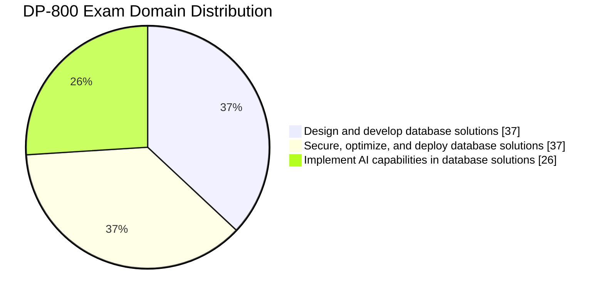

<p align="center">
  <a href="https://learn.microsoft.com/en-us/credentials/certifications/developing-ai-enabled-database-solutions/">
    
  </a>
</p>

<h1 align="center">DP-800: Developing AI-Enabled Database Solutions</h1>
<h3 align="center">Open-source community study guide for the Microsoft DP-800 certification</h3>

<p align="center">
  <a href="./LICENSE"></a>
  <a href="https://learn.microsoft.com/en-us/credentials/certifications/developing-ai-enabled-database-solutions/"></a>
  <a href="https://learn.microsoft.com/en-us/credentials/certifications/resources/study-guides/dp-800"></a>
  <a href="https://learn.microsoft.com/en-us/sql/sql-server/"></a>
  <a href="https://azure.microsoft.com/en-us/products/azure-sql"></a>
  <a href="https://www.microsoft.com/microsoft-fabric"></a>
  <br>
  <a href="#"></a>
  <a href="#"></a>
  <a href="#"></a>
  <a href="#"></a>
  <a href="#"></a>
  <a href="#"></a>
</p>

<p align="center">
  <i>A community-maintained study guide for the <b>Microsoft DP-800: Developing AI-Enabled Database Solutions</b> certification.<br>
  Aligned to the official skills-measured list updated <b>March 12, 2026</b>.</i>
</p>

> [!NOTE]
> **I used this guide to pass DP-800.** ✅ These are the exact notes, cheat sheets, practice questions, and mock exams I built while preparing — refined while studying, hardened on the actual exam, and now open-sourced under MIT so you can pass too. Every section is mapped 1:1 to the official Microsoft skills-measured list. If it helped you, ⭐ the repo and pass it on.

---

## Contents

- [Why this guide exists](#why-this-guide-exists)
- [Who this is for](#who-this-is-for)
- [What's covered](#whats-covered)
- [Exam at a glance](#exam-at-a-glance)
- [2026 updates you should know](#2026-updates-you-should-know)
- [Getting started with Obsidian](#getting-started-with-obsidian-recommended)
- [How to use this guide](#how-to-use-this-guide)
- [Study roadmap](#study-roadmap) — 4-week, 8-week, and 12-week plans
- [Roadmap for the guide itself](#roadmap-for-the-guide-itself)
- [Repository layout](#repository-layout)
- [Official Microsoft resources](#official-microsoft-resources)
- [Contributing](#contributing)
- [License](#license)

---

## Why this guide exists

The DP-800 is Microsoft's first certification focused on building **AI-enabled database solutions** — vector search, embeddings, RAG, and intelligent search inside SQL Server, Azure SQL, and SQL databases in Microsoft Fabric. The official skills list is broad and changes quickly. Public study resources are scarce.

This repo is the notes that got me through it. Now it's yours.

## Who this is for

- **Database developers / DBAs** moving into AI-augmented workloads
- **Data engineers** who want to add vector search and RAG to relational platforms
- **AI / app developers** who need to talk fluently about Azure SQL, Fabric SQL, and T-SQL AI functions
- **Exam takers** preparing for DP-800 specifically — every topic file maps 1:1 to the official blueprint
- **Anyone curious** about how Microsoft is bringing GenAI into the database layer

You don't need to be taking the exam to get value — the guide doubles as a reference for SQL Server 2025 vector features, MCP server integration, Data API Builder, and embedding maintenance patterns.

## What's covered

- **11 topic sections** mapped 1:1 to the official skills measured list
- **7 cheat sheets** for fast review (security, vector/AI, JSON, performance, T-SQL, Azure SQL config)
- **60+ practice questions** with full explanations across all three domains
- **2 full-length mock exams** (50 questions each — 45 standalone + a 5-question case study mirroring the real exam format)
- **Per-mock debrief files** mapping every missed question to a topic file + cheat sheet
- **End-to-end RAG worked example** — the full pipeline in ~80 lines of T-SQL
- **Final review** designed to read in 20 minutes the morning of the exam
- **T-SQL code examples** covering vector search, RAG, full-text, and AI integration

## Exam at a glance

| Detail | Information |
| --- | --- |
| **Exam ID** | DP-800 |
| **Full Name** | Developing AI-Enabled Database Solutions |
| **Credential** | Microsoft Certified: SQL AI Developer Associate |
| **Passing Score** | 700 / 1000 |
| **Duration** | 120 minutes |
| **Cost** | Varies by region (commonly ~$165 USD in the US) |
| **Renewal** | Annual (free Microsoft Learn assessment) |
| **Platforms tested** | SQL Server (incl. 2025), Azure SQL, SQL databases in Microsoft Fabric |
| **Language** | T-SQL |
| **Blueprint date** | March 12, 2026 |

### Domain weights



| Domain | Weight | Sections in this guide |
| :--- | :---: | :--- |
| **1. Design and develop database solutions** | 35–40 % | `01` – `04` |
| **2. Secure, optimize, and deploy database solutions** | 35–40 % | `05` – `08` |
| **3. Implement AI capabilities in database solutions** | 25–30 % | `09` – `11` |

### Skills measured (high level)

<details>
<summary><b>Domain 1 — Design and develop database solutions (35–40 %)</b></summary>

Tables · indexes · columnstore · specialized tables (in-memory, temporal, external, ledger, graph) · JSON columns and indexes · constraints · sequences · partitioning · views · functions · stored procedures · triggers · CTEs · window functions · JSON functions · regex (`REGEXP_LIKE`, `REGEXP_MATCHES`, `REGEXP_SPLIT_TO_TABLE`, etc.) · fuzzy matching (`EDIT_DISTANCE`, `JARO_WINKLER_DISTANCE`) · graph queries with `MATCH` · GitHub Copilot · MCP server endpoints

</details>

<details>
<summary><b>Domain 2 — Secure, optimize, and deploy database solutions (35–40 %)</b></summary>

Always Encrypted · column encryption · Dynamic Data Masking · Row-Level Security · object-level permissions · passwordless access · auditing · Managed Identity for model endpoints · secure GraphQL/REST/MCP endpoints · isolation levels · DMVs · Query Store · Query Performance Insight · blocking and deadlocks · SQL Database Projects (SDK-style) · schema drift detection · CI/CD pipelines · Data API Builder · Azure Monitor · CDC · Change Tracking · CES · Azure Functions SQL trigger · Logic Apps

</details>

<details>
<summary><b>Domain 3 — Implement AI capabilities in database solutions (25–30 %)</b></summary>

External models · embedding maintenance (triggers, CT, CDC, CES, Azure Functions, Logic Apps, Microsoft Foundry) · chunking · embedding generation · full-text search · `VECTOR` data type · `VECTOR_DISTANCE` · `VECTOR_SEARCH` · `VECTOR_NORMALIZE` · `VECTORPROPERTY` · DiskANN indexes · ANN vs ENN · hybrid search · RRF (Reciprocal Rank Fusion) · RAG with `sp_invoke_external_rest_endpoint`

</details>

## 2026 updates you should know

> [!IMPORTANT]
> Microsoft refreshed the DP-800 skills measured on **March 12, 2026**. Highlights:

- **SQL Server 2025 is GA.** The `VECTOR` data type and `VECTOR_DISTANCE` are **generally available** in SQL Server 2025 and Azure SQL Database. `VECTOR_SEARCH`, `VECTOR_NORMALIZE`, and `VECTORPROPERTY` are in **public preview** on the same platforms.
- **DiskANN vector indexes** are in **public preview** across SQL Server 2025, Azure SQL Database, Azure SQL Managed Instance, and SQL database in Microsoft Fabric. On SQL Server 2025 also requires `PREVIEW_FEATURES = ON`.
- **Half-precision (16-bit) `float16` vectors** are in preview — halves storage for the same dimension count (the documented type cap is **1 998** dimensions).
- **MCP server endpoints** (SQL Server + Fabric lakehouse) are explicitly tested.
- **Microsoft Foundry** is named as a valid embedding-maintenance method alongside CDC, Change Tracking, and CES.
- **Change Event Streaming (CES)** in Fabric is now in the blueprint.
- **Passwordless DB access** and **Managed Identity for model endpoints** are explicit security requirements.
- **Schema drift detection** in SQL Database Projects is now an explicit skill.

The [main overview](./certification/dp-800-overview.md) opens with the full "What's New" callout.

## Getting started with Obsidian (recommended)

This guide is written in [Obsidian Flavored Markdown](https://help.obsidian.md/). It renders fine on GitHub, but in **Obsidian** you get callouts, foldable practice-question answers, Mermaid diagrams, backlinks, and a navigable Graph View of every cross-link — which makes studying meaningfully better.

### 5-minute onboarding

1. **Install [Obsidian](https://obsidian.md/download)** (free; macOS, Windows, Linux).
2. **Clone this repo** somewhere on your machine:

   ```bash
   git clone https://github.com/kengio/dp-800-study-guide.git
   cd dp-800-study-guide
   ```

3. **Open the vault**: launch Obsidian → *Open folder as vault* → pick the cloned `dp-800-study-guide/` directory.
4. **Trust the author** when Obsidian asks (the included `.obsidian/` config has pre-tuned settings — line numbers, tab width, no inline titles).
5. **Open `certification/dp-800-overview.md`** — that's your study path entry point. Press `Cmd/Ctrl + O` to fuzzy-find any topic.
6. **Toggle Graph View** (`Cmd/Ctrl + G`) to see how all 11 sections cross-link — surprisingly useful for spotting weak areas.

### Recommended plugins

Two are essential, the rest are quality-of-life. Install via **Settings → Community plugins → Browse**.

- **Obsidian Git** — back up your notes and progress checkboxes to your own fork.
- **Linter** — keeps your edits consistent with the project's markdown conventions.
- **Advanced Tables** — auto-aligns Markdown tables as you type.
- **Codeblock Customizer** (or *Better CodeBlock*) — line numbers, titles, copy buttons on code blocks.
- **Copilot** (by logancyang) — chat with Claude / GPT-4o / Ollama inside Obsidian; **Vault QA** mode indexes the guide so the AI can quiz you using your actual notes.

> 📖 **See [`OBSIDIAN-SETUP.md`](./OBSIDIAN-SETUP.md)** for the full setup walkthrough — plugin configuration details, Copilot Vault QA setup, recommended study prompts, and tips for using AI to generate active-recall questions from your notes.

### Don't want Obsidian?

No problem. The guide also renders perfectly in:

- **GitHub** — browse the files online; callouts and Mermaid diagrams render natively
- **VS Code** with the [Markdown All in One](https://marketplace.visualstudio.com/items?itemName=yzhang.markdown-all-in-one) extension
- **Any Markdown reader** that supports GFM — you'll lose callouts and Graph View, but the content is fully readable

## How to use this guide

1. **Start at the [main overview](./certification/dp-800-overview.md)** — it has the full study path and a progress tracker.
2. **Work through the 11 topic sections in order** — each topic file is 300–600 lines with examples, comparison tables, common-mistake callouts, and exam tips.
3. **Hit the [cheat sheets](./certification/resources/cheat-sheets/cheat-sheets.md)** after each domain to consolidate.
4. **Take the [practice questions](./certification/resources/practice-questions/practice-questions.md)** — aim for 70 %+ per domain before moving on.
5. **Sit the two [mock exams](./certification/resources/mock-exam/mock-exam-1.md) under timed conditions** when you think you're close.
6. **Read [`final-review.md`](./certification/resources/final-review.md) the morning of the exam** — it's the 20-minute scan.

## Study roadmap

Pick the plan that matches the time you have. All three end with the same outcome — sitting the exam with confidence. The hours are realistic averages for an experienced T-SQL developer; double them if you're newer to relational databases or to the Microsoft stack.

### 🏃 4-week sprint (~30–35 hours total — ~1 hour/day)

Best for: experienced SQL developers brushing up on AI features. Tight but doable.

| Week | Focus | Files | Hours |
| :--- | :--- | :--- | :---: |
| **1** | Domain 1 — Design & develop | `01-database-objects`, `02-programmability-objects`, `03-advanced-tsql`, `04-ai-assisted-tools` | 9 |
| **2** | Domain 2 — Secure, optimize, deploy | `05-data-security-compliance`, `06-performance-optimization`, `07-cicd-database-projects`, `08-azure-services-integration` | 9 |
| **3** | Domain 3 — AI capabilities | `09-models-embeddings`, `10-intelligent-search`, `11-rag` + cheat sheets | 9 |
| **4** | Practice & polish | Practice questions (all 3 domains) → Mock Exam 1 → review → Mock Exam 2 → final-review.md | 6 |

### 🚶 8-week balanced (~55–65 hours total — ~1 hour/day, 7 days/week)

Best for: working professionals fitting study around a job. The recommended default.

| Week | Focus | Hours |
| :--- | :--- | :---: |
| **1** | `01-database-objects` (all 5 sub-topics) + read the [overview](./certification/dp-800-overview.md) | 7 |
| **2** | `02-programmability-objects` + `03-advanced-tsql` part 1 (CTEs, window, JSON) | 8 |
| **3** | `03-advanced-tsql` part 2 (regex, graph, error handling) + `04-ai-assisted-tools` | 7 |
| **4** | **Checkpoint:** Domain 1 cheat sheets + Domain 1 practice questions (target 70 %+) | 5 |
| **5** | `05-data-security-compliance` + `06-performance-optimization` | 8 |
| **6** | `07-cicd-database-projects` + `08-azure-services-integration` | 7 |
| **7** | Domain 2 practice questions + `09-models-embeddings` + `10-intelligent-search` | 8 |
| **8** | `11-rag` + Domain 3 practice → **Mock Exam 1 (timed)** → review weak areas → **Mock Exam 2** → final-review.md | 8 |

### 🧘 12-week comprehensive (~80–100 hours total — ~1 hour/day, with weekends off)

Best for: newcomers to AI features, career changers, or anyone wanting deeper retention.

| Week | Focus | Hours |
| :--- | :--- | :---: |
| **1** | `01-database-objects/01–02` (tables, specialized tables) | 6 |
| **2** | `01-database-objects/03–05` (JSON columns, constraints, partitioning) | 6 |
| **3** | `02-programmability-objects` (views, functions, procs, triggers) + first hands-on lab | 7 |
| **4** | `03-advanced-tsql/01–03` (CTEs, JSON, regex) | 7 |
| **5** | `03-advanced-tsql/04–05` + `04-ai-assisted-tools` + Domain 1 practice questions | 7 |
| **6** | **Checkpoint:** Domain 1 cheat sheets + retake weak Domain 1 questions | 5 |
| **7** | `05-data-security-compliance` (all 5 sub-topics) | 8 |
| **8** | `06-performance-optimization` + isolation/concurrency hands-on | 7 |
| **9** | `07-cicd-database-projects` + `08-azure-services-integration` | 8 |
| **10** | Domain 2 practice questions + `09-models-embeddings` | 8 |
| **11** | `10-intelligent-search` + `11-rag` (build a small RAG demo) | 9 |
| **12** | Domain 3 practice → **Mock Exam 1** → gap-fill → **Mock Exam 2** → final-review.md → exam | 8 |

### Suggested daily cadence

```text
Weekday    (45–60 min):  Read 1 topic sub-file + work the examples in your own DB
Weekend    (90–120 min): Cheat sheet review + practice questions + flashcards
Pre-exam   (last 3 days): Stop new material. Re-read cheat sheets and final-review.md only.
Exam day:                Read final-review.md once over coffee. Eat. Go pass it.
```

### Time-budget per resource (single sitting, end-to-end)

| Resource | Realistic time |
| :--- | :--- |
| Each numbered topic file | 30–45 min reading + 15 min experimentation |
| Each section index | 5 min |
| One cheat sheet | 15–20 min |
| One domain's practice questions (15–20 Qs) | 30–45 min |
| Mock Exam (45 Qs, timed) | 90 min + 30 min review |
| `final-review.md` | 20 min |

## Roadmap for the guide itself

This guide ships as a living resource. The roadmap below is what's planned for the next two quarters — issues and PRs against any of these are welcome.

### Q2–Q3 2026 (next 6 months)

- ✅ **Align to March 2026 blueprint** — complete
- ✅ **MIT license + open-source release** — complete
- ✅ **2026 update callouts** in overview and final-review — complete
- ✅ **Mock-exam debrief files** mapping every question to a topic file — complete
- ✅ **End-to-end RAG worked example** in `code-examples/tsql/` — complete
- ✅ **Mermaid diagrams in Domain 3 topic files** — complete
- ✅ **Case-study mini-blocks** in both mock exams (mirroring real DP-800 format) — complete
- ✅ **Practice-question rebalancing** (+2 Hard Domain 1, +2 Easy Domain 2, +1 REGEXP) — complete
- ✅ **Mental-model phrasings** in highest-leverage Domain 1 / 2 topics — complete
- 🔄 **Hands-on lab pack** — runnable T-SQL scripts that set up sample data and walk through vector search, RAG, full-text, and MCP scenarios
- 🔄 **Half-precision vector** examples once the feature reaches public preview in Azure SQL
- 🔄 **Microsoft Foundry walkthrough** as an embedding-maintenance method
- 🔄 **Video walkthroughs** of the hardest topics (vector index metric matching, RLS predicate functions, CES vs CDC)

### Q4 2026 (3–6 months out)

- ⏳ **Azure SQL DiskANN GA** content updates (expected to leave private preview)
- ⏳ **Half-precision vector GA** content updates
- ⏳ **Updated mock exams** following any Microsoft blueprint refresh
- ⏳ **Community contributor list** in CONTRIBUTORS.md
- ✅ **Spaced-repetition deck (Anki)** generated from cheat-sheet facts — see [`certification/resources/anki/`](./certification/resources/anki/anki-deck.md) (130 cards across 6 cheat sheets)
- ✅ **Translation scaffolding** so non-English learners can fork and translate — see [`TRANSLATING.md`](./TRANSLATING.md)

### Q1 2027 (6–12 months out)

- 🌱 **Renewal-assessment guide** for those who took DP-800 in 2026 and need to renew
- 🌱 **Companion guide for related exams** (e.g., DP-700 Fabric Data Engineer, AI-102 AI Engineer cross-references)
- 🌱 **Adaptive practice questions** — JSON-driven question bank with difficulty tagging

Legend: ✅ done · 🔄 in progress / next up · ⏳ planned · 🌱 ideas being explored

## Quick navigation

| Resource | Description |
| :--- | :--- |
| [Start Studying →](./certification/dp-800-overview.md) | Main index with all 11 study sections and progress tracker |
| [Cheat Sheets](./certification/resources/cheat-sheets/cheat-sheets.md) | Seven quick-reference guides for exam day |
| [Practice Questions](./certification/resources/practice-questions/practice-questions.md) | 60+ domain-specific questions with explanations |
| [Mock Exam 1](./certification/resources/mock-exam/mock-exam-1.md) | 50-question timed practice exam (45 standalone + 5-question case study) |
| [Mock Exam 1 Debrief](./certification/resources/mock-exam/mock-exam-1-debrief.md) | Per-question map to topic files + cheat sheets, plus a study plan by miss count |
| [Mock Exam 2](./certification/resources/mock-exam-2/mock-exam-2.md) | Second 50-question practice exam (different questions; includes case study) |
| [Mock Exam 2 Debrief](./certification/resources/mock-exam-2/mock-exam-2-debrief.md) | Same debrief pattern for Mock 2 |
| [RAG Walkthrough](./certification/resources/code-examples/tsql/rag-end-to-end-walkthrough.md) | End-to-end RAG pipeline in ~80 lines of T-SQL |
| [Final Review](./certification/resources/final-review.md) | 20-minute exam-morning scan |
| [Exam Tips](./certification/resources/exam-tips.md) | Time management, common traps, and strategy |
| [Appendix](./certification/resources/appendix/appendix.md) | Glossary, comparison tables, error reference |
| [T-SQL Code Examples](./certification/resources/code-examples/tsql/tsql-code-examples.md) | Standalone runnable T-SQL snippets |

## Repository layout

```text
dp-800-study-guide/
├── certification/
│   ├── dp-800-overview.md           # main entry point — start here
│   ├── 01-database-objects/         # tables, indexes, JSON, partitioning
│   ├── 02-programmability-objects/  # views, functions, procedures, triggers
│   ├── 03-advanced-tsql/            # CTEs, window functions, regex, graph
│   ├── 04-ai-assisted-tools/        # GitHub Copilot, MCP server endpoints
│   ├── 05-data-security-compliance/ # encryption, RLS, DDM, secure endpoints
│   ├── 06-performance-optimization/ # configs, isolation, plans, DMVs
│   ├── 07-cicd-database-projects/   # SQL DB Projects, schema drift
│   ├── 08-azure-services-integration/ # DAB, REST/GraphQL, CDC/CT/CES
│   ├── 09-models-embeddings/        # external models, embedding maintenance
│   ├── 10-intelligent-search/       # full-text, vector, hybrid (RRF)
│   ├── 11-rag/                      # RAG, sp_invoke_external_rest_endpoint
│   └── resources/
│       ├── cheat-sheets/            # quick-reference for exam day
│       ├── practice-questions/      # per-domain Q&A
│       ├── mock-exam/               # mock exam 1
│       ├── mock-exam-2/             # mock exam 2
│       ├── code-examples/tsql/      # standalone T-SQL examples
│       ├── appendix/                # glossary, comparisons, error reference
│       ├── final-review.md          # 20-minute exam-morning scan
│       ├── exam-tips.md             # strategy and time management
│       └── official-links.md        # Microsoft docs and exam registration
├── LICENSE                          # MIT
└── README.md                        # this file
```

## Official Microsoft resources

<details>
<summary><b>📋 Exam and certification</b></summary>

### Exam and certification

- [DP-800 skills measured (official study guide)](https://learn.microsoft.com/en-us/credentials/certifications/resources/study-guides/dp-800)
- [DP-800 certification page](https://learn.microsoft.com/en-us/credentials/certifications/developing-ai-enabled-database-solutions/)
- [Schedule the exam](https://learn.microsoft.com/en-us/credentials/certifications/developing-ai-enabled-database-solutions/#schedule-exam)
- [Free Microsoft Learn practice assessment](https://learn.microsoft.com/en-us/credentials/certifications/azure-administrator/practice/assessment?assessment-type=practice&assessmentId=1704375541&practice-assessment-type=certification)
- [Exam sandbox (try the testing UI)](https://aka.ms/examdemo)
- [Request accommodations](https://learn.microsoft.com/en-us/credentials/certifications/request-accommodations)

</details>

<details>
<summary><b>📚 Documentation by topic</b></summary>

### Documentation by topic

- [SQL Server documentation](https://learn.microsoft.com/en-us/sql/?view=sql-server-ver17)
- [SQL Server 2025 — announcement](https://www.microsoft.com/en-us/sql-server/blog/2025/05/19/announcing-sql-server-2025-preview-the-ai-ready-enterprise-database-from-ground-to-cloud/)
- [Azure SQL documentation](https://learn.microsoft.com/en-us/azure/azure-sql/)
- [SQL database in Microsoft Fabric](https://learn.microsoft.com/en-us/fabric/database/sql/)
- [VECTOR data type](https://learn.microsoft.com/en-us/sql/t-sql/data-types/vector-data-type)
- [VECTOR_DISTANCE](https://learn.microsoft.com/en-us/sql/t-sql/functions/vector-distance-transact-sql)
- [VECTOR_SEARCH](https://learn.microsoft.com/en-us/sql/t-sql/functions/vector-search-transact-sql)
- [Vector search and indexes overview](https://learn.microsoft.com/en-us/sql/sql-server/ai/vectors)
- [Public preview of DiskANN in Azure SQL (Azure SQL Dev Corner)](https://devblogs.microsoft.com/azure-sql/public-preview-of-vector-indexing-in-azure-sql-db-azure-sql-mi-and-sql-database-in-microsoft-fabric/)
- [sp_invoke_external_rest_endpoint](https://learn.microsoft.com/en-us/sql/relational-databases/system-stored-procedures/sp-invoke-external-rest-endpoint-transact-sql)
- [CREATE EXTERNAL MODEL](https://learn.microsoft.com/en-us/sql/t-sql/statements/create-external-model-transact-sql)
- [Data API Builder (DAB)](https://learn.microsoft.com/en-us/azure/data-api-builder/)
- [SQL Database Projects](https://learn.microsoft.com/en-us/sql/azure-data-studio/extensions/sql-database-project-extension)
- [Change Data Capture](https://learn.microsoft.com/en-us/sql/relational-databases/track-changes/about-change-data-capture-sql-server)
- [Change Tracking](https://learn.microsoft.com/en-us/sql/relational-databases/track-changes/about-change-tracking-sql-server)
- [Change Event Streaming (CES) overview](https://learn.microsoft.com/en-us/sql/relational-databases/track-changes/change-event-streaming/overview)
- [Always Encrypted](https://learn.microsoft.com/en-us/sql/relational-databases/security/encryption/always-encrypted-database-engine)
- [Row-Level Security](https://learn.microsoft.com/en-us/sql/relational-databases/security/row-level-security)
- [Dynamic Data Masking](https://learn.microsoft.com/en-us/sql/relational-databases/security/dynamic-data-masking)
- [Microsoft Foundry](https://learn.microsoft.com/en-us/azure/ai-foundry/)
- [Model Context Protocol (MCP) spec](https://modelcontextprotocol.io/)
- [GitHub Copilot in VS Code](https://docs.github.com/en/copilot)
- [Copilot in Microsoft Fabric](https://learn.microsoft.com/en-us/fabric/fundamentals/copilot-fabric-overview)

</details>

<details>
<summary><b>👥 Community and learning paths</b></summary>

### Community and learning paths

- [Microsoft Learn — DP-800 learning path](https://learn.microsoft.com/en-us/training/courses/dp-800t00)
- [Microsoft Q&A](https://learn.microsoft.com/en-us/answers/products/)
- [SQL Server Tech Community](https://techcommunity.microsoft.com/category/sql-server/blog/sqlserver)
- [Microsoft Fabric Blog](https://blog.fabric.microsoft.com/)
- [Azure SQL Dev Corner](https://devblogs.microsoft.com/azure-sql/)
- [Data Exposed (video series)](https://learn.microsoft.com/en-us/shows/data-exposed/)
- [Exam Readiness Zone](https://learn.microsoft.com/en-us/shows/exam-readiness-zone/)

</details>

## Translations

The English content under `certification/` is canonical. Community translations live in `i18n/<locale>/` as parallel trees and don't alter the English source.

- **Available locales** — see [`i18n/README.md`](./i18n/README.md) (none yet — be the first!)
- **How to translate** — read [`TRANSLATING.md`](./TRANSLATING.md) for BCP-47 locale codes, layout, priority order, and the currency policy
- **Coordinate first** — open an issue titled `i18n: <locale name>` so two people don't start the same locale in parallel

## Contributing

Found an error, a stale link, or a topic that needs deeper coverage? PRs are welcome.

- **Small fixes** (typos, link rot, factual corrections) — open a PR directly
- **New practice questions or topic expansions** — open an issue first to discuss scope
- **Blueprint changes** — Microsoft updates DP-800 periodically; PRs that bring sections in line with the latest skills-measured list are especially appreciated

Please keep the existing structure: each topic file follows the conventions in [`CLAUDE.md`](./CLAUDE.md), and code examples live in `certification/resources/code-examples/tsql/`.

## License

Released under the [MIT License](./LICENSE). Use, fork, remix, redistribute — just keep the copyright notice.

---

<p align="center">
  <i>This guide is a community resource. It is <b>not</b> affiliated with, endorsed by, or sponsored by Microsoft.<br>
  "Microsoft", "Azure", "SQL Server", and "Microsoft Fabric" are trademarks of Microsoft Corporation.<br>
  Always verify against the official <a href="https://learn.microsoft.com/en-us/credentials/certifications/resources/study-guides/dp-800">DP-800 skills measured</a> page — it is the source of truth.</i>
</p>

<p align="center"><b>Good luck on the exam. You've got this. ⭐ this repo if it helped you pass.</b></p>
