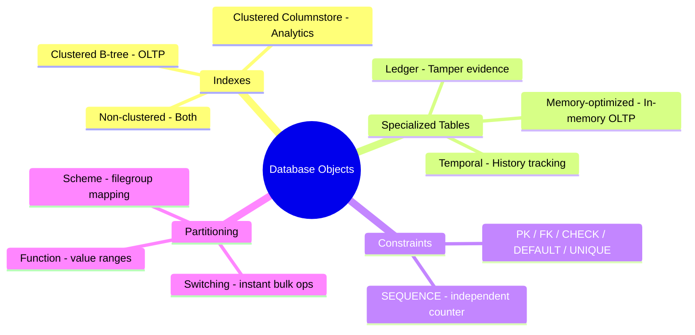
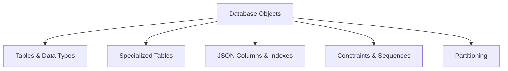

# Design and Implement Database Objects (Domain 1 — 35–40%)

Core database design skills covering tables, indexes, constraints, and partitioning across SQL Server, Azure SQL, and Microsoft Fabric SQL databases.

---

## Quick Recall

---

## Topics Overview

## Section Contents

| File | Topic | Priority |
| :--- | :--- | :--- |
| [01-tables-indexes.md](01-tables-indexes.md) | Tables, data types, column store indexes | High |
| [02-specialized-tables.md](02-specialized-tables.md) | In-memory, temporal, external, ledger, graph | High |
| [03-json-columns.md](03-json-columns.md) | JSON columns and indexes | Medium |
| [04-constraints-sequences.md](04-constraints-sequences.md) | PRIMARY KEY, FOREIGN KEY, CHECK, DEFAULT, SEQUENCES | High |
| [05-partitioning.md](05-partitioning.md) | Table and index partitioning | Medium |

## Key Concepts

- **Column Store Indexes**: Optimized for analytical queries on large datasets
- **In-Memory Tables**: Memory-optimized tables for high-throughput OLTP workloads
- **Temporal Tables**: System-versioned tables for auditing and time-travel queries
- **Ledger Tables**: Tamper-evident tables using blockchain-like verification
- **Graph Tables**: Node and edge tables for relationship data
- **Partitioning**: Horizontal division of large tables for performance and manageability

## Related Resources

- [02-Programmability Objects](../02-programmability-objects/README.md)
- [03-Advanced T-SQL](../03-advanced-tsql/README.md)
- [Official: SQL Server Tables](https://learn.microsoft.com/en-us/sql/relational-databases/tables/tables)

## Next Steps

Proceed to [02-Programmability Objects](../02-programmability-objects/README.md) to learn about views, functions, stored procedures, and triggers.

---

**[↑ Back to Certification](../README.md)**
