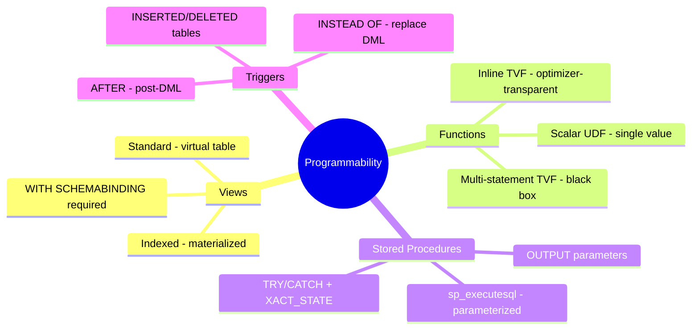
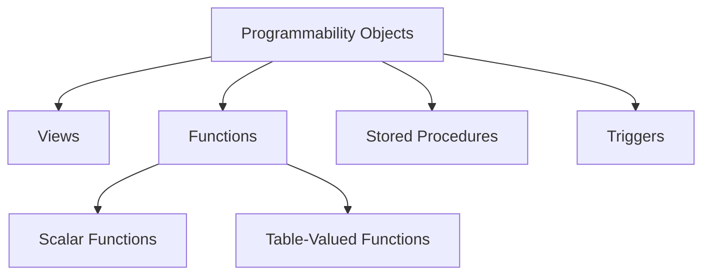

# Implement Programmability Objects (Domain 1 — 35–40%)

Creating and managing T-SQL programmability objects: views, scalar and table-valued functions, stored procedures, and triggers.

---

## Quick Recall

---

## Topics Overview

## Section Contents

| File | Topic | Priority |
| :--- | :--- | :--- |
| [01-views.md](01-views.md) | Views — standard, indexed, and schema-bound | High |
| [02-functions.md](02-functions.md) | Scalar and table-valued functions | High |
| [03-stored-procedures.md](03-stored-procedures.md) | Stored procedure design and parameters | High |
| [04-triggers.md](04-triggers.md) | DML and DDL triggers | Medium |

## Key Concepts

- **Indexed Views**: Materialized views with a clustered index for query performance
- **Schema-Binding**: Prevents underlying objects from being modified or dropped
- **Table-Valued Functions (TVFs)**: Return result sets; inline TVFs are most efficient
- **EXECUTE AS**: Security context switching in stored procedures
- **AFTER vs INSTEAD OF Triggers**: Controls when trigger logic fires relative to the DML

## Related Resources

- [01-Database Objects](../01-database-objects/database-objects.md)
- [03-Advanced T-SQL](../03-advanced-tsql/advanced-tsql.md)
- [Official: Stored Procedures](https://learn.microsoft.com/en-us/sql/relational-databases/stored-procedures/stored-procedures-database-engine)

## Next Steps

Proceed to [03-Advanced T-SQL](../03-advanced-tsql/advanced-tsql.md) to learn about CTEs, window functions, JSON, regex, and graph queries.

---

**[← Back to Database Objects](../01-database-objects/database-objects.md) | [↑ Back to Certification](../dp-800-overview.md)**
