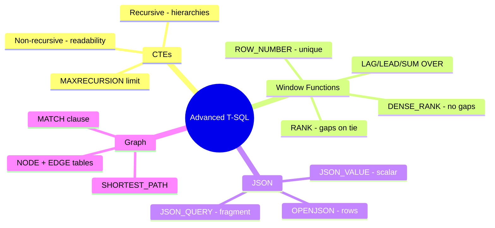
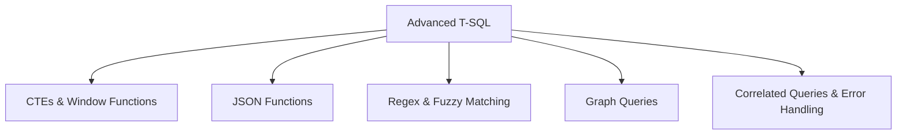

# Write Advanced T-SQL Code (Domain 1 — 35–40%)

Advanced T-SQL querying including CTEs, window functions, JSON functions, regex/fuzzy matching, graph queries, correlated subqueries, and error handling.

---

## Quick Recall

---

## Topics Overview

## Section Contents

| File | Topic | Priority |
| :--- | :--- | :--- |
| [01-ctes-window-functions.md](01-ctes-window-functions.md) | Common Table Expressions and window functions | High |
| [02-json-functions.md](02-json-functions.md) | JSON_OBJECT, JSON_ARRAY, OPENJSON, JSON_VALUE, etc. | High |
| [03-regex-fuzzy-matching.md](03-regex-fuzzy-matching.md) | REGEXP_LIKE, EDIT_DISTANCE, JARO_WINKLER_DISTANCE | Medium |
| [04-graph-queries.md](04-graph-queries.md) | Graph tables and the MATCH operator | Medium |
| [05-correlated-queries-error-handling.md](05-correlated-queries-error-handling.md) | Correlated subqueries and TRY/CATCH | High |

## Key Concepts

- **CTEs**: Named temporary result sets; recursive CTEs for hierarchical data
- **Window Functions**: ROW_NUMBER, RANK, DENSE_RANK, LAG, LEAD, running totals
- **OPENJSON**: Parses JSON into relational rows; used with `WITH` for typed output
- **JSON_ARRAYAGG / JSON_CONTAINS**: New JSON aggregate and filter functions
- **EDIT_DISTANCE**: Calculates string similarity for fuzzy matching
- **MATCH**: Graph traversal predicate for querying node/edge relationships
- **TRY/CATCH + THROW**: Structured error handling in T-SQL

## Related Resources

- [02-Programmability Objects](../02-programmability-objects/README.md)
- [04-AI-Assisted Tools](../04-ai-assisted-tools/README.md)
- [Code Examples — T-SQL](../resources/code-examples/tsql/README.md)

## Next Steps

Proceed to [04-AI-Assisted Tools](../04-ai-assisted-tools/README.md) to learn about GitHub Copilot, MCP servers, and AI-assisted development.

---

**[← Back to Programmability Objects](../02-programmability-objects/README.md) | [↑ Back to Certification](../README.md)**
