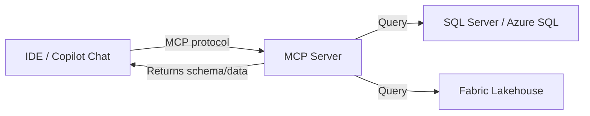
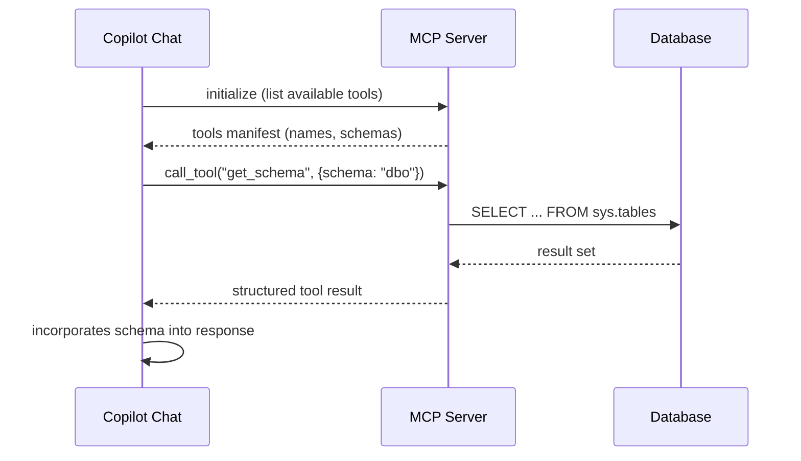

# MCP Server Endpoints

## Overview

The **Model Context Protocol** (MCP) is an open standard that allows AI tools (like GitHub Copilot) to connect to external data sources. For DP-800, the key endpoints are the Microsoft SQL Server MCP server and the Fabric lakehouse MCP server.

> [!abstract]
>
> - Covers MCP (Model Context Protocol): what it is, how MCP servers expose tools/resources, and connection methods
> - MCP is a protocol standard — not a specific Azure service — that allows AI models to interact with external tools
> - Key exam topics: MCP definition, server/client roles, tool vs resource in MCP, connection types (stdio, HTTP+SSE)

> [!tip] What the Exam Tests
>
> - **MCP = Model Context Protocol** — an open protocol for AI models to call external tools and access resources
> - An MCP server **exposes tools** (callable actions) and **resources** (data the model can read)
> - Connection types: `stdio` (local process) and `HTTP+SSE` (remote server) — the exam may ask which suits which scenario

---

## What is MCP?

MCP provides a standardized way for AI assistants to:

- **Read data** from external systems (databases, files, APIs)
- **Execute tools** (run queries, fetch schema information)
- **Maintain context** about data sources during a conversation



---

## Connecting to MCP Server Endpoints

### SQL Server MCP Server

The SQL Server MCP server allows Copilot to query schema and data from a SQL Server or Azure SQL instance.

```json
// .vscode/mcp.json
{
    "servers": {
        "sql-developer": {
            "type": "stdio",
            "command": "npx",
            "args": ["-y", "@modelcontextprotocol/server-mssql"],
            "env": {
                "MSSQL_CONNECTION_STRING": "Server=myserver.database.windows.net;Database=mydb;Authentication=ActiveDirectoryInteractive;"
            }
        }
    }
}
```

**With Managed Identity (passwordless):**

```json
{
    "servers": {
        "sql-developer": {
            "type": "stdio",
            "command": "npx",
            "args": ["-y", "@modelcontextprotocol/server-mssql"],
            "env": {
                "MSSQL_CONNECTION_STRING": "Server=myserver.database.windows.net;Database=mydb;Authentication=ActiveDirectoryManagedIdentity;"
            }
        }
    }
}
```

### Fabric Lakehouse MCP Server

The Fabric lakehouse MCP server exposes lakehouse tables and files to Copilot:

```json
{
    "servers": {
        "fabric-lakehouse": {
            "type": "http",
            "url": "https://api.fabric.microsoft.com/v1/workspaces/{workspaceId}/lakehouses/{lakehouseId}/mcp",
            "headers": {
                "Authorization": "Bearer ${env:FABRIC_TOKEN}"
            }
        }
    }
}
```

---

## Configuring MCP in a Copilot Chat Session

### Enabling Tools

In GitHub Copilot Chat:

1. Open the chat panel (`Ctrl+Shift+I`)
2. Click the **Tools** button (wrench icon) at the bottom
3. Toggle on the MCP servers you want active in this session
4. Reference tools explicitly: `#sql-developer` or use them implicitly

### Using MCP in Chat

```text
// With SQL Server MCP connected:
@workspace What tables exist in the dbo schema?

List all stored procedures and describe what each one does.

Write a query to find all customers with orders over $1000 using the actual schema.
```

When connected via MCP, Copilot has access to:

- Schema metadata (tables, columns, types, indexes)
- Stored procedure and function definitions
- View definitions
- Real-time query execution (if read access is configured)

---

## MCP Tool Configuration Examples

Each MCP server exposes a set of **tools** — discrete callable actions the AI assistant can invoke. Tools are defined with a name, description, and JSON Schema for their inputs.

### Tool Schema Structure

```json
{
  "name": "execute_query",
  "description": "Executes a read-only SQL query against the connected database and returns results. Use this to inspect data, verify row counts, or explore sample values.",
  "inputSchema": {
    "type": "object",
    "properties": {
      "query": {
        "type": "string",
        "description": "A SELECT statement to execute"
      },
      "maxRows": {
        "type": "integer",
        "description": "Maximum number of rows to return (default: 100)"
      }
    },
    "required": ["query"]
  }
}
```

**Description quality matters:** The AI assistant selects which tool to call based on the tool's `description` field. A vague description like `"runs SQL"` is far less effective than one that explains what the tool does and when to use it.

### Example: Azure SQL MCP Config (global format)

Some tools use a top-level `mcpServers` key (e.g., Claude Desktop format):

```json
{
  "mcpServers": {
    "azure-sql": {
      "command": "npx",
      "args": ["-y", "@modelcontextprotocol/server-azure-sql"],
      "env": {
        "AZURE_SQL_CONNECTION_STRING": "Server=myserver.database.windows.net;..."
      }
    }
  }
}
```

VS Code uses `.vscode/mcp.json` with a `servers` key; other clients (Claude Desktop, Cursor) use `mcpServers`. The tool definitions themselves are identical regardless of config format.

---

## MCP Server Lifecycle

### Startup and Shutdown

MCP servers are **process-based** for stdio transport: the AI tool spawns the server process when the session starts and terminates it when the session ends. The server does not persist between IDE restarts unless reconfigured.

### Transport Types

| Transport | Description | Use Case |
| :--- | :--- | :--- |
| **stdio** | JSON-RPC over standard input/output | ==Local dev, CLI-launched servers== |
| **SSE** | Server-Sent Events over HTTP | Remote servers, multi-client scenarios |

stdio is the most common for local database MCP servers. SSE (Server-Sent Events) is used when the MCP server is hosted remotely (e.g., the Fabric lakehouse MCP endpoint).

> [!warning] Common Mistake
> MCP is NOT an Azure service and NOT a Microsoft-specific technology. It is an open protocol. Don't confuse "MCP server" (a server that implements the Model Context Protocol) with Azure API Management or Azure Functions — they are different things.

### Credential Management

Environment variables are the **recommended** way to pass credentials to MCP servers:

- Set credentials in `env` block of the MCP config, not as command-line args
- Use `${env:VAR_NAME}` syntax to reference OS-level environment variables
- Never hardcode connection strings, passwords, or tokens directly in config files committed to source control

### Health and Error Recovery

- If an MCP server process crashes, most AI tools will surface the error in the chat panel
- Re-enabling the tool in the session will restart the server process
- Timeout errors are common on cold starts with large Node.js packages — retry once before diagnosing

### Request-Response Flow



---

## Database-Specific MCP Servers

### SQL Server / Azure SQL MCP Server

- Package: `@modelcontextprotocol/server-mssql`
- Exposes: table/column schema, view definitions, stored procedure text, index info
- Can execute SELECT queries if connection user has read access
- Uses `MSSQL_CONNECTION_STRING` environment variable

### Microsoft Fabric MCP Integration

- Hosted endpoint: `api.fabric.microsoft.com/.../mcp`
- Exposes: lakehouse tables, OneLake files, SQL analytics endpoint schema
- Authenticated via Bearer token (service principal or user token)
- Enables Copilot to understand Fabric data models without manual schema import

### Azure OpenAI MCP Server

- Allows AI tools to call Azure OpenAI deployments as MCP tools
- Useful for chaining: IDE Copilot → MCP → Azure OpenAI → embedding or completion
- Relevant to DP-800 RAG patterns (section 11)

### Security Consideration

MCP servers execute with the **permissions of the connection string user**. If the service account has `db_owner` or `sysadmin`, the AI assistant (and anyone who can prompt it) can perform DDL and DML operations. Always use a least-privilege read-only account for MCP servers, particularly against shared or production databases.

---

## Error Handling in MCP Tools

### Structured Error Responses

MCP servers should return structured error objects rather than raw exceptions. A well-formed error lets the AI tool surface a meaningful message to the developer.

```json
{
  "error": {
    "code": "PERMISSION_DENIED",
    "message": "User does not have SELECT permission on table 'Salaries'",
    "data": { "table": "dbo.Salaries", "operation": "SELECT" }
  }
}
```

### How AI Tools Surface MCP Errors

- GitHub Copilot Chat displays tool errors inline in the chat response
- The assistant may retry with a modified query or explain why it cannot fulfill the request
- Persistent errors (bad connection string, server not found) appear as warnings in the Tools panel

### Common MCP Errors

| Error | Cause | Resolution |
| :--- | :--- | :--- |
| `CONNECTION_TIMEOUT` | Firewall blocking, server cold start | Check firewall rules; retry |
| `PERMISSION_DENIED` | Account lacks required permission | ==Grant `SELECT` or `VIEW DEFINITION`== |
| `INVALID_TOOL_INPUT` | Query fails JSON Schema validation | Check tool input schema |
| `SERVER_NOT_FOUND` | Wrong package name or npx cache issue | Verify package name; clear npx cache |
| `AUTH_FAILURE` | Expired token or wrong credentials | Refresh token or update connection string |

### Best Practice

MCP server implementations should catch database exceptions and re-throw them as structured MCP error responses. Raw stack traces passed back to the AI tool are unhelpful and may leak internal information.

---

## MCP vs REST APIs for Database Access

| Aspect | MCP Server | REST API / DAB |
| :--- | :--- | :--- |
| Audience | AI coding assistants | Applications / web clients |
| Protocol | JSON-RPC over stdio/SSE | HTTP |
| Authentication | Via config/env vars | OAuth, API keys |
| Schema discovery | ==Built-in tool for schema== | Manual or Swagger |
| Best for | AI-assisted development | Production app backends |

MCP and REST/DAB are complementary: MCP is for the **development phase** (helping developers write code), while DAB and REST APIs serve **runtime application requests**.

---

## Securing MCP Endpoints

### Managed Identity for SQL Server

```json
// Use Managed Identity instead of username/password
"MSSQL_CONNECTION_STRING": "Server=tcp:myserver.database.windows.net,1433;Database=mydb;Authentication=ActiveDirectoryManagedIdentity;"
```

### Least Privilege for MCP

Create a dedicated read-only user for MCP access:

```sql
-- Create MCP service account
CREATE USER [mcp-reader] FROM EXTERNAL PROVIDER;

-- Grant schema view permissions (for schema discovery)
GRANT VIEW DEFINITION ON SCHEMA::dbo TO [mcp-reader];
GRANT SELECT ON SCHEMA::dbo TO [mcp-reader];

-- Restrict from sensitive tables
DENY SELECT ON dbo.CustomerPayments TO [mcp-reader];
```

### Network Security

```text
Azure SQL → Networking:
- Enable service endpoints or Private Link
- Restrict firewall to only allow MCP server IP
- Use Azure AD authentication (disable SQL auth)
```

---

## MCP vs Direct Database Connection

| Aspect | MCP | Direct Connection |
| :--- | :--- | :--- |
| Purpose | AI tool context | Application queries |
| Auth | Service principal / Managed Identity | App credentials |
| Access | Schema + limited query | Full application access |
| Audit | Through Azure Monitor | Through SQL Audit |
| Scope | Development/IDE use | Production queries |

---

## Use Cases

- **Schema-aware completions**: Copilot suggests correct column names and types
- **Query generation**: Copilot writes queries that reference actual table structure
- **Stored procedure analysis**: Copilot reads existing procedures and suggests improvements
- **Data exploration**: Copilot explains what data exists and how tables relate

---

## Common Issues & Errors

- **MCP server not starting**: Verify `npx` is installed and the package name is correct
- **Schema not loading**: Check that the service account has `VIEW DEFINITION` permission
- **Stale schema cache**: Restart the MCP tool session to force a fresh schema pull
- **Fabric token expiry**: SSE-based connections use short-lived tokens — configure token refresh

---

## Best Practices

- Use **Managed Identity** or service principals for MCP connections — never embed passwords in config files
- Apply the **principle of least privilege**: grant only `SELECT` and `VIEW DEFINITION` to the MCP service account
- Use **separate MCP accounts per environment** — never point a development MCP server at production with write access
- Store sensitive connection strings in **OS-level environment variables** referenced via `${env:VAR}`, not in committed config files
- **Audit MCP activity** through Azure Monitor or SQL Audit logs to detect unexpected query patterns

---

## Exam Tips

> [!tip] Exam Tips
>
> - MCP configuration goes in `.vscode/mcp.json` for VS Code / Azure Data Studio
> - Use **Managed Identity** authentication for MCP connections (not username/password)
> - MCP gives Copilot **read access to schema** — configure least-privilege accordingly
> - Tool options in a chat session can be toggled on/off per session
> - stdio transport is for **local** MCP servers; SSE is for **remote/hosted** endpoints
> - MCP servers run with the **permissions of the connection string user** — this is a key security exam point

---

## Key Takeaways

- MCP standardizes how AI tools access external data sources
- SQL Server and Fabric lakehouse both have MCP server implementations
- Always use Managed Identity or service principals — never hardcoded credentials
- Grant only the minimum permissions the MCP service account needs
- MCP is for AI-assisted **development**, not for production application data access

---

## Practice Questions

**Practice Question**

A developer configures a GitHub Copilot MCP server pointing to a production Azure SQL Database with a high-privilege service account. What is the PRIMARY security concern?

A. MCP servers cannot connect to Azure SQL databases
B. AI tools may execute unauthorized queries using the high-privilege account
C. The MCP server configuration file cannot store environment variables
D. GitHub Copilot does not support MCP servers for database access

> [!success]- Answer
> **B — AI tools may execute unauthorized queries using the high-privilege account**
>
> MCP servers execute with the credentials configured in the connection string. If the AI assistant calls a "run query" tool with a high-privilege account, it could execute arbitrary DDL or DML. Best practice: use a read-only or least-privilege account for MCP servers, especially against production databases. Environment variables (C) are the RECOMMENDED way to store credentials in MCP config.

---

## Related Topics

- [02-GitHub Copilot Setup](./02-github-copilot-setup.md)
- [03-Permissions & Access](../05-data-security-compliance/03-permissions-access.md)
- [05-Secure Endpoints](../05-data-security-compliance/05-secure-endpoints.md)

---

## Official Documentation

- [Model Context Protocol (MCP) Spec](https://modelcontextprotocol.io/)
- [SQL Server MCP Server](https://learn.microsoft.com/en-us/sql/tools/mcp/overview)
- [Microsoft Fabric MCP](https://learn.microsoft.com/en-us/fabric/fundamentals/copilot-fabric-overview)

---

**[← Previous](./02-github-copilot-setup.md) | [↑ Back to Section](./ai-assisted-tools.md)**
