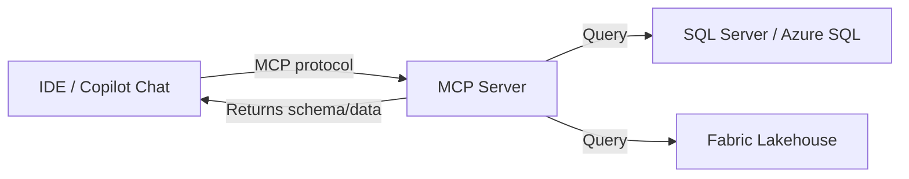

# MCP Server Endpoints

## Overview

The Model Context Protocol (MCP) is an open standard that allows AI tools (like GitHub Copilot) to connect to external data sources. For DP-800, the key endpoints are the Microsoft SQL Server MCP server and the Fabric lakehouse MCP server.

## What is MCP?

MCP provides a standardized way for AI assistants to:
- **Read data** from external systems (databases, files, APIs)
- **Execute tools** (run queries, fetch schema information)
- **Maintain context** about data sources during a conversation



## Connecting to MCP Server Endpoints

### SQL Server MCP Server

The SQL Server MCP server allows Copilot to query schema and data from a SQL Server or Azure SQL instance.

```json
// .vscode/mcp.json
{
    "servers": {
        "sql-developer": {
            "type": "stdio",
            "command": "npx",
            "args": ["-y", "@modelcontextprotocol/server-mssql"],
            "env": {
                "MSSQL_CONNECTION_STRING": "Server=myserver.database.windows.net;Database=mydb;Authentication=ActiveDirectoryInteractive;"
            }
        }
    }
}
```

**With Managed Identity (passwordless):**

```json
{
    "servers": {
        "sql-developer": {
            "type": "stdio",
            "command": "npx",
            "args": ["-y", "@modelcontextprotocol/server-mssql"],
            "env": {
                "MSSQL_CONNECTION_STRING": "Server=myserver.database.windows.net;Database=mydb;Authentication=ActiveDirectoryManagedIdentity;"
            }
        }
    }
}
```

### Fabric Lakehouse MCP Server

The Fabric lakehouse MCP server exposes lakehouse tables and files to Copilot:

```json
{
    "servers": {
        "fabric-lakehouse": {
            "type": "http",
            "url": "https://api.fabric.microsoft.com/v1/workspaces/{workspaceId}/lakehouses/{lakehouseId}/mcp",
            "headers": {
                "Authorization": "Bearer ${env:FABRIC_TOKEN}"
            }
        }
    }
}
```

## Configuring MCP in a Copilot Chat Session

### Enabling Tools

In GitHub Copilot Chat:
1. Open the chat panel (`Ctrl+Shift+I`)
2. Click the **Tools** button (wrench icon) at the bottom
3. Toggle on the MCP servers you want active in this session
4. Reference tools explicitly: `#sql-developer` or use them implicitly

### Using MCP in Chat

```text
// With SQL Server MCP connected:
@workspace What tables exist in the dbo schema?

List all stored procedures and describe what each one does.

Write a query to find all customers with orders over $1000 using the actual schema.
```

When connected via MCP, Copilot has access to:
- Schema metadata (tables, columns, types, indexes)
- Stored procedure and function definitions
- View definitions
- Real-time query execution (if read access is configured)

## Securing MCP Endpoints

### Managed Identity for SQL Server

```json
// Use Managed Identity instead of username/password
"MSSQL_CONNECTION_STRING": "Server=tcp:myserver.database.windows.net,1433;Database=mydb;Authentication=ActiveDirectoryManagedIdentity;"
```

### Least Privilege for MCP

Create a dedicated read-only user for MCP access:

```sql
-- Create MCP service account
CREATE USER [mcp-reader] FROM EXTERNAL PROVIDER;

-- Grant schema view permissions (for schema discovery)
GRANT VIEW DEFINITION ON SCHEMA::dbo TO [mcp-reader];
GRANT SELECT ON SCHEMA::dbo TO [mcp-reader];

-- Restrict from sensitive tables
DENY SELECT ON dbo.CustomerPayments TO [mcp-reader];
```

### Network Security

```text
Azure SQL → Networking:
- Enable service endpoints or Private Link
- Restrict firewall to only allow MCP server IP
- Use Azure AD authentication (disable SQL auth)
```

## MCP vs Direct Database Connection

| Aspect | MCP | Direct Connection |
| :--- | :--- | :--- |
| Purpose | AI tool context | Application queries |
| Auth | Service principal / Managed Identity | App credentials |
| Access | Schema + limited query | Full application access |
| Audit | Through Azure Monitor | Through SQL Audit |
| Scope | Development/IDE use | Production queries |

## Use Cases

- **Schema-aware completions**: Copilot suggests correct column names and types
- **Query generation**: Copilot writes queries that reference actual table structure
- **Stored procedure analysis**: Copilot reads existing procedures and suggests improvements
- **Data exploration**: Copilot explains what data exists and how tables relate

## Exam Tips

- MCP configuration goes in `.vscode/mcp.json` for VS Code / Azure Data Studio
- Use **Managed Identity** authentication for MCP connections (not username/password)
- MCP gives Copilot **read access to schema** — configure least-privilege accordingly
- Tool options in a chat session can be toggled on/off per session

## Key Takeaways

- MCP standardizes how AI tools access external data sources
- SQL Server and Fabric lakehouse both have MCP server implementations
- Always use Managed Identity or service principals — never hardcoded credentials
- Grant only the minimum permissions the MCP service account needs

## Related Topics

- [02-GitHub Copilot Setup](./02-github-copilot-setup.md)
- [03-Permissions & Access](../05-data-security-compliance/03-permissions-access.md)
- [05-Secure Endpoints](../05-data-security-compliance/05-secure-endpoints.md)

## Official Documentation

- [Model Context Protocol (MCP) Spec](https://modelcontextprotocol.io/)
- [SQL Server MCP Server](https://learn.microsoft.com/en-us/sql/tools/mcp/overview)
- [Microsoft Fabric MCP](https://learn.microsoft.com/en-us/fabric/fundamentals/copilot-fabric-overview)

---

**[← Previous](./02-github-copilot-setup.md) | [↑ Back to Section](./README.md)**
