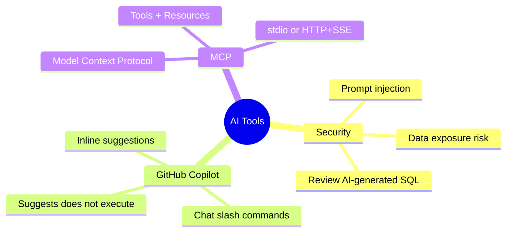
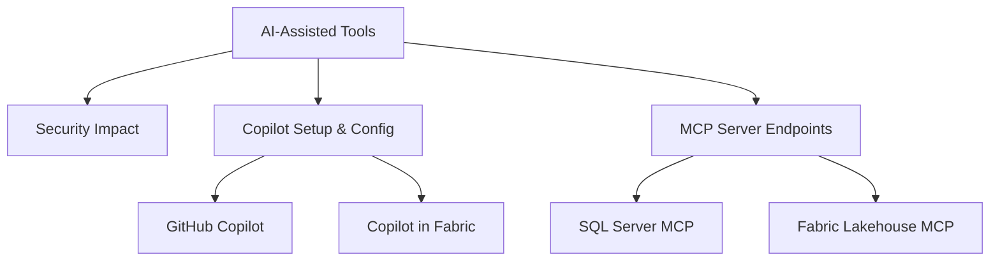

# Design and Implement SQL Solutions Using AI-Assisted Tools (Domain 1 — 35–40%)

Using GitHub Copilot and Microsoft Copilot in Fabric to accelerate SQL development — including configuration, security implications, and MCP server connectivity.

---

## Quick Recall

---

## Topics Overview

## Section Contents

| File | Topic | Priority |
| :--- | :--- | :--- |
| [01-ai-security-impact.md](01-ai-security-impact.md) | Security impact of AI-assisted tools | High |
| [02-github-copilot-setup.md](02-github-copilot-setup.md) | Enabling Copilot, instruction files, model options | High |
| [03-mcp-server-endpoints.md](03-mcp-server-endpoints.md) | MCP protocol, SQL Server and Fabric endpoints | Medium |

## Key Concepts

- **AI Security Impact**: Data exposure risks, prompt injection, credential leakage
- **GitHub Copilot Instruction Files**: `.github/copilot-instructions.md` for repo context
- **Model Context Protocol (MCP)**: Standardized protocol for AI tools to access data sources
- **Copilot in Fabric**: Microsoft's integrated AI assistant for Fabric workloads
- **MCP Tool Options**: Configure which tools and capabilities are available in a session

## Related Resources

- [03-Advanced T-SQL](../03-advanced-tsql/advanced-tsql.md)
- [05-Data Security & Compliance](../05-data-security-compliance/data-security-compliance.md)
- [Official: GitHub Copilot for SQL](https://learn.microsoft.com/en-us/azure/azure-sql/copilot/copilot-azure-sql-overview)

## Next Steps

Proceed to [05-Data Security & Compliance](../05-data-security-compliance/data-security-compliance.md) to learn about encryption, masking, RLS, and auditing.

---

**[← Back to Advanced T-SQL](../03-advanced-tsql/advanced-tsql.md) | [↑ Back to Certification](../dp-800-overview.md)**
