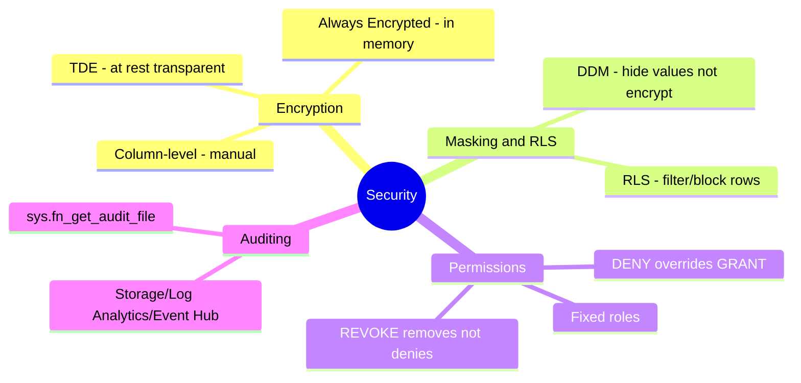
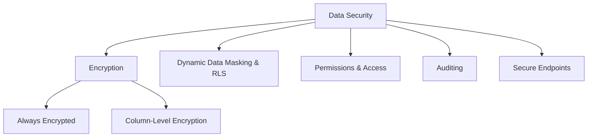

# Implement Data Security and Compliance (Domain 2 — 35–40%)

Securing SQL database solutions through encryption, data masking, row-level security, permission management, and auditing.

---

## Quick Recall

---

## Topics Overview

## Section Contents

| File | Topic | Priority |
| :--- | :--- | :--- |
| [01-encryption.md](01-encryption.md) | Always Encrypted, column-level encryption | High |
| [02-dynamic-data-masking-rls.md](02-dynamic-data-masking-rls.md) | Dynamic Data Masking and Row-Level Security | High |
| [03-permissions-access.md](03-permissions-access.md) | Object-level permissions, passwordless access | High |
| [04-auditing.md](04-auditing.md) | Database and server auditing | Medium |
| [05-secure-endpoints.md](05-secure-endpoints.md) | Managed Identity, GraphQL/REST/MCP endpoint security | Medium |

## Key Concepts

- **Always Encrypted**: Client-side encryption — server never sees plaintext; uses column master keys
- **Column-Level Encryption**: Server-side using certificates or asymmetric keys
- **Dynamic Data Masking (DDM)**: Obscures sensitive data in query results without changing stored data
- **Row-Level Security (RLS)**: Inline table-valued function predicates control row visibility per user
- **Managed Identity**: Passwordless authentication to Azure services
- **Auditing**: Track database events to storage account, Event Hub, or Log Analytics

## Related Resources

- [04-AI-Assisted Tools](../04-ai-assisted-tools/README.md)
- [06-Performance Optimization](../06-performance-optimization/README.md)
- [Official: Always Encrypted](https://learn.microsoft.com/en-us/sql/relational-databases/security/encryption/always-encrypted-database-engine)

## Next Steps

Proceed to [06-Performance Optimization](../06-performance-optimization/README.md) to learn about query tuning and performance monitoring.

---

**[← Back to AI-Assisted Tools](../04-ai-assisted-tools/README.md) | [↑ Back to Certification](../README.md)**
