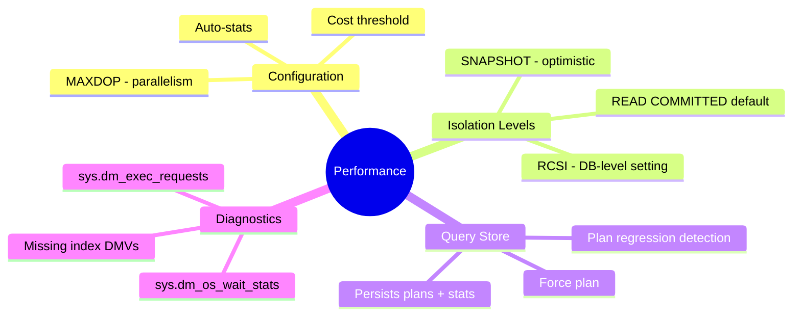
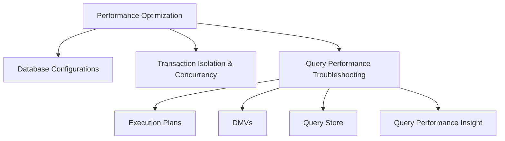

# Optimize Database Performance (Domain 2 — 35–40%)

Database configuration recommendations, concurrency controls, and query performance investigation using execution plans, DMVs, Query Store, and Query Performance Insight.

---

## Quick Recall

---

## Topics Overview

## Section Contents

| File | Topic | Priority |
| :--- | :--- | :--- |
| [01-database-configurations.md](01-database-configurations.md) | Database and server configuration recommendations | Medium |
| [02-transaction-isolation-concurrency.md](02-transaction-isolation-concurrency.md) | Isolation levels, blocking, deadlocks, RCSI | High |
| [03-query-performance-troubleshooting.md](03-query-performance-troubleshooting.md) | Execution plans, DMVs, Query Store, QPI | High |

## Key Concepts

- **Transaction Isolation Levels**: READ UNCOMMITTED, READ COMMITTED, REPEATABLE READ, SNAPSHOT, SERIALIZABLE
- **RCSI (Read Committed Snapshot Isolation)**: Readers don't block writers — enabled via database option
- **Execution Plans**: Estimated vs actual; key operators: Hash Join, Nested Loops, Sort, Index Scan vs Seek
- **DMVs**: `sys.dm_exec_query_stats`, `sys.dm_exec_requests`, `sys.dm_os_wait_stats`
- **Query Store**: Captures query plans and runtime statistics; force plans for regression prevention
- **Blocking & Deadlocks**: Extended Events and deadlock graph for diagnosis

## Related Resources

- [05-Data Security & Compliance](../05-data-security-compliance/data-security-compliance.md)
- [07-CI/CD Database Projects](../07-cicd-database-projects/cicd-database-projects.md)
- [Official: Query Store](https://learn.microsoft.com/en-us/sql/relational-databases/performance/monitoring-performance-by-using-the-query-store)

## Next Steps

Proceed to [07-CI/CD Database Projects](../07-cicd-database-projects/cicd-database-projects.md) to learn about SQL Database Projects and deployment pipelines.

---

**[← Back to Data Security](../05-data-security-compliance/data-security-compliance.md) | [↑ Back to Certification](../dp-800-overview.md)**
