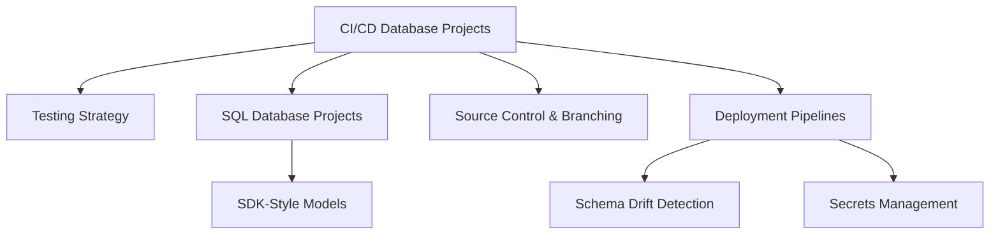

# Implement CI/CD by Using SQL Database Projects (Domain 2 — 35–40%)

Building robust deployment pipelines for SQL database solutions using SQL Database Projects (SDK-style), source control in GitHub, and automated testing strategies.

## Topics Overview

## Section Contents

| File | Topic | Priority |
| :--- | :--- | :--- |
| [01-testing-strategy.md](01-testing-strategy.md) | Unit tests, integration tests, reference data | High |
| [02-sql-database-projects.md](02-sql-database-projects.md) | SDK-style projects, build, validate | High |
| [03-source-control-branching.md](03-source-control-branching.md) | Git config, branching, PRs, conflict resolution | High |
| [04-deployment-pipelines.md](04-deployment-pipelines.md) | Schema drift, secrets, pipeline controls | High |

## Key Concepts

- **SQL Database Projects**: Declarative schema management — `.sqlproj` files for source-controlled databases
- **SDK-Style Projects**: Modern MSBuild SDK format (`<Project Sdk="Microsoft.Build.Sql">`)
- **Schema Drift**: When the deployed schema diverges from source control; detected via `sqlpackage` drift reports
- **Secrets Management**: Azure Key Vault integration in pipelines; never hardcode credentials
- **Branching Policies**: Require PR reviews, status checks, and code owners before merging
- **dacpac**: Deployment artifact produced by building a SQL Database Project

## Related Resources

- [06-Performance Optimization](../06-performance-optimization/README.md)
- [08-Azure Services Integration](../08-azure-services-integration/README.md)
- [Official: SQL Database Projects](https://learn.microsoft.com/en-us/azure-data-studio/extensions/sql-database-project-extension)

## Next Steps

Proceed to [08-Azure Services Integration](../08-azure-services-integration/README.md) to learn about Data API Builder, REST/GraphQL endpoints, and change event handling.

---

**[← Back to Performance Optimization](../06-performance-optimization/README.md) | [↑ Back to Certification](../README.md)**
