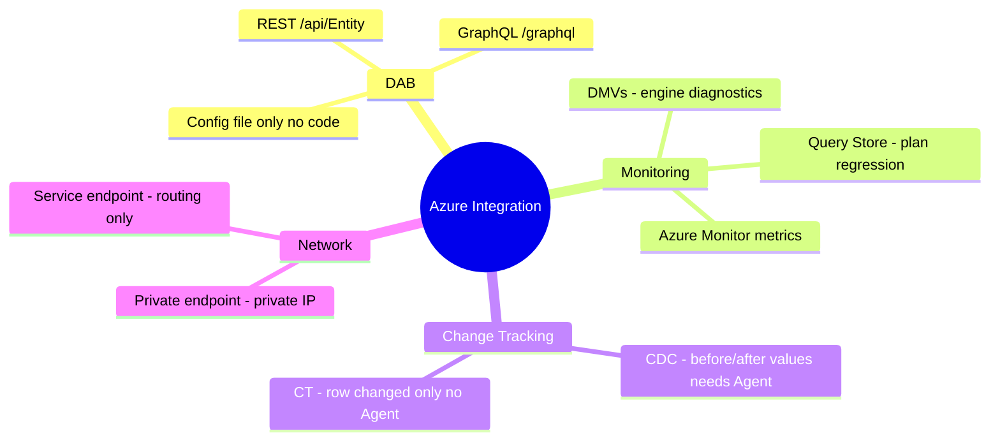
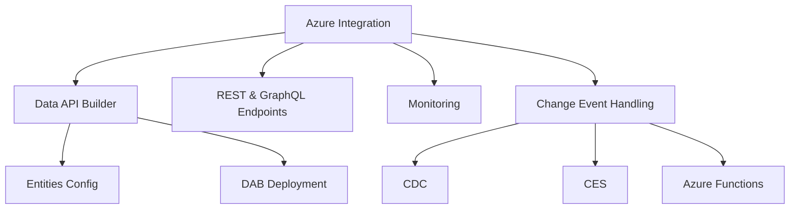

# Integrate SQL Solutions with Azure Services (Domain 2 — 35–40%)

Integrating SQL databases with Azure services including Data API Builder (DAB), REST/GraphQL endpoints, monitoring with Azure Monitor, and change event handling.

---

## Quick Recall

---

## Topics Overview

## Section Contents

| File | Topic | Priority |
| :--- | :--- | :--- |
| [01-data-api-builder.md](01-data-api-builder.md) | DAB configuration, entities, REST/GraphQL | High |
| [02-rest-graphql-endpoints.md](02-rest-graphql-endpoints.md) | Endpoint config, pagination, caching, filtering | High |
| [03-monitoring.md](03-monitoring.md) | Azure Monitor, Application Insights, Log Analytics | Medium |
| [04-change-event-handling.md](04-change-event-handling.md) | CDC, CES, Change Tracking, Azure Functions, Logic Apps | High |

## Key Concepts

- **Data API Builder (DAB)**: Open-source tool that generates REST and GraphQL APIs from database objects
- **DAB Configuration**: `dab-config.json` defines data sources, entities, authentication, and caching
- **GraphQL Relationships**: DAB exposes foreign key relationships as nested GraphQL types
- **Change Data Capture (CDC)**: Captures row-level changes in SQL Server/Azure SQL at the transaction log level
- **Change Event Streaming (CES)**: Near-real-time event stream from SQL databases in Fabric
- **Azure Functions SQL Trigger Binding**: Triggers a function on data changes using CDC under the hood

## Related Resources

- [07-CI/CD Database Projects](../07-cicd-database-projects/cicd-database-projects.md)
- [09-Models & Embeddings](../09-models-embeddings/models-embeddings.md)
- [Official: Data API Builder](https://learn.microsoft.com/en-us/azure/data-api-builder/overview-to-data-api-builder)

## Next Steps

Proceed to [09-Models & Embeddings](../09-models-embeddings/models-embeddings.md) to start exploring AI capabilities.

---

**[← Back to CI/CD Database Projects](../07-cicd-database-projects/cicd-database-projects.md) | [↑ Back to Certification](../dp-800-overview.md)**
