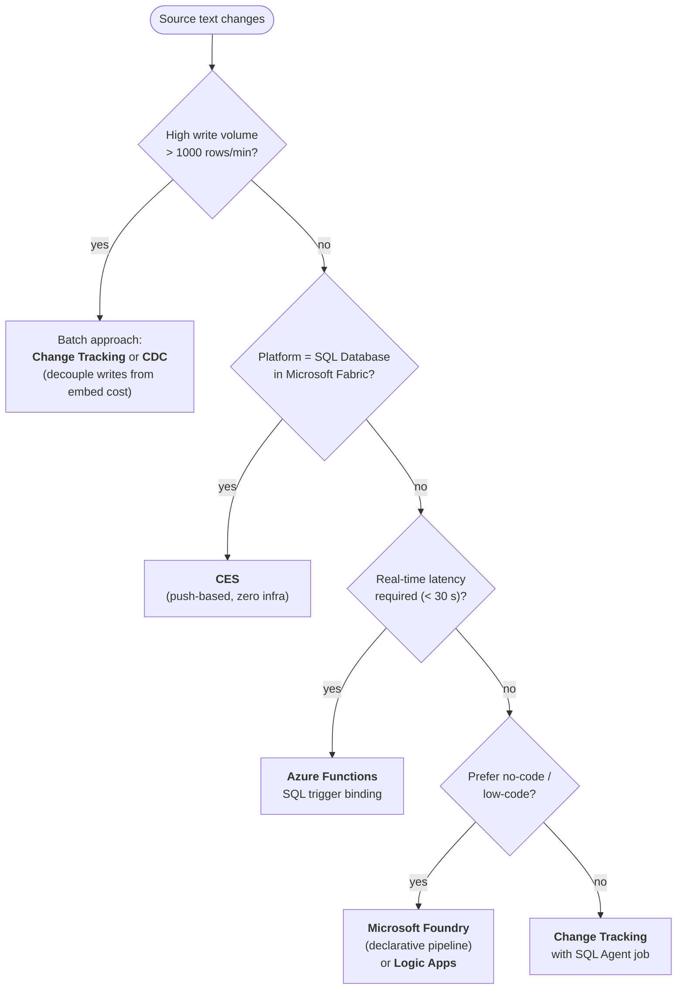

# Embedding Maintenance

## Overview

**Embeddings** stored in a vector column go stale when the source text changes. Maintaining embeddings means detecting when source data changes, re-generating embeddings for affected rows, and updating the vector column. Several approaches exist — each with different tradeoffs in complexity, latency, cost, and infrastructure requirements.

> [!abstract]
>
> - Covers when and how to regenerate embeddings: model changes, schema changes, data updates, and dirty tracking
> - Embeddings are point-in-time snapshots of text meaning — they go stale when the underlying text or model changes
> - Key exam topics: model version incompatibility, dirty tracking with a flag column, batch vs incremental refresh

> [!tip] What the Exam Tests
>
> - Changing embedding models requires **regenerating ALL embeddings** — vectors from different models are in different dimensional spaces and cannot be mixed
> - Dirty tracking: add an `EmbeddingDirty BIT DEFAULT 1` column; set to 0 after embedding; UPDATE sets back to 1 via trigger or app logic
> - Batch refresh = regenerate all at once (simple, offline); incremental = process only dirty rows (complex, online)

---

## Embedding Maintenance Methods Comparison

| Method | Latency | Complexity | Infrastructure | Best For |
| :--- | :--- | :--- | :--- | :--- |
| Table Triggers | Near real-time | Low | ==None (in-DB)== | Small tables, low write volume |
| Change Tracking | Low (polling) | Medium | SQL Agent or scheduler | Moderate volume, batch-friendly |
| CDC | Medium (polling) | Medium | SQL Agent (on-prem) | Audit trail needed with embeddings |
| CES (Fabric) | Near real-time | Low | Fabric only | Fabric SQL, cloud-native |
| Azure Functions SQL Trigger | Near real-time | Medium | Azure Functions | Any Azure SQL, event-driven |
| Azure Logic Apps | Minutes | Low | Logic Apps | Low-code, low-volume |
| Microsoft Foundry | Configurable | Low | Fabric/Foundry | Declarative AI pipeline |

---

## Method 1: Table Triggers

Triggers fire synchronously on INSERT/UPDATE, calling the embedding model immediately.

```sql
-- Requires an external model already registered
-- CREATE EXTERNAL MODEL [MyEmbeddingModel] ...

CREATE OR ALTER TRIGGER trg_Products_EmbedDescription
ON dbo.Products
AFTER INSERT, UPDATE
AS
BEGIN
    SET NOCOUNT ON;

    -- Only regenerate if the Description actually changed
    IF UPDATE(Description)
    BEGIN
        UPDATE p
        SET DescriptionEmbedding = CAST(
            PREDICT(MODEL = [MyEmbeddingModel],
                    DATA = (SELECT i.Description AS input_text)) AS VECTOR(1536))
        FROM dbo.Products p
        INNER JOIN inserted i ON p.ProductId = i.ProductId;
    END;
END;
```

**Tradeoffs:**

- Simple — no external infrastructure
- Adds latency to every INSERT/UPDATE (synchronous API call)
- If the AI endpoint is unavailable, the write transaction fails
- Not suitable for high-volume write tables (each row = one API call)

---

## Method 2: Change Tracking (Batch Polling)

Change Tracking records which rows changed; a background job re-embeds them in batches.

```sql
-- Enable Change Tracking on the database and table
ALTER DATABASE MyDB SET CHANGE_TRACKING = ON
    (CHANGE_RETENTION = 7 DAYS, AUTO_CLEANUP = ON);

ALTER TABLE dbo.Products
ENABLE CHANGE_TRACKING WITH (TRACK_COLUMNS_UPDATED = ON);

-- Watermark table
CREATE TABLE dbo.EmbeddingWatermark (
    TableName    NVARCHAR(100) PRIMARY KEY,
    SyncVersion  BIGINT NOT NULL
);
INSERT INTO dbo.EmbeddingWatermark VALUES ('Products', CHANGE_TRACKING_CURRENT_VERSION());
```

```sql
-- Embedding maintenance job (runs on a schedule via SQL Agent or App Service)
DECLARE @last_version BIGINT;
SELECT @last_version = SyncVersion FROM dbo.EmbeddingWatermark WHERE TableName = 'Products';

-- Find products whose Description changed since last run
UPDATE p
SET DescriptionEmbedding = CAST(
    PREDICT(MODEL = [MyEmbeddingModel],
            DATA = (SELECT p2.Description AS input_text)) AS VECTOR(1536))
FROM dbo.Products p
INNER JOIN CHANGETABLE(CHANGES dbo.Products, @last_version) AS ct
    ON p.ProductId = ct.ProductId
CROSS APPLY (SELECT p.Description) p2(Description)
WHERE ct.SYS_CHANGE_COLUMNS IS NULL  -- all columns changed (no column tracking)
   OR CHANGE_TRACKING_IS_COLUMN_IN_MASK(
        COLUMNPROPERTY(OBJECT_ID('dbo.Products'), 'Description', 'ColumnId'),
        ct.SYS_CHANGE_COLUMNS) = 1;  -- specifically Description changed

-- Update watermark
UPDATE dbo.EmbeddingWatermark
SET SyncVersion = CHANGE_TRACKING_CURRENT_VERSION()
WHERE TableName = 'Products';
```

**Tradeoffs:**

- Decouples write performance from embedding generation
- Latency = polling interval (seconds to minutes)
- Resilient to AI endpoint failures (retry at next poll)
- Requires a scheduler (SQL Agent, Azure Automation, App Service WebJob)

---

## Method 3: CDC (Change Data Capture)

CDC captures before/after values; useful when you need to know what changed before updating the embedding.

```sql
-- After enabling CDC on the database and Products table...
DECLARE @from_lsn BINARY(10);
DECLARE @to_lsn   BINARY(10) = sys.fn_cdc_get_max_lsn();

SELECT @from_lsn = LastLSN FROM dbo.EmbeddingCDCWatermark WHERE TableName = 'dbo_Products';

-- Get only changed rows (net changes — final state)
WITH ChangedProducts AS (
    SELECT ProductId
    FROM cdc.fn_cdc_get_net_changes_dbo_Products(@from_lsn, @to_lsn, 'all')
    WHERE __$operation IN (2, 5)  -- INSERT or INSERT_OR_UPDATE
)
UPDATE p
SET DescriptionEmbedding = CAST(
    PREDICT(MODEL = [MyEmbeddingModel],
            DATA = (SELECT p.Description AS input_text)) AS VECTOR(1536))
FROM dbo.Products p
INNER JOIN ChangedProducts cp ON p.ProductId = cp.ProductId;

-- Update CDC watermark
UPDATE dbo.EmbeddingCDCWatermark
SET LastLSN = @to_lsn
WHERE TableName = 'dbo_Products';
```

---

## Method 4: Azure Functions with SQL Trigger Binding

Azure Functions can listen for table changes and call the OpenAI API to regenerate embeddings asynchronously.

```csharp
[FunctionName("UpdateProductEmbeddings")]
public static async Task Run(
    [SqlTrigger("[dbo].[Products]", "SqlConnectionString")]
    IReadOnlyList<SqlChange<Product>> changes,
    [Sql("[dbo].[Products]", "SqlConnectionString")] IAsyncCollector<Product> productsOut,
    ILogger log)
{
    var openAiClient = new OpenAIClient(new Uri(openAiEndpoint), new AzureKeyCredential(apiKey));

    foreach (var change in changes.Where(c =>
        c.Operation == SqlChangeOperation.Insert || c.Operation == SqlChangeOperation.Update))
    {
        if (change.Item.Description == null) continue;

        var embeddings = await openAiClient.GetEmbeddingsAsync(
            new EmbeddingsOptions("text-embedding-3-small", new[] { change.Item.Description }));

        var updatedProduct = change.Item with
        {
            DescriptionEmbedding = embeddings.Value.Data[0].Embedding.ToArray()
        };

        // Write updated embedding back to SQL
        await productsOut.AddAsync(updatedProduct);
    }
}
```

**Tradeoffs:**

- Event-driven — near real-time with minimal polling overhead
- Infrastructure: requires Azure Functions deployment and configuration
- Resilient: Azure Functions handles retries on failure
- Can process changes in batches (multiple rows per trigger invocation)

---

## Method 5: CES (Change Event Streaming — Fabric)

In Fabric SQL Database, CES streams changes to an Eventstream, which triggers a Data Pipeline or Notebook to re-generate embeddings.

```text
Fabric SQL DB (Products table)
    → CES (Change Event Streaming)
        → Fabric Eventstream
            → Fabric Notebook (Python)
                → Azure OpenAI: generate embedding
                → Write back to SQL Database
```

```python
# Fabric Notebook: process CES events and update embeddings
import openai
import pyodbc

for event in eventstream_batch:
    product_id = event["ProductId"]
    description = event["Description"]

    # Generate embedding
    response = openai.embeddings.create(
        model="text-embedding-3-small",
        input=description
    )
    embedding = response.data[0].embedding  # list of 1536 floats

    # Update the SQL Database
    cursor.execute(
        "UPDATE dbo.Products SET DescriptionEmbedding = ? WHERE ProductId = ?",
        (str(embedding), product_id)
    )
```

---

## Method 6: Azure Logic Apps

Logic Apps polls for changes on a schedule and calls the embedding API via an HTTP action.

```text
Logic App:
├── Trigger: Recurrence (every 5 minutes)
├── Action: SQL - Execute Stored Procedure → dbo.GetProductsNeedingEmbedding
├── For Each (products):
│   ├── Action: HTTP POST to Azure OpenAI embeddings endpoint
│   └── Action: SQL - Execute Query → UPDATE dbo.Products SET Embedding = ?
└── End
```

```sql
-- Stored procedure to find products needing embedding refresh
CREATE OR ALTER PROCEDURE dbo.GetProductsNeedingEmbedding
    @BatchSize INT = 50
AS
BEGIN
    SELECT TOP (@BatchSize)
        ProductId,
        Description
    FROM dbo.Products
    WHERE DescriptionEmbedding IS NULL
       OR DescriptionLastUpdated > EmbeddingGeneratedAt
    ORDER BY DescriptionLastUpdated ASC;
END;
```

---

## Method 7: Microsoft Foundry

**Microsoft Foundry** (formerly Azure AI Foundry; rebranded late 2025) is the declarative, **most-managed** option on the DP-800 blueprint. You design an embedding pipeline visually or in YAML, point it at a SQL source, deploy, and Foundry handles **chunking, batching, retries, throttling, monitoring, and write-back** — no T-SQL, no Python, no Logic App glue.

It shows up on the 2026-03-12 blueprint as one of the named embedding-maintenance methods, so expect at least one DP-800 question that asks you to **pick Foundry vs CES vs CDC vs triggers** for a given scenario.

### Architecture

```text
Foundry Project
├── Connections:
│   ├── SQL connection (Azure SQL DB / SQL DB in Fabric / on-prem via SHIR)
│   └── Embedding model deployment (text-embedding-3-small / -large / ada-002 legacy)
├── Pipeline / Flow:
│   ├── Source step:   SELECT ProductId, Description, LastUpdated
│   │                  FROM dbo.Products
│   │                  WHERE DescriptionEmbedding IS NULL
│   │                     OR LastUpdated > EmbeddingGeneratedAt
│   ├── Chunk step:    (optional) split long Description into N-token chunks
│   ├── Embed step:    POST chunks to the model deployment in batch
│   └── Sink step:     UPDATE dbo.Products SET DescriptionEmbedding = @vec,
│                                              EmbeddingGeneratedAt = SYSUTCDATETIME()
│                                          WHERE ProductId = @id
└── Trigger:
    ├── Scheduled (cron, recurrence)
    ├── Event-driven (Fabric Eventstream / Event Grid)
    └── On-demand (Foundry SDK / REST API)
```

### Step-by-step setup (typical)

1. **Create a Foundry project** in the Microsoft Foundry portal (<https://ai.azure.com/>). Pick a region close to your SQL endpoint to minimise embedding-call latency.
2. **Deploy the embedding model** — `text-embedding-3-small` (1 536 dims) is the standard choice; `text-embedding-3-large` (3 072 dims) for higher recall at higher cost; `ada-002` is legacy and rarely the right pick today.
3. **Add a SQL connection** under the project's **Connections** pane. For passwordless, attach a Managed Identity to the Foundry project and grant `db_datareader` + `db_datawriter` (or a more scoped role) on the target database. **Do not** store SQL passwords in Foundry connection strings — Managed Identity is the GA pattern Microsoft expects on DP-800.
4. **Author the pipeline** either via the visual editor or via a YAML flow definition. The minimum shape is the four steps above (source → chunk → embed → sink).
5. **Attach a trigger** — scheduled recurrence for batch-style refresh, or event-driven (via a Fabric Eventstream subscribed to CES from the source DB) for near-real-time.
6. **Deploy the pipeline.** Foundry handles retry/back-off on transient model-deployment errors automatically.
7. **Monitor** via the Foundry project's built-in run-history pane — every run records source rows processed, tokens consumed, sink rows updated, and any per-row failures.

### When to choose Foundry

```text
Use Foundry when:
✓ You want NO code (declarative pipeline > triggers/jobs)
✓ Embedding maintenance is one of several AI workflows you're orchestrating
  (RAG indexing, batch scoring, evaluation) and you want them in one place
✓ You're already in the Foundry/Fabric ecosystem
✓ You need centralised monitoring, cost tracking, and audit per AI workflow
✓ The pipeline shape is "SQL → embed → SQL" (the most-supported template)

Avoid Foundry when:
✗ Sub-30-second latency required from source change → embedding write
  (use CES + Notebook, or table triggers, instead)
✗ Your embedding logic needs custom Python (rich text preprocessing,
  multi-modal inputs, custom chunking) — pipelines can call out, but
  at that point a Fabric Notebook is simpler
✗ Source is purely on-prem with no Self-Hosted Integration Runtime
✗ Compliance forbids cross-region data flow that Foundry's hosted
  embedding endpoint would create
```

### Foundry vs CES — the canonical comparison

Both Foundry and CES (Change Event Streaming) appear on the blueprint as named methods, and the exam loves to contrast them.

| Aspect | Microsoft Foundry | CES (Change Event Streaming) |
| :--- | :--- | :--- |
| **Source platform** | SQL Server, Azure SQL DB, SQL DB in Fabric, on-prem (with SHIR) | SQL DB in Microsoft Fabric only |
| **Code required** | None (declarative pipeline) | Notebook code (Python) or Pipeline activities |
| **Trigger** | Schedule / event-driven / on-demand | Event-driven (push from CES) |
| **Latency** | Seconds to minutes (depending on trigger) | Near-real-time (push-based) |
| **Embedding logic** | Built-in `Embed` step | You write it in the Notebook |
| **Monitoring** | Foundry run history (centralised) | Eventstream + Notebook job history (split) |
| **Best for** | Multi-workflow AI projects, batch + scheduled refresh, no-code teams | Fabric-only deployments needing sub-30 s latency |

### What the exam will ask

> [!warning] Common Mistake
> "Microsoft Foundry **requires** Fabric" — false. Foundry connects to Azure SQL Database and on-prem SQL Server (via Self-Hosted Integration Runtime) too. CES is the Fabric-only one. Don't conflate them.

> [!note] Mental model — Foundry vs the others
> **Foundry is the "credit card" option** — pay (in service cost + lock-in) for ergonomics. **CES is the "tap to pay"** — fast and Fabric-native but only on the right rails. **CDC/Change Tracking are "bank transfers"** — they work everywhere but you write the plumbing. **Triggers are "cash"** — instant, but they cost write latency and stop scaling around a few thousand rows per minute.

```python
# Foundry handles the embedding call for you, but if you want to see what
# it does under the hood, this is approximately what the Embed step runs:
import requests

embedding = requests.post(
    "https://<your-foundry>.openai.azure.com/openai/deployments/text-embedding-3-small/embeddings?api-version=2024-02-01",
    headers={"api-key": "<managed-identity-token-from-foundry>"},
    json={"input": description}
).json()["data"][0]["embedding"]

# Foundry then writes back to SQL via the connection it manages — no T-SQL
# required from you. The whole pipeline declaration is YAML or visual.
```

---

## Choosing an Approach



---

## Use Cases

- **Product catalog**: New products or description updates trigger embedding regeneration via Azure Functions
- **Document library**: Daily batch job using Change Tracking re-embeds documents modified since last run
- **Fabric data platform**: CES-driven pipeline automatically keeps Lakehouse embeddings in sync with SQL source

---

## Common Issues & Errors

| Issue | Cause | Fix |
| :--- | :--- | :--- |
| Trigger causes timeouts on bulk loads | Trigger fires per-row for large imports | Disable trigger during bulk load; use batch re-embedding afterward |
| Change Tracking min version exceeded | Sync version older than retention period | Do a full re-embed of all rows; reset watermark |
| Embedding drift undetected | Source text updated without regenerating embedding | Add `EmbeddingGeneratedAt` column and compare to `UpdatedAt` |
| Azure Functions not firing | Change Tracking not enabled on table | SQL trigger binding auto-enables CT; verify `db_owner` permission |

---

## Exam Tips

> [!tip] Exam Tips
>
> - **Triggers**: Simplest but synchronous — adds AI API latency to every write; risky if endpoint is down
> - **Change Tracking**: Best for batch scenarios — decouple embedding from write path
> - **Azure Functions SQL trigger**: Event-driven alternative to polling — uses Change Tracking internally
> - **CES**: Fabric-native, zero-infrastructure — only available in SQL Database in Fabric
> - Always maintain a watermark (version or timestamp) to know which rows have been embedded

---

## Key Takeaways

- No single embedding maintenance method suits all scenarios — choose based on volume, latency, and infrastructure
- Synchronous approaches (triggers) have simplicity but risk tightly coupling writes to AI API availability
- Asynchronous batch approaches (Change Tracking, CDC) are more resilient but have higher embedding latency
- CES is the preferred Fabric-native approach when using SQL Database in Fabric

---

## Related Topics

- [01-External Models](./01-external-models.md)
- [03-Chunking & Generation](./03-chunking-generation.md)
- [04-Change & Event Handling](../08-azure-services-integration/04-change-event-handling.md)

---

## Official Documentation

- [Azure Functions SQL Trigger](https://learn.microsoft.com/en-us/azure/azure-functions/functions-bindings-azure-sql-trigger)
- [Change Tracking](https://learn.microsoft.com/en-us/sql/relational-databases/track-changes/about-change-tracking-sql-server)
- [Fabric Change Event Streaming](https://learn.microsoft.com/en-us/fabric/database/sql/change-event-streaming)

---

**[← Previous](./01-external-models.md) | [↑ Back to Section](./models-embeddings.md) | [Next →](./03-chunking-generation.md)**
