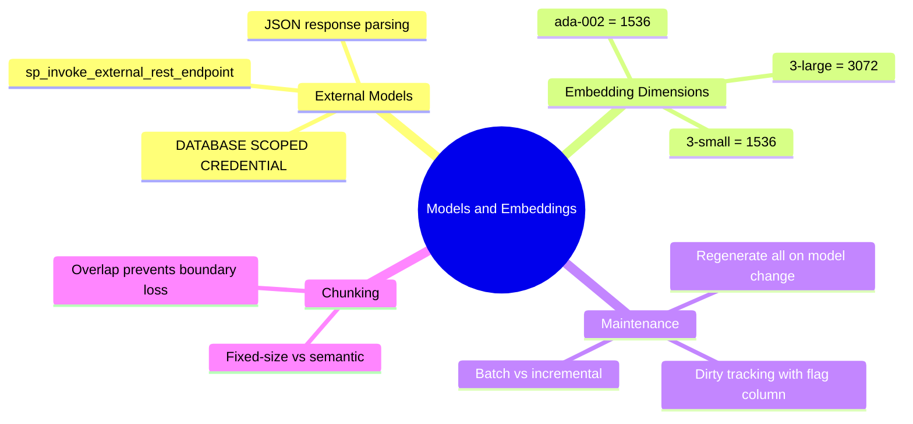
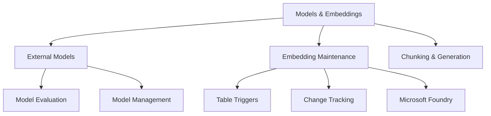

# Design and Implement Models and Embeddings (Domain 3 — 25–30%)

Evaluating and managing external AI models, designing embedding strategies, and generating embeddings for use in SQL databases.

---

## Quick Recall

---

## Topics Overview

## Section Contents

| File | Topic | Priority |
| :--- | :--- | :--- |
| [01-external-models.md](01-external-models.md) | Model evaluation, creation, and management | High |
| [02-embedding-maintenance.md](02-embedding-maintenance.md) | Maintenance methods: triggers, CT, CDC, CES, Azure Functions | High |
| [03-chunking-generation.md](03-chunking-generation.md) | Column selection, chunk design, generating embeddings | High |

## Key Concepts

- **External Models**: AI models registered in the database for inference (multimodal, multilanguage, structured output)
- **Embedding**: Dense vector representation of text/data used for semantic similarity search
- **Chunking**: Breaking content into overlapping/fixed-size segments before embedding
- **Embedding Maintenance**: Keeping embeddings in sync with source data changes
- **Microsoft Foundry**: Azure AI model hub for deploying and managing models
- **Structured Output**: Constraining model responses to a defined JSON schema

## Related Resources

- [08-Azure Services Integration](../08-azure-services-integration/azure-services-integration.md)
- [10-Intelligent Search](../10-intelligent-search/intelligent-search.md)
- [Official: AI in Azure SQL](https://learn.microsoft.com/en-us/azure/azure-sql/database/ai-artificial-intelligence-intelligent-insights-overview)

## Next Steps

Proceed to [10-Intelligent Search](../10-intelligent-search/intelligent-search.md) to learn about full-text, vector, and hybrid search.

---

**[← Back to Azure Services Integration](../08-azure-services-integration/azure-services-integration.md) | [↑ Back to Certification](../dp-800-overview.md)**
