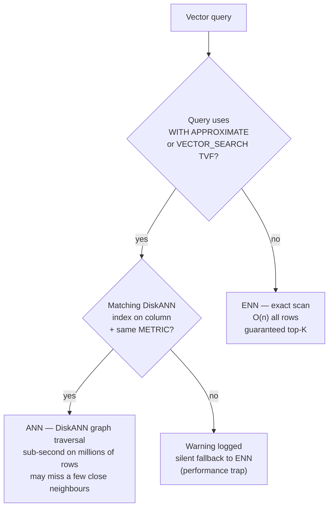

# Vector Search

## Overview

Vector search finds rows whose vector embeddings are mathematically similar to a query vector. This enables semantic search — finding conceptually related content even when exact keywords don't match. SQL Database in Fabric and Azure SQL support native vector search with the `VECTOR` data type, `VECTOR_DISTANCE` function, and `VECTOR_SEARCH` function with approximate nearest neighbor (ANN) indexing via DiskANN.

> [!abstract]
>
> - Covers the VECTOR data type, VECTOR_DISTANCE (exact search), VECTOR_SEARCH (approximate search), and DiskANN indexing
> - Vector search enables semantic similarity queries — finding conceptually related content, not just keyword matches
> - Key exam topics: ENN vs ANN distinction, choosing the right distance metric, VECTOR_NORMALIZE requirement

> [!tip] What the Exam Tests
>
> - `VECTOR_DISTANCE('cosine', v1, v2)` = **exact** nearest neighbor (ENN) — compares all rows; use when accuracy > speed
> - `VECTOR_SEARCH(TABLE, VECTOR(col), JSON_ARRAY(query_vector), top_n)` = **approximate** (ANN) via DiskANN — faster at scale
> - DiskANN supports `cosine`, `dot`, and `euclidean` metrics — the index metric **must match** the metric used in `VECTOR_SEARCH`

> [!note] 2026 status
>
> - `VECTOR` and `VECTOR_DISTANCE` — **GA** in SQL Server 2025 and Azure SQL Database.
> - `VECTOR_SEARCH`, `VECTOR_NORMALIZE`, `VECTORPROPERTY` — **public preview** on SQL Server 2025, Azure SQL Database, and SQL database in Microsoft Fabric. Fully testable on the exam.
> - **DiskANN vector index** — **public preview** across SQL Server 2025, Azure SQL Database, Azure SQL Managed Instance, and SQL database in Microsoft Fabric. SQL Server 2025 additionally requires `PREVIEW_FEATURES = ON`. Expect questions on metric matching.
> - **Half-precision (`float16`) vectors** — preview; halves storage at the same dimension count. The `VECTOR` type documented cap is **1 998** dimensions.

---

## VECTOR Data Type

```sql
-- Store a 1536-dimensional embedding (text-embedding-3-small or ada-002)
CREATE TABLE dbo.Products (
    ProductId         INT          NOT NULL PRIMARY KEY,
    ProductName       NVARCHAR(500) NOT NULL,
    Description       NVARCHAR(MAX) NOT NULL,
    DescriptionVector VECTOR(1536)  NULL      -- 1536 floats = 6 KB per row
);

-- Store a 3072-dimensional embedding (text-embedding-3-large)
ALTER TABLE dbo.Documents ADD ContentVector VECTOR(3072) NULL;

-- Insert a vector from a JSON array string
INSERT INTO dbo.Products (ProductId, ProductName, DescriptionVector)
VALUES (1, 'Wireless Headphones',
    CAST('[0.023, -0.041, 0.018, ...]' AS VECTOR(1536)));
```

---

## VECTOR_NORMALIZE

Normalize a vector to unit length (L2 norm = 1). Required before using dot product as a cosine similarity approximation:

```sql
-- Normalize a vector
SELECT VECTOR_NORMALIZE(DescriptionVector, 'norm2') AS NormalizedVector
FROM dbo.Products
WHERE ProductId = 1;

-- Normalize all vectors in-place
UPDATE dbo.Products
SET DescriptionVector = VECTOR_NORMALIZE(DescriptionVector, 'norm2')
WHERE DescriptionVector IS NOT NULL;
```

`'norm2'` = L2 (Euclidean) norm. After normalization, dot product distance equals cosine similarity.

---

## VECTORPROPERTY

Inspect properties of a vector value:

```sql
-- Get the number of dimensions in a vector
SELECT VECTORPROPERTY(DescriptionVector, 'Dimensions') AS Dims
FROM dbo.Products
WHERE ProductId = 1;
-- Returns: 1536

-- Get vector data type (float32 is the current supported type)
SELECT VECTORPROPERTY(DescriptionVector, 'BaseType') AS BaseType
FROM dbo.Products
WHERE ProductId = 1;
-- Returns: float32
```

---

## VECTOR_DISTANCE — Distance Metrics

`VECTOR_DISTANCE` computes the distance between two vectors. Smaller distance = more similar.

### Cosine Distance

Measures the angle between two vectors. Best for text embeddings where magnitude doesn't matter:

```sql
-- Find products most similar to a query embedding
DECLARE @query_vector VECTOR(1536) = CAST('[0.025, -0.038, ...]' AS VECTOR(1536));

SELECT TOP 10
    p.ProductId,
    p.ProductName,
    VECTOR_DISTANCE('cosine', p.DescriptionVector, @query_vector) AS CosineDistance
FROM dbo.Products p
WHERE p.DescriptionVector IS NOT NULL
ORDER BY CosineDistance ASC;  -- Lower = more similar
```

### Euclidean (L2) Distance

Measures straight-line distance between vectors in n-dimensional space:

```sql
SELECT TOP 10
    p.ProductId,
    p.ProductName,
    VECTOR_DISTANCE('euclidean', p.DescriptionVector, @query_vector) AS EuclideanDistance
FROM dbo.Products p
ORDER BY EuclideanDistance ASC;
```

### Dot Product Distance

Measures similarity as the dot product (inner product) of two vectors. When vectors are normalized, this is equivalent to cosine similarity:

```sql
-- Dot product: for normalized vectors, lower = less similar (inverse of cosine sim)
-- Note: this computes negative dot product as "distance"
SELECT TOP 10
    p.ProductId,
    p.ProductName,
    VECTOR_DISTANCE('dot', p.DescriptionVector, @query_vector) AS DotDistance
FROM dbo.Products p
ORDER BY DotDistance ASC;
```

### Distance Metric Comparison

| Metric | Formula | Range | Best For |
| :--- | :--- | :--- | :--- |
| `cosine` | 1 - cos(θ) | 0 to 2 | ==Text embeddings, direction-based similarity== |
| `euclidean` | √Σ(a-b)² | 0 to ∞ | Spatial/geometric data, normalized vectors |
| `dot` | 1 - Σ(aᵢ×bᵢ) | -∞ to +∞ | When vectors are already L2-normalized |

**Rule of thumb:** Use `cosine` for text embeddings — it is invariant to vector magnitude, which varies by document length.

---

## VECTOR_SEARCH — Approximate Nearest Neighbor

`VECTOR_SEARCH` uses a vector index (DiskANN) to perform approximate nearest neighbor (ANN) search — much faster than exact search for large tables.

```sql
-- ANN search using VECTOR_SEARCH (requires a vector index)
DECLARE @query_vector VECTOR(1536) = CAST('[...]' AS VECTOR(1536));

SELECT TOP 10
    p.ProductId,
    p.ProductName,
    vs.distance AS CosineDistance
FROM VECTOR_SEARCH(
    TABLE = dbo.Products AS p,
    COLUMN = DescriptionVector,
    SIMILAR_TO = @query_vector,
    METRIC = 'cosine',
    TOP_N = 50           -- retrieve top 50 candidates from index
) AS vs
ORDER BY vs.distance ASC
FETCH FIRST 10 ROWS ONLY;
```

The `TOP_N` parameter controls how many candidates the ANN index returns — a higher value increases recall at the cost of performance.

---

## Vector Index (DiskANN)

**DiskANN** (Disk-based Approximate Nearest Neighbor) is the vector index type in Azure SQL and Fabric SQL:

```sql
-- Create a DiskANN vector index on the DescriptionVector column
CREATE INDEX IX_Products_DescriptionVector
ON dbo.Products (DescriptionVector)
USING DISKANN
WITH (METRIC = 'cosine');  -- or 'euclidean', 'dot'

-- Rebuild the index after bulk inserts
ALTER INDEX IX_Products_DescriptionVector ON dbo.Products REBUILD;

-- Check index details
SELECT
    name,
    type_desc,
    is_disabled
FROM sys.indexes
WHERE object_id = OBJECT_ID('dbo.Products')
AND name = 'IX_Products_DescriptionVector';
```

### DiskANN Index Options

| Option | Description |
| :--- | :--- |
| `METRIC` | Distance metric: `cosine`, `euclidean`, or `dot` |
| Index type | DiskANN is the only supported vector index type |

### When the Optimizer Uses the Vector Index

The vector index is used automatically by `VECTOR_SEARCH` — it is not used by `VECTOR_DISTANCE` in a regular `ORDER BY` clause (which always does exact/ENN search).

---

## ANN vs ENN



| | ANN (Approximate) | ENN (Exact) |
| :--- | :--- | :--- |
| **Syntax (current)** | `SELECT TOP (N) ... ORDER BY VECTOR_DISTANCE(...) WITH APPROXIMATE` | `SELECT TOP (N) ... ORDER BY VECTOR_DISTANCE(...)` (no `WITH APPROXIMATE`) |
| **Syntax (legacy)** | `VECTOR_SEARCH(... TOP_N=N)` TVF — deprecated on latest indexes | `VECTOR_DISTANCE` in `ORDER BY` |
| **Accuracy** | May miss a few close neighbors | Guaranteed exact top-K |
| **Performance** | Sub-second on millions of rows | Linear scan — slow on large tables |
| **Use case** | Production search with large datasets | Small tables or validation |

```sql
-- ENN (Exact Nearest Neighbor) — scans every row
-- Accurate but slow for large tables
SELECT TOP 10
    ProductId, ProductName,
    VECTOR_DISTANCE('cosine', DescriptionVector, @query) AS dist
FROM dbo.Products
ORDER BY dist ASC;

-- ANN (Approximate Nearest Neighbor) — uses DiskANN index
-- Slightly less accurate but very fast
SELECT TOP 10
    p.ProductId, p.ProductName,
    vs.distance
FROM VECTOR_SEARCH(
    TABLE = dbo.Products AS p,
    COLUMN = DescriptionVector,
    SIMILAR_TO = @query,
    METRIC = 'cosine',
    TOP_N = 10
) AS vs
ORDER BY vs.distance;
```

---

## Converting Similarity to Distance

`VECTOR_DISTANCE('cosine', ...)` returns a **distance** (0 = identical, 2 = opposite). To express as similarity score (0 to 1):

```sql
SELECT
    ProductId,
    1.0 - VECTOR_DISTANCE('cosine', DescriptionVector, @query_vector) AS CosineSimilarity
FROM dbo.Products
ORDER BY CosineSimilarity DESC;
```

---

## Full Search Pattern with Query Embedding

```sql
-- Complete semantic search pattern:
-- 1. Generate embedding for the user's query
-- 2. Search for similar documents

-- Step 1: Generate query embedding (inline using PREDICT)
DECLARE @user_query NVARCHAR(500) = 'comfortable headphones for long meetings';
DECLARE @query_vector VECTOR(1536);

SELECT @query_vector = CAST(
    PREDICT(MODEL = [MyEmbeddingModel],
            DATA = (SELECT @user_query AS input_text)) AS VECTOR(1536));

-- Step 2: Find semantically similar products
SELECT TOP 10
    p.ProductId,
    p.ProductName,
    p.Description,
    vs.distance AS SemanticDistance,
    1.0 - vs.distance AS SemanticSimilarity
FROM VECTOR_SEARCH(
    TABLE = dbo.Products AS p,
    COLUMN = DescriptionVector,
    SIMILAR_TO = @query_vector,
    METRIC = 'cosine',
    TOP_N = 10
) AS vs
ORDER BY vs.distance ASC;
```

---

## Use Cases

- **Semantic product search**: "comfortable headphones for long meetings" finds noise-cancelling headphones even if the query words don't appear in product descriptions
- **Document retrieval (RAG)**: Find document chunks most relevant to a user question before generating an LLM response
- **Similar item recommendations**: "Customers who viewed X might also like Y" — find products with similar description embeddings
- **Duplicate detection**: Find near-duplicate rows where descriptions are semantically equivalent

---

## Common Issues & Errors

| Issue | Cause | Fix |
| :--- | :--- | :--- |
| `Cannot use VECTOR_DISTANCE on NULL` | NULL vector in column | Add `WHERE DescriptionVector IS NOT NULL` |
| Dimension mismatch error | Query vector dimension ≠ column dimension | Ensure query embedding uses the same model as stored embeddings |
| ANN results differ from ENN | Expected — ANN is approximate | Increase `TOP_N` in VECTOR_SEARCH for higher recall |
| Vector index not used | Using `VECTOR_DISTANCE` in ORDER BY, not `VECTOR_SEARCH` | ==Use `VECTOR_SEARCH` function to leverage the index== |
| Poor search results | Embeddings not normalized, using dot product | Either normalize vectors or use `cosine` metric |

---

## Exam Tips

> [!tip] Exam Tips
>
> - `VECTOR_DISTANCE('cosine', ...)` returns a **distance** (lower = more similar) — not a similarity score
> - `VECTOR_SEARCH` uses the DiskANN index (ANN); `VECTOR_DISTANCE` in ORDER BY is always ENN (exact)
> - The vector index metric (`cosine`, `euclidean`, `dot`) must match the metric used in `VECTOR_SEARCH`
> - `VECTOR(1536)` stores 1536 × 4 bytes = 6KB per row — factor this into storage planning
> - `VECTOR_NORMALIZE` with `'norm2'` normalizes to unit length — required before using dot product as cosine similarity

---

## Key Takeaways

- `VECTOR` data type stores fixed-dimension floating-point arrays
- `VECTOR_DISTANCE` computes exact distances; `VECTOR_SEARCH` uses ANN for scalable approximate search
- Create a DiskANN index on the vector column to enable fast ANN search
- Use cosine distance for text embeddings; it is robust to differences in vector magnitude

---

## Related Topics

- [01-Full-Text Search](./01-fulltext-search.md)
- [03-Hybrid Search & RRF](./03-hybrid-search-rrf.md)
- [03-Chunking & Generation](../09-models-embeddings/03-chunking-generation.md)
- [11-RAG: Use Cases](../11-rag/01-rag-use-cases.md) — vector search is the retrieval engine for RAG
- [11-RAG: Prompts and Responses](../11-rag/02-prompts-and-responses.md)

---

## Official Documentation

- [VECTOR Data Type](https://learn.microsoft.com/en-us/sql/t-sql/data-types/vector-data-type)
- [VECTOR_DISTANCE](https://learn.microsoft.com/en-us/sql/t-sql/functions/vector-distance-transact-sql)
- [VECTOR_SEARCH](https://learn.microsoft.com/en-us/sql/t-sql/functions/vector-search-transact-sql)
- [DiskANN Vector Index](https://learn.microsoft.com/en-us/azure/azure-sql/database/vector-index)

---

**[← Previous](./01-fulltext-search.md) | [↑ Back to Section](./intelligent-search.md) | [Next →](./03-hybrid-search-rrf.md)**
