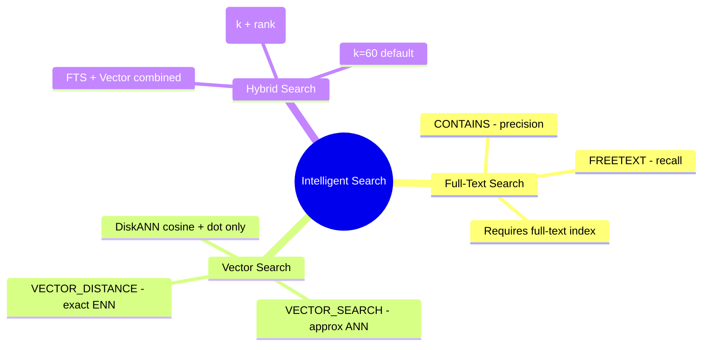
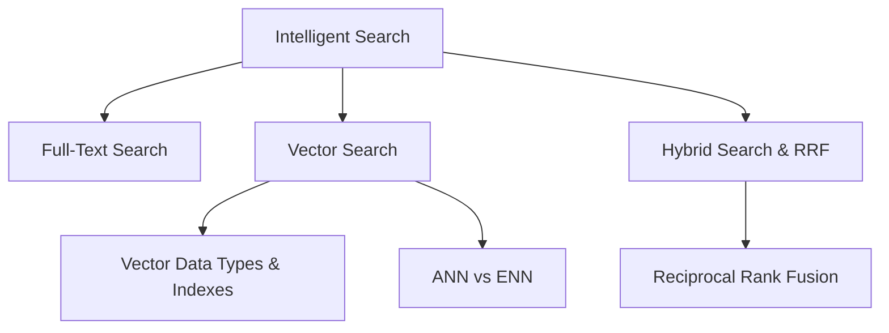

# Design and Implement Intelligent Search (Domain 3 — 25–30%)

Choosing and implementing the right search strategy — full-text, semantic vector, or hybrid — and evaluating vector index types, ANN vs ENN, and reciprocal rank fusion.

---

## Quick Recall

---

## Topics Overview

## Section Contents

| File | Topic | Priority |
| :--- | :--- | :--- |
| [01-fulltext-search.md](01-fulltext-search.md) | Full-text indexes, CONTAINS, FREETEXT, predicates | High |
| [02-vector-search.md](02-vector-search.md) | Vector data type, VECTOR_DISTANCE, VECTOR_SEARCH, indexes | High |
| [03-hybrid-search-rrf.md](03-hybrid-search-rrf.md) | Hybrid search, RRF implementation, performance evaluation | High |

## Key Concepts

- **Full-Text Search**: Linguistic-aware keyword search using full-text indexes and catalogs
- **Vector Search**: Semantic similarity search using cosine distance on embedding vectors
- **Hybrid Search**: Combining full-text and vector search results for broader recall
- **ANN (Approximate Nearest Neighbor)**: Fast approximate search using vector indexes (lower latency)
- **ENN (Exact Nearest Neighbor)**: Brute-force search across all vectors (higher accuracy)
- **VECTOR_SEARCH**: Built-in T-SQL function for vector similarity search
- **Reciprocal Rank Fusion (RRF)**: Algorithm to merge ranked lists from multiple search methods
- **VECTOR_NORMALIZE**: Normalizes a vector to unit length before comparison
- **VECTORPROPERTY**: Returns metadata about a vector column

## Related Resources

- [09-Models & Embeddings](../09-models-embeddings/models-embeddings.md)
- [11-RAG](../11-rag/rag.md)
- [Official: Vector Search in Azure SQL](https://learn.microsoft.com/en-us/azure/azure-sql/database/ai-artificial-intelligence-intelligent-insights-overview)

## Next Steps

Proceed to [11-RAG](../11-rag/rag.md) to learn about retrieval-augmented generation.

---

**[← Back to Models & Embeddings](../09-models-embeddings/models-embeddings.md) | [↑ Back to Certification](../dp-800-overview.md)**
