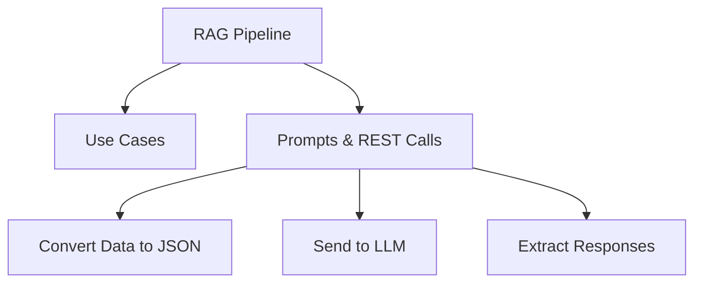

# Design and Implement Retrieval-Augmented Generation (RAG) (Domain 3 — 25–30%)

Building RAG pipelines that convert structured data to JSON, retrieve relevant context via vector search, and send prompts to language models using `sp_invoke_external_rest_endpoint`.

## Topics Overview

## Section Contents

| File | Topic | Priority |
| :--- | :--- | :--- |
| [01-rag-use-cases.md](01-rag-use-cases.md) | RAG use cases and architecture patterns | High |
| [02-prompts-and-responses.md](02-prompts-and-responses.md) | sp_invoke_external_rest_endpoint, JSON conversion, LLM responses | High |

## Key Concepts

- **RAG (Retrieval-Augmented Generation)**: Augments LLM prompts with retrieved context to reduce hallucinations
- **sp_invoke_external_rest_endpoint**: SQL Server stored procedure for calling external REST APIs (including AI model endpoints)
- **FOR JSON**: T-SQL clause to convert relational data to JSON for LLM processing
- **Grounding**: Providing factual context from the database in the prompt
- **Prompt Engineering**: Structuring system and user prompts for reliable model responses
- **Structured Output Extraction**: Parsing JSON responses from language models back into SQL

## Related Resources

- [10-Intelligent Search](../10-intelligent-search/README.md)
- [09-Models & Embeddings](../09-models-embeddings/README.md)
- [Official: sp_invoke_external_rest_endpoint](https://learn.microsoft.com/en-us/sql/relational-databases/system-stored-procedures/sp-invoke-external-rest-endpoint-transact-sql)

## Next Steps

This is the final domain section. After completing RAG:

1. Review the [Cheat Sheets](../resources/cheat-sheets/README.md) for all three domains
2. Complete [Domain 3 Practice Questions](../resources/practice-questions/03-ai-capabilities.md)
3. Take [Mock Exam 1](../resources/mock-exam/README.md) under timed conditions
4. Review weak areas, then take [Mock Exam 2](../resources/mock-exam-2/README.md)

---

**[← Back to Intelligent Search](../10-intelligent-search/README.md) | [↑ Back to Certification](../README.md)**
