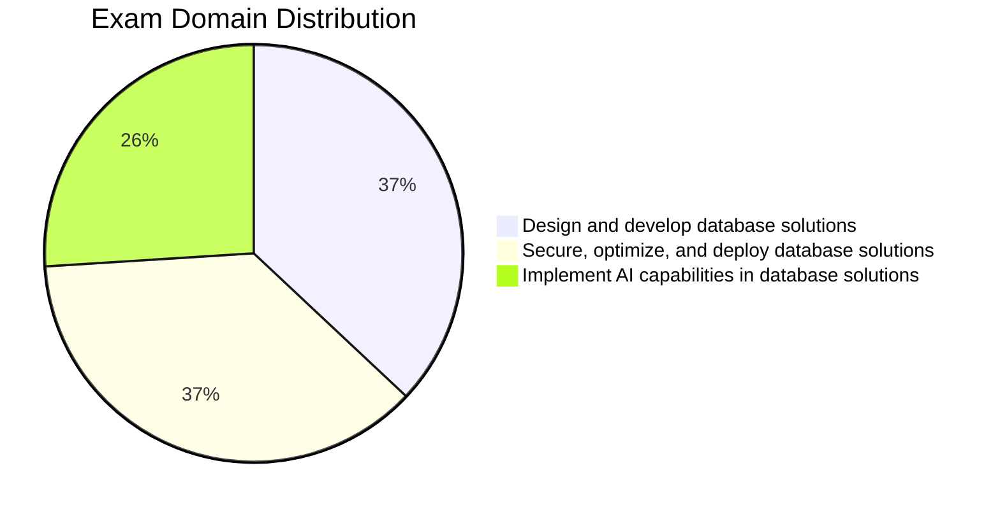

# Microsoft DP-800: Developing AI-Enabled Database Solutions

## Exam Overview

| Detail             | Information                                               |
| ------------------ | --------------------------------------------------------- |
| **Exam**           | DP-800                                                    |
| **Full Name**      | Developing AI-Enabled Database Solutions                  |
| **Passing Score**  | 700 / 1000                                                |
| **Renewal**        | Annual (free online assessment on Microsoft Learn)        |
| **Platforms**      | SQL Server, Azure SQL, SQL databases in Microsoft Fabric  |
| **Languages**      | T-SQL                                                     |

## Exam Domain Weights

## Study Topics

### Domain 1: Design and Develop Database Solutions (35–40%)

| Section | Weight | Topics |
| :--- | :--- | :--- |
| [01-Database Objects](01-database-objects/README.md) | 35–40% (shared) | Tables, indexes, constraints, partitioning |
| [02-Programmability Objects](02-programmability-objects/README.md) | 35–40% (shared) | Views, functions, stored procedures, triggers |
| [03-Advanced T-SQL](03-advanced-tsql/README.md) | 35–40% (shared) | CTEs, window functions, JSON, regex, graph |
| [04-AI-Assisted Tools](04-ai-assisted-tools/README.md) | 35–40% (shared) | GitHub Copilot, MCP servers, AI security |

### Domain 2: Secure, Optimize, and Deploy (35–40%)

| Section | Weight | Topics |
| :--- | :--- | :--- |
| [05-Data Security & Compliance](05-data-security-compliance/README.md) | 35–40% (shared) | Encryption, masking, RLS, auditing |
| [06-Performance Optimization](06-performance-optimization/README.md) | 35–40% (shared) | Query plans, DMVs, Query Store, blocking |
| [07-CI/CD Database Projects](07-cicd-database-projects/README.md) | 35–40% (shared) | SQL DB Projects, source control, deployment |
| [08-Azure Services Integration](08-azure-services-integration/README.md) | 35–40% (shared) | DAB, REST/GraphQL, monitoring, CDC |

### Domain 3: Implement AI Capabilities (25–30%)

| Section | Weight | Topics |
| :--- | :--- | :--- |
| [09-Models & Embeddings](09-models-embeddings/README.md) | 25–30% (shared) | External models, embedding maintenance |
| [10-Intelligent Search](10-intelligent-search/README.md) | 25–30% (shared) | Full-text, vector, hybrid search |
| [11-RAG](11-rag/README.md) | 25–30% (shared) | Retrieval-augmented generation |

### Practice & Resources

| Resource | Description |
| :--- | :--- |
| [Practice Questions](resources/practice-questions/README.md) | Domain-specific practice questions |
| [Mock Exam 1](resources/mock-exam/README.md) | Full-length practice exam |
| [Mock Exam 2](resources/mock-exam-2/README.md) | Alternative practice exam |
| [Exam Tips](resources/exam-tips.md) | Strategies and exam format guide |
| [Official Links](resources/official-links.md) | Microsoft documentation and registration |
| [Code Examples](resources/code-examples/tsql/README.md) | Standalone T-SQL code example files |
| [Cheat Sheets](resources/cheat-sheets/README.md) | Quick-reference guides for exam topics |
| [Appendix](resources/appendix/README.md) | Glossary, comparison tables, error messages |

## Study Progress Tracker

### Phase 1: Database Design & T-SQL

- [ ] Tables, indexes, and constraints
- [ ] Specialized tables (in-memory, temporal, external, ledger, graph)
- [ ] JSON columns and indexes
- [ ] Partitioning strategies
- [ ] Views and programmability objects
- [ ] CTEs and window functions
- [ ] JSON functions
- [ ] Regex and fuzzy string matching
- [ ] Graph queries with MATCH operator

### Phase 2: AI-Assisted Development

- [ ] GitHub Copilot setup and configuration
- [ ] MCP server endpoints
- [ ] AI security impact assessment
- [ ] Copilot instruction files

### Phase 3: Security, Performance & Deployment

- [ ] Always Encrypted and column-level encryption
- [ ] Dynamic Data Masking and Row-Level Security
- [ ] Object-level permissions and auditing
- [ ] Transaction isolation levels
- [ ] Query execution plans and DMVs
- [ ] Query Store and Query Performance Insight
- [ ] SQL Database Projects (SDK-style)
- [ ] CI/CD pipeline design
- [ ] Data API Builder configuration

### Phase 4: AI Capabilities

- [ ] External model evaluation and creation
- [ ] Embedding maintenance strategies
- [ ] Chunking and embedding generation
- [ ] Full-text search
- [ ] Vector data types and indexes
- [ ] Vector and hybrid search
- [ ] RAG implementation with sp_invoke_external_rest_endpoint

### Phase 5: Practice

- [ ] Complete practice questions (aim for 70%+)
- [ ] Take Mock Exam 1 (under timed conditions)
- [ ] Review weak areas
- [ ] Take Mock Exam 2
