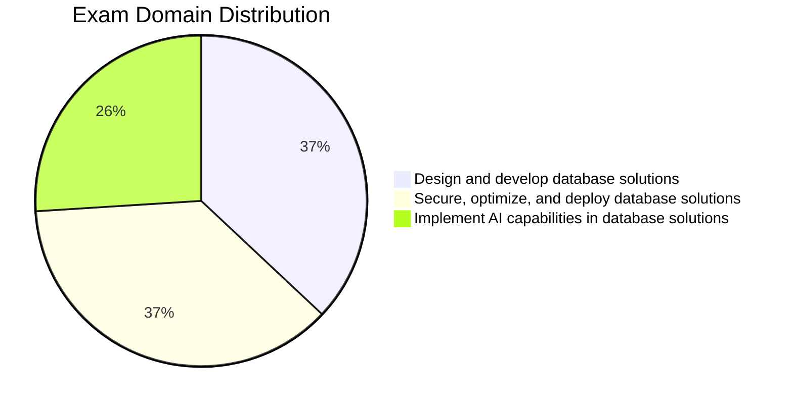

# Microsoft DP-800: Developing AI-Enabled Database Solutions

> [!info] What's New for the 2026 Exam (updated May 2026)
> Microsoft refreshed the official DP-800 skills measured list on **March 12, 2026**. This guide is aligned to that blueprint. The biggest 2026 changes you should know cold:
>
> - **SQL Server 2025 is GA.** The `VECTOR` data type and `VECTOR_DISTANCE` are **generally available** in SQL Server 2025 and Azure SQL Database. `VECTOR_SEARCH`, `VECTOR_NORMALIZE`, and `VECTORPROPERTY` are in **public preview** on the same platforms — the exam regularly tests preview features that are commonly used (per Microsoft's own note on the study guide).
> - **DiskANN vector index** is in **public preview** across SQL Server 2025, Azure SQL Database, Azure SQL Managed Instance, and SQL database in Microsoft Fabric. On SQL Server 2025 also requires `PREVIEW_FEATURES = ON`. Know the syntax and the `METRIC` clause cold.
> - **Half-precision (`float16`) vectors** are in preview — halves storage at the same dimension count. The documented `VECTOR` type cap is **1 998** dimensions.
> - **MCP server endpoints** are explicitly tested: connecting Copilot to SQL Server and Fabric lakehouse MCP endpoints, plus **securing MCP/REST/GraphQL endpoints**.
> - **Passwordless database access** and **Managed Identity for model endpoints** are now called out as secure-access requirements.
> - **Microsoft Foundry** is listed alongside Change Tracking, CDC, CES, Azure Functions, and Logic Apps as a valid embedding-maintenance method.
> - **Change Event Streaming (CES)** in Fabric is now explicitly named in the blueprint as a change-handling mechanism.
> - **Schema drift detection** in SQL Database Projects is now an explicit skill.
> - **`REGEXP_MATCHES` and `REGEXP_SPLIT_TO_TABLE`** appear in the regex skills list — make sure you can write both.
>
> > [!tip] Coming in the next 6 months
> > Expect Azure SQL DiskANN GA, half-precision vector GA, and broader Microsoft Foundry / Copilot in Fabric coverage. The exam typically lags GA by 4–8 weeks before adding feature questions; preview features only appear if they're commonly used (per Microsoft's own note on the study guide).

## How to Use This Guide

1. **Topic files** (`01-topic-name.md`) — core study material with SQL examples, comparison tables, and practice questions. Start here.
2. **Section READMEs** — overview flowcharts and topic indexes. Use to orient before diving into a section.
3. **Cheat sheets** (`resources/cheat-sheets/`) — compact quick-reference for exam day and review. Each ends with a `## Gotchas & Traps` section and a `## Before the Exam, I Can…` checklist. Use after studying a section to reinforce.
4. **Practice questions** (`resources/practice-questions/`) — 60+ questions across the three domains (Domain 1: 18, Domain 2: 22, Domain 3: 20), with explanations. Use to test knowledge after each domain.
5. **Mock exams** (`resources/mock-exam/`, `resources/mock-exam-2/`) — full 50-question timed exams (45 standalone + 5-question case study mirroring the real DP-800 format). After each, use the matching **debrief** file (`mock-exam-N-debrief.md`) to map missed questions back to study material.
6. **Final Review** (`resources/final-review.md`) — 20-minute exam-morning scan: highest-probability facts across all three domains and 10 last-minute traps. Read the morning of the exam.

> Study path: topic files → cheat sheets → practice questions → mock exams → **final-review.md** (exam morning)

## Exam Overview

| Detail             | Information                                               |
| ------------------ | --------------------------------------------------------- |
| **Exam**           | DP-800                                                    |
| **Full Name**      | Developing AI-Enabled Database Solutions                  |
| **Passing Score**  | 700 / 1000                                                |
| **Renewal**        | Annual (free online assessment on Microsoft Learn)        |
| **Platforms**      | SQL Server, Azure SQL, SQL databases in Microsoft Fabric  |
| **Languages**      | T-SQL                                                     |

## Exam Domain Weights

## Study Topics

### Domain 1: Design and Develop Database Solutions (35–40%)

| Section | Priority | Topics |
| :--- | :--- | :--- |
| [01-Database Objects](01-database-objects/database-objects.md) | High | Tables, indexes, constraints, partitioning |
| [02-Programmability Objects](02-programmability-objects/programmability-objects.md) | High | Views, functions, stored procedures, triggers |
| [03-Advanced T-SQL](03-advanced-tsql/advanced-tsql.md) | High | CTEs, window functions, JSON, regex, graph |
| [04-AI-Assisted Tools](04-ai-assisted-tools/ai-assisted-tools.md) | Medium | GitHub Copilot, MCP servers, AI security |

### Domain 2: Secure, Optimize, and Deploy (35–40%)

| Section | Priority | Topics |
| :--- | :--- | :--- |
| [05-Data Security & Compliance](05-data-security-compliance/data-security-compliance.md) | High | Encryption, masking, RLS, auditing |
| [06-Performance Optimization](06-performance-optimization/performance-optimization.md) | High | Query plans, DMVs, Query Store, blocking |
| [07-CI/CD Database Projects](07-cicd-database-projects/cicd-database-projects.md) | Medium | SQL DB Projects, source control, deployment |
| [08-Azure Services Integration](08-azure-services-integration/azure-services-integration.md) | Medium | DAB, REST/GraphQL, monitoring, CDC |

### Domain 3: Implement AI Capabilities (25–30%)

| Section | Priority | Topics |
| :--- | :--- | :--- |
| [09-Models & Embeddings](09-models-embeddings/models-embeddings.md) | High | External models, embedding maintenance |
| [10-Intelligent Search](10-intelligent-search/intelligent-search.md) | High | Full-text, vector, hybrid search |
| [11-RAG](11-rag/rag.md) | High | Retrieval-augmented generation |

### Practice & Resources

| Resource | Description |
| :--- | :--- |
| [Practice Questions](resources/practice-questions/practice-questions.md) | 60+ domain-specific practice questions |
| [Mock Exam 1](resources/mock-exam/mock-exam-1.md) | 50-question exam (45 standalone + 5-question case study) |
| [Mock Exam 1 — Debrief](resources/mock-exam/mock-exam-1-debrief.md) | Per-question map to topic files + study plan by miss count |
| [Mock Exam 2](resources/mock-exam-2/mock-exam-2.md) | Second 50-question exam (different questions; includes case study) |
| [Mock Exam 2 — Debrief](resources/mock-exam-2/mock-exam-2-debrief.md) | Per-question map to topic files + study plan by miss count |
| [Exam Tips](resources/exam-tips.md) | Strategies, common-traps table, case-study playbook |
| [Official Links](resources/official-links.md) | Microsoft documentation and registration |
| [Code Examples](resources/code-examples/tsql/tsql-code-examples.md) | Standalone T-SQL code example files (incl. end-to-end RAG walkthrough) |
| [Cheat Sheets](resources/cheat-sheets/cheat-sheets.md) | Quick-reference guides for exam topics (each includes Gotchas & Traps + Before the Exam checklist) |
| [Anki Deck](resources/anki/anki-deck.md) | ~130 spaced-repetition cards generated from the cheat sheets, with tag-based filtering |
| [Adaptive Practice Quiz](../practice/README.md) | Browser-based JSON-driven quiz — 160 questions across 3 banks, with adaptive selection, exam timer, and per-bank progress. **Live: [kengio.github.io/dp-800-study-guide](https://kengio.github.io/dp-800-study-guide/)** |
| [Final Review](resources/final-review.md) | 20-minute exam-morning scan: top facts and last-minute traps for all three domains |
| [Renewal Guide](resources/renewal-guide.md) | DP-800 annual-renewal workflow: free/unproctored/open-book assessment, 6-month window, what to prep |
| [Companion Exams](resources/companion-exams.md) | DP-700 + AI-102 cross-references with overlap matrices, retirement warnings, and recommended next-step paths |
| [Appendix](resources/appendix/appendix.md) | Glossary, comparison tables, error messages |

## Study Progress Tracker

### Phase 1: Database Design & T-SQL

- [ ] Tables, indexes, and constraints
- [ ] Specialized tables (in-memory, temporal, external, ledger, graph)
- [ ] JSON columns and indexes
- [ ] Partitioning strategies
- [ ] Views and programmability objects
- [ ] CTEs and window functions
- [ ] JSON functions
- [ ] Regex and fuzzy string matching
- [ ] Graph queries with MATCH operator

### Phase 2: AI-Assisted Development

- [ ] GitHub Copilot setup and configuration
- [ ] MCP server endpoints
- [ ] AI security impact assessment
- [ ] Copilot instruction files

### Phase 3: Security, Performance & Deployment

- [ ] Always Encrypted and column-level encryption
- [ ] Dynamic Data Masking and Row-Level Security
- [ ] Object-level permissions and auditing
- [ ] Transaction isolation levels
- [ ] Query execution plans and DMVs
- [ ] Query Store and Query Performance Insight
- [ ] SQL Database Projects (SDK-style)
- [ ] CI/CD pipeline design
- [ ] Data API Builder configuration

### Phase 4: AI Capabilities

- [ ] External model evaluation and creation
- [ ] Embedding maintenance strategies
- [ ] Chunking and embedding generation
- [ ] Full-text search
- [ ] Vector data types and indexes
- [ ] Vector and hybrid search
- [ ] RAG implementation with sp_invoke_external_rest_endpoint

### Phase 5: Practice

- [ ] Complete practice questions (aim for 70%+)
- [ ] Take Mock Exam 1 (under timed conditions)
- [ ] Review weak areas
- [ ] Take Mock Exam 2
