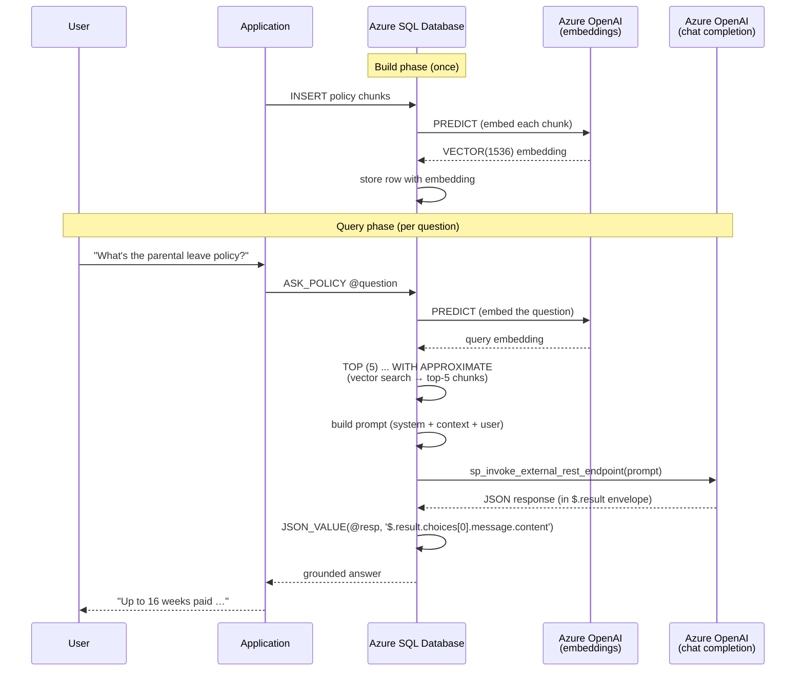

# Building a Policy Q&A Bot in ~80 lines of T-SQL

A complete RAG (Retrieval-Augmented Generation) pipeline built entirely inside Azure SQL Database. Read this once and every Domain 3 question on the exam will feel familiar.

> [!abstract]
> - Demonstrates the full RAG flow in one place: **chunk → embed → store → retrieve → augment prompt → call LLM → parse → return**
> - Touches every Domain 3 testable concept: `CREATE EXTERNAL MODEL`, `PREDICT`, `VECTOR(n)`, `VECTOR_DISTANCE` / `WITH APPROXIMATE`, `sp_invoke_external_rest_endpoint`, `DATABASE SCOPED CREDENTIAL`, `JSON_OBJECT` / `JSON_VALUE`
> - Scenario: a Q&A bot grounded on company policy documents

> [!tip] How to read this
> Skim the **Pipeline Overview** first. Then read each numbered step in order — each step has a tiny SQL block plus a one-line "what this teaches" callout pointing at the exam concept.

---

## Pipeline Overview



---

## Step 1 — Register external models

We need two external models: one to embed text into a 1536-dim vector, one to generate the final answer.

```sql
-- Credential holding the Azure OpenAI key (encrypted at rest)
CREATE DATABASE SCOPED CREDENTIAL [https://contoso-oai.openai.azure.com]
WITH IDENTITY    = 'HTTPEndpointHeaders',
     SECRET     = '{"api-key":"<your-key>"}';
GO

-- Embedding model — note: keyword is MODEL_TYPE (not TASK)
CREATE EXTERNAL MODEL [PolicyEmbedder]
WITH (
    LOCATION    = 'https://contoso-oai.openai.azure.com/openai/deployments/text-embedding-3-small/embeddings?api-version=2024-02-01',
    CREDENTIAL  = [https://contoso-oai.openai.azure.com],
    MODEL_TYPE  = EMBEDDINGS,
    MODEL       = 'text-embedding-3-small'
);

-- Chat model
CREATE EXTERNAL MODEL [PolicyChat]
WITH (
    LOCATION    = 'https://contoso-oai.openai.azure.com/openai/deployments/gpt-4o/chat/completions?api-version=2024-02-01',
    CREDENTIAL  = [https://contoso-oai.openai.azure.com],
    MODEL_TYPE  = COMPLETIONS,
    MODEL       = 'gpt-4o'
);
```

> **What this teaches**: `MODEL_TYPE` is the T-SQL keyword (not `TASK`). Valid values include `EMBEDDINGS` and `COMPLETIONS`. The `CREDENTIAL` references a Database Scoped Credential — never hardcode keys.

---

## Step 2 — Create the policy chunks table

```sql
CREATE TABLE dbo.PolicyChunks (
    ChunkId       INT IDENTITY(1,1) PRIMARY KEY,
    PolicyName    NVARCHAR(200)  NOT NULL,
    ChunkText     NVARCHAR(MAX)  NOT NULL,
    Embedding     VECTOR(1536)   NULL  -- text-embedding-3-small dims
);
```

> **What this teaches**: `VECTOR(1536)` matches the model. Dimension mismatch = runtime error. `text-embedding-3-large` would be `VECTOR(3072)`.

---

## Step 3 — Chunk and insert raw policy text

For brevity we insert two pre-chunked rows. In production you'd split source documents by paragraph or ~400-token windows with 10–20 % overlap.

```sql
INSERT INTO dbo.PolicyChunks (PolicyName, ChunkText) VALUES
('Parental Leave',
 'Employees are entitled to up to 16 weeks of paid parental leave. ' +
 'This applies to birth, adoption, and foster placement. Apply through HR at least 30 days before the start date.'),
('Remote Work',
 'Full-time employees may work remotely up to 4 days per week with manager approval. ' +
 'A dedicated home workspace and reliable internet are required. ' +
 'Equipment is provided after 90 days of employment.');
```

> **What this teaches**: chunk size affects retrieval quality. Too small → no context; too large → diluted relevance. Overlap between chunks prevents losing a sentence at the boundary.

---

## Step 4 — Generate and store embeddings

```sql
UPDATE p
SET p.Embedding = CAST(
    PREDICT(MODEL = [PolicyEmbedder],
            DATA  = (SELECT p.ChunkText AS input_text))
    AS VECTOR(1536))
FROM dbo.PolicyChunks AS p
WHERE p.Embedding IS NULL;
```

> **What this teaches**: `PREDICT` invokes the registered external model. The result is cast into the matching `VECTOR(n)` type before storage. To maintain embeddings as text changes, attach this UPDATE to a trigger / Change Tracking job / Azure Function with SQL trigger binding / CES — pick based on volume and latency. **Microsoft Foundry** is the most managed option (declarative pipeline).

---

## Step 5 — (Optional) Create a DiskANN vector index for fast retrieval

```sql
-- Current syntax (public preview across SS2025 / Azure SQL DB / MI / Fabric SQL)
CREATE VECTOR INDEX IX_PolicyChunks_Embedding
ON dbo.PolicyChunks (Embedding)
WITH (METRIC = 'cosine', TYPE = 'diskann');
```

> **What this teaches**: the index `METRIC` must match the metric used in the query. A mismatch does **not** error — it logs a warning and falls back to exact kNN (silent performance regression). To support multiple metrics, build one index per metric.

---

## Step 6 — Retrieve the top-K relevant chunks for a question

```sql
DECLARE @question NVARCHAR(MAX) =
    N'How much parental leave do I get and how do I apply?';

-- Embed the question (same model as the stored chunks — must match)
DECLARE @query_vec VECTOR(1536);
SELECT @query_vec = CAST(
    PREDICT(MODEL = [PolicyEmbedder],
            DATA  = (SELECT @question AS input_text))
    AS VECTOR(1536));

-- Top-5 closest chunks — current ANN syntax uses WITH APPROXIMATE
SELECT TOP (5)
    p.ChunkId,
    p.PolicyName,
    p.ChunkText,
    VECTOR_DISTANCE('cosine', p.Embedding, @query_vec) AS Distance
INTO   #Top5
FROM   dbo.PolicyChunks AS p
WHERE  p.Embedding IS NOT NULL
ORDER  BY VECTOR_DISTANCE('cosine', p.Embedding, @query_vec) ASC
WITH APPROXIMATE;   -- uses the DiskANN index when one matches the metric
```

> **What this teaches**: `WITH APPROXIMATE` is the current ANN-search clause on latest-version vector indexes. To raise recall: increase `N` in `TOP (N)`. The legacy `VECTOR_SEARCH(... TOP_N = n)` TVF still works on earlier-version indexes but raises Msg 42274 on current ones.

---

## Step 7 — Assemble the augmented prompt

```sql
-- Concatenate the retrieved chunks into one context block
DECLARE @context NVARCHAR(MAX) = (
    SELECT STRING_AGG(
        CONCAT('[', PolicyName, ']: ', ChunkText),
        CHAR(10) + CHAR(10))
    FROM #Top5
);

-- Build a properly-escaped JSON payload (don't string-concat user content)
DECLARE @payload NVARCHAR(MAX) = (
    JSON_OBJECT(
        'messages':  JSON_ARRAY(
            JSON_OBJECT(
                'role':    'system',
                'content': N'You answer using only the provided policy excerpts. If the answer is not in the excerpts, say "I don''t know based on the provided policies." Cite the policy name in brackets.'
            ),
            JSON_OBJECT(
                'role':    'system',
                'content': CONCAT(N'Policy excerpts:', CHAR(10), @context)
            ),
            JSON_OBJECT(
                'role':    'user',
                'content': @question
            )
        ),
        'temperature': 0.1,    -- low temp for grounded Q&A
        'max_tokens':  600
    )
);
```

> **What this teaches**: use `JSON_OBJECT` / `JSON_ARRAY` to construct payloads — they escape quotes and backslashes automatically. Low temperature (0.0–0.2) reduces hallucination for RAG. System messages set the persona and the "answer from context only" instruction.

---

## Step 8 — Call the LLM and parse the response

```sql
DECLARE @response NVARCHAR(MAX);
DECLARE @ret INT;

EXEC @ret = sp_invoke_external_rest_endpoint
    @url        = 'https://contoso-oai.openai.azure.com/openai/deployments/gpt-4o/chat/completions?api-version=2024-02-01',
    @method     = 'POST',
    @credential = [https://contoso-oai.openai.azure.com],
    @payload    = @payload,
    @timeout    = 230,
    @response   = @response OUTPUT;

-- *** The detail most often missed on the exam ***
-- sp_invoke_external_rest_endpoint wraps the API response under "result":
-- {
--   "response": { "status": { "http": { "code": 200 } }, "headers": { ... } },
--   "result":   { "choices": [ { "message": { "content": "<the answer>" } } ] }
-- }
SELECT
    Answer = JSON_VALUE(@response, '$.result.choices[0].message.content');
```

> **What this teaches**: the response is wrapped in `$.result` — not `$.choices[0]` as you'd get calling Azure OpenAI directly with HttpClient. This is the single most-missed RAG detail in T-SQL. `@ret` and `$.response.status.http.code` give you HTTP-level status separate from the wrapped body.

---

## Step 9 — Wrap it all in a single procedure

```sql
CREATE OR ALTER PROCEDURE dbo.AskPolicy
    @question NVARCHAR(MAX),
    @top_n    INT = 5,
    @answer   NVARCHAR(MAX) OUTPUT
AS
BEGIN
    SET NOCOUNT ON;

    DECLARE @query_vec VECTOR(1536);
    SELECT @query_vec = CAST(
        PREDICT(MODEL = [PolicyEmbedder],
                DATA  = (SELECT @question AS input_text))
        AS VECTOR(1536));

    DECLARE @context NVARCHAR(MAX) = (
        SELECT STRING_AGG(CONCAT('[', PolicyName, ']: ', ChunkText),
                          CHAR(10) + CHAR(10))
        FROM (
            SELECT TOP (@top_n)
                p.PolicyName, p.ChunkText
            FROM   dbo.PolicyChunks AS p
            WHERE  p.Embedding IS NOT NULL
            ORDER  BY VECTOR_DISTANCE('cosine', p.Embedding, @query_vec) ASC
            WITH APPROXIMATE
        ) AS t
    );

    DECLARE @payload NVARCHAR(MAX) = JSON_OBJECT(
        'messages':    JSON_ARRAY(
            JSON_OBJECT('role':'system','content':
                N'Answer using only the policy excerpts. Say "I don''t know" if unsupported. Cite the [Policy Name].'),
            JSON_OBJECT('role':'system','content': CONCAT(N'Excerpts:', CHAR(10), @context)),
            JSON_OBJECT('role':'user','content': @question)),
        'temperature': 0.1,
        'max_tokens':  600
    );

    DECLARE @response NVARCHAR(MAX);
    EXEC sp_invoke_external_rest_endpoint
        @url        = 'https://contoso-oai.openai.azure.com/openai/deployments/gpt-4o/chat/completions?api-version=2024-02-01',
        @method     = 'POST',
        @credential = [https://contoso-oai.openai.azure.com],
        @payload    = @payload,
        @response   = @response OUTPUT;

    SET @answer = JSON_VALUE(@response, '$.result.choices[0].message.content');
END;
GO

-- Use it
DECLARE @reply NVARCHAR(MAX);
EXEC dbo.AskPolicy
    @question = N'How much parental leave do I get and how do I apply?',
    @answer   = @reply OUTPUT;
SELECT @reply AS Answer;
```

> **What this teaches**: ~80 lines, no application server, no separate orchestration framework. The database is the RAG runtime. This is the exam's mental model of "AI capabilities in database solutions."

---

## What you can now answer on the exam

| Concept | Step that demonstrates it |
| :--- | :--- |
| `CREATE EXTERNAL MODEL` with `MODEL_TYPE` | Step 1 |
| `DATABASE SCOPED CREDENTIAL` for Azure OpenAI | Step 1 |
| `VECTOR(n)` data type sizing to match model | Steps 2, 4 |
| Chunking strategy | Step 3 |
| `PREDICT` to generate embeddings | Step 4 |
| Embedding maintenance options | Step 4 (note) |
| `CREATE VECTOR INDEX` with DiskANN + METRIC | Step 5 |
| ANN vs ENN; `WITH APPROXIMATE` syntax | Step 6 |
| Metric matching requirement | Step 5 (note) |
| `VECTOR_DISTANCE` semantics (lower = closer) | Step 6 |
| Augmented prompt construction | Step 7 |
| `JSON_OBJECT` / `JSON_ARRAY` for safe payloads | Step 7 |
| `sp_invoke_external_rest_endpoint` invocation | Step 8 |
| **`$.result.choices[0].message.content` response envelope** | Step 8 |
| Temperature and grounding for RAG | Steps 7, 9 |

---

## Try it yourself

- Swap `'cosine'` for `'dot'` and add `VECTOR_NORMALIZE(... , 'norm2')` on insert — observe that normalised dot product equals cosine similarity
- Increase `@top_n` from 5 to 20 — recall climbs, latency rises (the recall lever in `WITH APPROXIMATE`)
- Change `temperature` from `0.1` to `0.8` — answers become more creative but more likely to drift from the cited policy
- Replace one chunk's text and trigger a re-embed — confirm the answer for that policy now reflects the updated text

---

## Related Topics

- [01-External Models](../../../09-models-embeddings/01-external-models.md)
- [02-Embedding Maintenance](../../../09-models-embeddings/02-embedding-maintenance.md)
- [02-Vector Search](../../../10-intelligent-search/02-vector-search.md)
- [03-Hybrid Search & RRF](../../../10-intelligent-search/03-hybrid-search-rrf.md)
- [01-RAG Use Cases](../../../11-rag/01-rag-use-cases.md)
- [02-Prompts and Responses](../../../11-rag/02-prompts-and-responses.md)

---

**[← Back to Code Examples](./tsql-code-examples.md)**
