# DP-800 Visual Formatting & Exam-Confidence Implementation Plan

> **For agentic workers:** REQUIRED SUB-SKILL: Use superpowers:subagent-driven-development (recommended) or superpowers:executing-plans to implement this plan task-by-task. Steps use checkbox (`- [ ]`) syntax for tracking.

**Goal:** Transform the DP-800 study guide into a beautiful, confidence-building Obsidian vault before the exam on Friday 2026-04-03.

**Architecture:** Priority-first execution — `final-review.md` first (standalone new file, highest exam-day value), then cheat sheets (Gotchas + confidence checklists), then all 41 topic files (abstract + exam callouts + highlights), then 11 section README mindmaps.

**Tech Stack:** Obsidian Flavored Markdown, Mermaid (mindmap), Obsidian callouts (`> [!type]`), `==highlight==` syntax, foldable callouts (`> [!type]-`).

---

## Formatting Rules Reference

Apply these rules consistently across all files:

**Callout types:**
- `> [!abstract]` — top-of-file summary (2–4 bullets)
- `> [!tip] What the Exam Tests` — new, near top of every topic file, before first `##`
- `> [!tip] Exam Tips` — existing bottom section, enrich only
- `> [!warning] Common Mistake` — inline, near the content it relates to
- `> [!info]` — neutral context
- `> [!note]` — extra detail

**Highlights:** `==term==` on the single most exam-relevant term/value per table row.

**Bold:** `**term**` on critical terms in prose (not headers).

**Horizontal rules:** `---` between every `##` section.

**Abstract callout position:** Immediately after the `## Overview` paragraph (or replace the plain overview text if it's short), before the first `##` section heading.

**What the Exam Tests callout position:** After the `[!abstract]`, before the first `##` section.

---

## Task 1: Create `certification/resources/final-review.md`

**Files:**
- Create: `certification/resources/final-review.md`

- [ ] **Step 1: Create the file with this exact content**

```markdown
---
title: "DP-800 Final Review — Exam Morning"
type: study-material
tags:
  - dp-800
  - final-review
  - exam-prep
---

# DP-800 Final Review — Exam Morning

> [!abstract] Read This in 20 Minutes
> - Highest-probability testable facts across all three exam domains
> - One scroll, no deep dives — orient your brain before walking in
> - After reading: open your cheat sheets and run through the "Before the Exam, I Can…" checklists

---

## Domain 1: Design and Develop (35–40%)

- **Clustered Columnstore Index (CCI):** optimal for analytics-only workloads; batch mode execution; delta rowstore buffers inserts before compressing. For mixed OLTP+analytics, add a *non-clustered* CCI alongside the rowstore.
- **Temporal tables:** `FOR SYSTEM_TIME AS OF '2025-01-01T12:00:00'` = point-in-time query. Columns `SysStartTime`/`SysEndTime` are system-managed. History table is auto-created or user-specified.
- **Ledger tables:** append-only, blockchain-style tamper evidence. `GENERATED ALWAYS AS ROW START/END` + `LEDGER = ON`. Cannot update or delete rows in append-only mode.
- **Memory-optimized tables:** `DURABILITY = SCHEMA_AND_DATA` (survives restart) vs `SCHEMA_ONLY` (data lost on restart). Must use `MEMORY_OPTIMIZED = ON` in filegroup.
- **JSON functions:** `JSON_VALUE` = scalar; `JSON_QUERY` = object or array fragment; `OPENJSON` = table rows; `JSON_MODIFY` = update a path in place; `FOR JSON PATH` = serialize rows to JSON.
- **SEQUENCE vs IDENTITY:** `SEQUENCE` is a standalone object, shared across tables, cycles; `IDENTITY` is column-bound, table-scoped, no cycling.
- **Partitioning:** partition *function* defines value ranges → partition *scheme* maps ranges to filegroups → table uses scheme. `$PARTITION.FunctionName(col)` = partition number. Partition switching = instant bulk load/archive.
- **Recursive CTE:** anchor member `UNION ALL` recursive member. Anchor runs once; recursive runs until no rows returned. `OPTION (MAXRECURSION n)` limits depth.
- **Window functions on ties:** `ROW_NUMBER` = unique (arbitrary tie-break); `RANK` = skips numbers; `DENSE_RANK` = no skip. `NTILE(n)` = bucket.
- **Graph tables:** `CREATE TABLE … AS NODE` / `AS EDGE`. Query with `MATCH (A)-[E]->(B)`. `SHORTEST_PATH` for traversal. Edges must reference NODE tables.
- **Triggers:** `AFTER` fires after the DML; `INSTEAD OF` fires in place of it. `INSERTED` = new values; `DELETED` = old values. Both available in UPDATE triggers.
- **Inline TVF vs multi-statement TVF:** inline TVF is expanded like a view (optimizer sees through it, parallelism allowed); multi-statement TVF is a black box (no parallelism, worse cardinality estimates).

---

## Domain 2: Secure, Optimize, Deploy (35–40%)

- **TDE:** encrypts entire database at rest; transparent to app; server sees plaintext; enabled by default on Azure SQL. Does NOT protect data in transit — use TLS separately.
- **Always Encrypted:** column-level; server NEVER sees plaintext; driver handles encrypt/decrypt; CMK (Column Master Key, client-side in Key Vault) → CEK (Column Encryption Key, encrypted by CMK, stored in DB) → column data.
- **DDM (Dynamic Data Masking):** hides values from non-privileged users at query time; does NOT encrypt; `UNMASK` permission reveals full data; masks: `default()`, `email()`, `partial()`, `random()`.
- **RLS (Row-Level Security):** security predicate function returns a filter; attached to table via `CREATE SECURITY POLICY`. Transparent to the user — they don't know rows are hidden. Filter predicate (SELECT) vs block predicate (INSERT/UPDATE/DELETE).
- **Permission precedence:** `DENY` always wins over `GRANT`, even if GRANT comes through a role. `REVOKE` removes a prior GRANT or DENY — it does not itself deny.
- **Query Store:** persists query plans and runtime stats across restarts. Force a plan: `sp_query_store_force_plan`. Unforce: `sp_query_store_unforce_plan`. Detects plan regressions via Automatic Plan Correction.
- **Isolation levels:** `READ COMMITTED` = default; `READ UNCOMMITTED` = dirty reads; `REPEATABLE READ` = no phantom rows; `SERIALIZABLE` = full isolation; `SNAPSHOT` = optimistic, row versioning, database-level; `RCSI` (Read Committed Snapshot Isolation) = row-version READ COMMITTED — set `READ_COMMITTED_SNAPSHOT ON`.
- **Blocking vs deadlock:** blocking = one session waits for lock held by another (resolves when lock released); deadlock = circular wait (SQL Server auto-kills one victim). Check with `sys.dm_exec_requests` and `sys.dm_os_waiting_tasks`.
- **SQL DB Projects:** `.sqlproj` file; `Build` → `.dacpac`; `Publish` (via SqlPackage.exe) → deploys diff to target. Pre/post-deployment scripts run outside the diff. `SqlPackage.exe /Action:Publish` deploys; `/Action:Extract` creates dacpac from existing DB.
- **DAB (Data API Builder):** config file maps entities to DB objects; generates REST (`/api/{Entity}`) and GraphQL (`/graphql`) endpoints; no custom code. Permissions: anonymous, authenticated, role-based.
- **Change Data Capture vs Change Tracking:** CDC = captures before/after values for each row change, requires SQL Server Agent; CT = lightweight, captures only that a change occurred (not what changed), no Agent needed.
- **Private endpoint vs service endpoint:** private endpoint = private IP in your VNet (fully private); service endpoint = routes Azure service traffic via Azure backbone but endpoint remains public-facing.

---

## Domain 3: AI Capabilities (25–30%)

- **VECTOR data type:** `VECTOR(n)` — fixed-dimension float array. `VECTOR(1536)` = text-embedding-3-small or ada-002; `VECTOR(3072)` = text-embedding-3-large.
- **VECTOR_DISTANCE:** exact nearest neighbor (ENN); syntax: `VECTOR_DISTANCE('cosine', v1, v2)`; metrics: `cosine`, `euclidean`, `dot`. Smaller value = more similar (except dot where larger = more similar).
- **VECTOR_SEARCH:** approximate nearest neighbor (ANN) via DiskANN index; faster at scale; only `cosine` and `dot` metrics — **euclidean NOT supported** for ANN indexes.
- **VECTOR_NORMALIZE:** normalizes to unit length (L2 norm = 1); after normalization, dot product equals cosine similarity. Required before using dot as cosine proxy.
- **Full-text search:** `CONTAINS` = precision (exact terms, proximity, weighted); `FREETEXT` = recall (natural language, broader); both require a full-text index. `CONTAINSTABLE`/`FREETEXTTABLE` return ranked results.
- **Hybrid search with RRF:** Reciprocal Rank Fusion combines FTS + vector result sets. Formula: `score = Σ 1/(k + rank)` where `k=60` by default. Higher RRF score = better. Not a score average — a rank-combination algorithm.
- **Chunking:** fixed-size (predictable) vs semantic (respects sentence/paragraph boundaries). Overlap (`overlap_tokens`) prevents losing context at chunk boundaries. Too small chunks = no context; too large = diluted relevance.
- **sp_invoke_external_rest_endpoint:** calls external REST API (e.g., Azure OpenAI). Requires `DATABASE SCOPED CREDENTIAL` for bearer token. Returns JSON response parsed with `JSON_VALUE`/`JSON_QUERY`.
- **RAG pattern:** (1) embed user query → (2) search DB with `VECTOR_SEARCH` + `CONTAINS` → (3) retrieve top-K chunks → (4) build prompt (system message + context + user question) → (5) call LLM → (6) return grounded response.
- **Grounding:** RAG provides context at *inference time* — it does NOT fine-tune the model. The LLM uses retrieved data for this one response; its weights are unchanged.
- **Prompt structure:** system message (instructions/persona) + user message (question + context). Temperature → randomness (0 = deterministic, 1 = creative). Top_p → token sampling diversity.

---

## Last-Minute Traps

1. **JSON_VALUE on an object/array path returns NULL** — not an error. Use `JSON_QUERY` to extract objects or arrays.
2. **DiskANN (VECTOR_SEARCH) does NOT support euclidean** — only `cosine` and `dot`. The exam will offer euclidean as a distractor.
3. **DENY always overrides GRANT** — even if the GRANT came through a role. There is no way to "un-deny" except REVOKE of the DENY.
4. **DDM ≠ encryption** — DDM hides values at display time; the data is stored in plaintext. Users with `UNMASK` or admin rights see everything.
5. **SNAPSHOT isolation ≠ RCSI** — SNAPSHOT = application sets it per transaction; RCSI = database setting that changes the *default* READ COMMITTED behavior to row-versioning.
6. **VECTOR_SEARCH is approximate** — it can miss the true nearest neighbor for speed. VECTOR_DISTANCE is exact but slower.
7. **CMK stays client-side** — Always Encrypted: the Column Master Key lives in Key Vault (or cert store), never uploaded to SQL Server. The server only holds the encrypted CEK.
8. **SqlPackage /Action:Extract ≠ Publish** — Extract creates a dacpac FROM an existing database. Publish deploys a dacpac TO a database.
9. **Partition function ≠ partition scheme** — function defines value boundaries; scheme maps them to filegroups. Need both to partition a table.
10. **RAG doesn't train the model** — retrieved context is injected into the prompt for one call; the model's weights do not change.
```

- [ ] **Step 2: Add final-review.md to resources README**

Open `certification/resources/README.md`. Add a row to the resources table:

```markdown
| [Final Review](./final-review.md) | 20-minute exam-morning scan: highest-probability facts + last-minute traps |
```

- [ ] **Step 3: Commit**

```bash
git add certification/resources/final-review.md certification/resources/README.md
git commit -m "docs: add final-review exam-morning cheat file"
```

---

## Task 2: Cheat Sheet — `security-quick-ref.md`

**Files:**
- Modify: `certification/resources/cheat-sheets/security-quick-ref.md`

- [ ] **Step 1: Read the current file to find the end**

Read `certification/resources/cheat-sheets/security-quick-ref.md` to locate the last section before any `## Official Documentation` or end of file.

- [ ] **Step 2: Append these two sections before any Official Documentation section (or at end of file)**

```markdown
---

## Gotchas & Traps

- **DDM ≠ encryption** — Dynamic Data Masking hides values at query time; data is stored plaintext. Users with `UNMASK` or elevated permissions see everything.
- **Always Encrypted: server never sees plaintext** — the CMK lives in Key Vault (client-side), not in SQL Server. The server only holds the encrypted CEK.
- **DENY overrides GRANT** — even if a GRANT came through role membership, an explicit DENY on the same principal blocks access. REVOKE removes a permission; it does not itself deny.
- **TDE protects at rest only** — TDE does NOT protect data in transit. Use TLS for in-transit protection; they are separate concerns.
- **RLS is transparent** — the filtered user has no indication that rows are hidden. A query on a 1000-row table might return 50 rows with no error.
- **Filter vs block predicates** — filter predicate silently limits SELECT results; block predicate prevents INSERT/UPDATE/DELETE that would violate the policy.
- **CMK → CEK → column** — the Column Master Key encrypts the Column Encryption Key. The CEK encrypts column data. Rotating the CMK requires re-encrypting the CEK, not the column data.

---

## Before the Exam, I Can…

- [ ] Explain the difference between TDE, Always Encrypted, and column-level encryption — and choose the right one given a scenario (at-rest-only vs in-memory vs manual)
- [ ] Describe what Dynamic Data Masking does and what it does NOT do (stores plaintext, does not encrypt)
- [ ] Explain how RLS works: create a predicate function → attach via CREATE SECURITY POLICY → filter vs block
- [ ] State the permission precedence rule: DENY > GRANT; REVOKE removes but does not deny
- [ ] Describe the Always Encrypted key hierarchy: CMK (client/Key Vault) → CEK (encrypted, in DB) → column data
- [ ] Name the four DDM mask types: default, email, partial, random
- [ ] Explain where audit logs are written (Storage Account, Log Analytics, Event Hub) and how to query them (sys.fn_get_audit_file or Log Analytics)
```

- [ ] **Step 3: Commit**

```bash
git add certification/resources/cheat-sheets/security-quick-ref.md
git commit -m "docs: add gotchas and confidence checklist to security cheat sheet"
```

---

## Task 3: Cheat Sheet — `vector-ai-quick-ref.md`

**Files:**
- Modify: `certification/resources/cheat-sheets/vector-ai-quick-ref.md`

- [ ] **Step 1: Read the file to find insertion point**

Read `certification/resources/cheat-sheets/vector-ai-quick-ref.md` to find the last section.

- [ ] **Step 2: Append these two sections**

```markdown
---

## Gotchas & Traps

- **DiskANN does NOT support euclidean** — `VECTOR_SEARCH` with a DiskANN index only supports `cosine` and `dot` metrics. The exam will offer euclidean as a distractor.
- **VECTOR_SEARCH is approximate** — it can miss the true nearest neighbor for speed. Use `VECTOR_DISTANCE` when perfect accuracy matters; use `VECTOR_SEARCH` when scale matters.
- **Normalize before dot product** — `VECTOR_NORMALIZE` (norm2) is required before you can use dot product distance as a cosine similarity proxy. Without normalization, dot product reflects magnitude, not direction.
- **Embedding model dimensions matter** — text-embedding-3-small = 1536 dims; text-embedding-3-large = 3072 dims; ada-002 = 1536 dims. Changing models requires regenerating ALL embeddings — old and new vectors are incompatible.
- **sp_invoke_external_rest_endpoint needs a CREDENTIAL** — the Azure OpenAI API key goes in a `DATABASE SCOPED CREDENTIAL`, not hard-coded in the procedure.
- **RAG ≠ fine-tuning** — RAG injects context at inference time. The model's weights do not change.
- **Chunking overlap is not redundancy** — overlap prevents a sentence split across a chunk boundary from being unretrievable. It is not wasteful duplication.

---

## Before the Exam, I Can…

- [ ] Explain the difference between `VECTOR_DISTANCE` (ENN, exact) and `VECTOR_SEARCH` (ANN, approximate via DiskANN) and choose correctly given a scenario
- [ ] State which distance metrics DiskANN supports (`cosine`, `dot`) and which it does NOT (`euclidean`)
- [ ] Explain why `VECTOR_NORMALIZE` is needed before using dot product as cosine similarity
- [ ] Recall dimensions for text-embedding-3-small (1536), text-embedding-3-large (3072), ada-002 (1536)
- [ ] Describe the end-to-end RAG pattern: embed query → vector+FTS search → retrieve top-K → augment prompt → call LLM → return grounded response
- [ ] Explain how `sp_invoke_external_rest_endpoint` calls Azure OpenAI and how the API key is stored
- [ ] Describe RRF: combines FTS + vector result ranks using `1/(k + rank)`; k=60 default; higher score = more relevant
```

- [ ] **Step 3: Commit**

```bash
git add certification/resources/cheat-sheets/vector-ai-quick-ref.md
git commit -m "docs: add gotchas and confidence checklist to vector-ai cheat sheet"
```

---

## Task 4: Cheat Sheet — `tsql-core-commands.md`

**Files:**
- Modify: `certification/resources/cheat-sheets/tsql-core-commands.md`

- [ ] **Step 1: Read the file to find insertion point**

Read `certification/resources/cheat-sheets/tsql-core-commands.md` to find the last section.

- [ ] **Step 2: Append these two sections**

```markdown
---

## Gotchas & Traps

- **ROW_NUMBER vs RANK vs DENSE_RANK on ties:** ROW_NUMBER = always unique (arbitrary tiebreak); RANK = leaves gaps (1,1,3); DENSE_RANK = no gaps (1,1,2). The exam tests which behaves which way.
- **Recursive CTE requires UNION ALL** — not UNION. The anchor and recursive members must be combined with UNION ALL. Forgetting MAXRECURSION causes infinite loops.
- **MERGE requires a unique match** — if multiple source rows match one target row, MERGE throws an error. Deduplicate source before MERGE.
- **CROSS APPLY vs OUTER APPLY** — CROSS APPLY = like INNER JOIN (drops rows with no result from TVF); OUTER APPLY = like LEFT JOIN (keeps rows even if TVF returns nothing).
- **sp_executesql is parameterized** — use it instead of EXEC for dynamic SQL to prevent injection and enable plan reuse. `EXEC(@sql)` is not parameterized.
- **IDENTITY is table-bound; SEQUENCE is independent** — SEQUENCE can be shared across tables, cycled, incremented by any value, and reset. IDENTITY cannot.
- **TRY/CATCH does not catch all errors** — severity 20+ (fatal) and some compilation errors are not catchable. Always check `XACT_STATE()` inside CATCH: -1 = uncommittable, must ROLLBACK.

---

## Before the Exam, I Can…

- [ ] Write a recursive CTE with anchor member, UNION ALL, and recursive member
- [ ] Explain the difference between ROW_NUMBER, RANK, and DENSE_RANK when rows tie
- [ ] Write a window function with PARTITION BY, ORDER BY, and a ROWS/RANGE frame clause
- [ ] Explain when to use CROSS APPLY vs OUTER APPLY
- [ ] Write a MERGE statement with WHEN MATCHED, WHEN NOT MATCHED BY TARGET, WHEN NOT MATCHED BY SOURCE
- [ ] Explain why sp_executesql is preferred over EXEC for dynamic SQL
- [ ] Describe what XACT_STATE() returns and when to use it in a CATCH block
```

- [ ] **Step 3: Commit**

```bash
git add certification/resources/cheat-sheets/tsql-core-commands.md
git commit -m "docs: add gotchas and confidence checklist to tsql cheat sheet"
```

---

## Task 5: Cheat Sheet — `json-functions-quick-ref.md`

**Files:**
- Modify: `certification/resources/cheat-sheets/json-functions-quick-ref.md`

- [ ] **Step 1: Read the file to find insertion point**

Read `certification/resources/cheat-sheets/json-functions-quick-ref.md` to find the last section.

- [ ] **Step 2: Append these two sections**

```markdown
---

## Gotchas & Traps

- **JSON_VALUE on an object/array path returns NULL** — not an error. If your path points to `{"specs":{"ram":16}}`, `JSON_VALUE(col, '$.specs')` returns NULL. Use `JSON_QUERY` for objects and arrays.
- **Lax mode (default) vs strict mode** — lax returns NULL on path errors; strict throws an error. Prefix path with `strict` to fail fast: `JSON_VALUE(col, 'strict $.name')`.
- **OPENJSON column definition** — without a WITH clause, OPENJSON returns (key, value, type) rows. With a WITH clause, it returns typed columns. The exam tests both forms.
- **FOR JSON PATH vs FOR JSON AUTO** — PATH gives you full control over nesting with dot-notation aliases; AUTO infers structure from table/column names. AUTO can't produce all structures.
- **JSON_MODIFY mutates a copy** — it does NOT update the column in place. You must UPDATE the column: `UPDATE t SET col = JSON_MODIFY(col, '$.path', value)`.
- **ISJSON returns 1/0/NULL** — 1 = valid JSON, 0 = invalid, NULL = input is NULL. Use it in CHECK constraints: `CHECK (ISJSON(col) = 1)`.

---

## Before the Exam, I Can…

- [ ] Explain the difference between JSON_VALUE (scalar), JSON_QUERY (object/array), and OPENJSON (table rows)
- [ ] Write an OPENJSON query both without a WITH clause (key/value/type) and with a WITH clause (typed columns)
- [ ] Explain lax vs strict path mode and when each throws vs returns NULL
- [ ] Write a FOR JSON PATH query with nested objects using dot-notation column aliases
- [ ] Use JSON_MODIFY to update a specific path in a JSON column via UPDATE
- [ ] Explain how to index JSON data using a computed column + regular index
```

- [ ] **Step 3: Commit**

```bash
git add certification/resources/cheat-sheets/json-functions-quick-ref.md
git commit -m "docs: add gotchas and confidence checklist to json cheat sheet"
```

---

## Task 6: Cheat Sheet — `performance-dmvs-quick-ref.md`

**Files:**
- Modify: `certification/resources/cheat-sheets/performance-dmvs-quick-ref.md`

- [ ] **Step 1: Read the file to find insertion point**

Read `certification/resources/cheat-sheets/performance-dmvs-quick-ref.md` to find the last section.

- [ ] **Step 2: Append these two sections**

```markdown
---

## Gotchas & Traps

- **sys.dm_os_wait_stats is cumulative** — values accumulate since the last service restart. To trend wait stats, capture a snapshot, wait, capture again, and diff. A single reading is meaningless.
- **Query Store ≠ plan cache** — plan cache is volatile (cleared on memory pressure, restart); Query Store persists plans and stats across restarts. Forced plans survive restarts too.
- **sys.dm_exec_query_plan is the current cached plan** — not necessarily the plan that ran for a slow query. Use Query Store for historical plan analysis.
- **Missing index DMVs are suggestions, not mandates** — `sys.dm_db_missing_index_details` recommends indexes but doesn't account for write overhead or existing similar indexes. Always evaluate before creating.
- **REBUILD vs REORGANIZE** — REBUILD: offline by default (ONLINE = ON option), full rewrite, resets fragmentation to ~0%; REORGANIZE: always online, leaf-level defrag, less disruptive.
- **MAXDOP = 0 ≠ no parallelism** — MAXDOP 0 means use all available CPUs. MAXDOP 1 disables parallelism. Override per query with `OPTION (MAXDOP n)`.

---

## Before the Exam, I Can…

- [ ] Name the key DMVs for: top CPU queries, active blocking, wait stats, missing indexes, and index fragmentation
- [ ] Explain the difference between REBUILD and REORGANIZE and when to use each
- [ ] Describe Query Store's role: what it captures, how to force a plan, how to unforce it
- [ ] Explain why sys.dm_os_wait_stats requires a delta approach and what a single snapshot tells you
- [ ] Explain what MAXDOP 0, 1, and N mean in practice
- [ ] Describe how to identify a blocking chain using sys.dm_exec_requests and sys.dm_os_waiting_tasks
```

- [ ] **Step 3: Commit**

```bash
git add certification/resources/cheat-sheets/performance-dmvs-quick-ref.md
git commit -m "docs: add gotchas and confidence checklist to performance cheat sheet"
```

---

## Task 7: Cheat Sheet — `azure-sql-config-quick-ref.md`

**Files:**
- Modify: `certification/resources/cheat-sheets/azure-sql-config-quick-ref.md`

- [ ] **Step 1: Read the file to find insertion point**

Read `certification/resources/cheat-sheets/azure-sql-config-quick-ref.md` to find the last section.

- [ ] **Step 2: Append these two sections**

```markdown
---

## Gotchas & Traps

- **SqlPackage /Action:Extract ≠ Publish** — Extract creates a dacpac FROM an existing database (reverse-engineer). Publish deploys a dacpac TO a database (forward-deploy). The exam tests both.
- **DAB requires no custom code** — Data API Builder generates REST and GraphQL endpoints purely from the config file. You do not write controller code.
- **Query Store must be ON before it captures anything** — `ALTER DATABASE db SET QUERY_STORE = ON`. It is on by default for new Azure SQL databases but off for databases migrated from older versions.
- **SNAPSHOT isolation ≠ RCSI** — SNAPSHOT must be set per-transaction by the application (`SET TRANSACTION ISOLATION LEVEL SNAPSHOT`); RCSI is a database-level setting that changes the default READ COMMITTED behavior.
- **Compatibility level is NOT the engine version** — you can run SQL Server 2022 engine with compatibility level 130 (SQL Server 2016 behavior). New features like inline scalar UDF are gated by compatibility level.
- **Auto-tuning Automatic Plan Correction** — enabled with `ALTER DATABASE db SET AUTOMATIC_TUNING (FORCE_LAST_GOOD_PLAN = ON)`. SQL Server reverts to last-known-good plan on regression. Can be monitored in `sys.dm_db_tuning_recommendations`.

---

## Before the Exam, I Can…

- [ ] Explain the difference between SqlPackage /Action:Publish, Extract, Export, and Import
- [ ] Describe what a DAB config file contains: data source, entities, REST/GraphQL permissions
- [ ] Explain the difference between SNAPSHOT isolation and RCSI (READ_COMMITTED_SNAPSHOT)
- [ ] State what compatibility level controls and that it's independent of the SQL Server engine version
- [ ] Explain how Automatic Plan Correction works and how to enable it
- [ ] Describe how Query Store captures plans and how to force/unforce a specific plan
```

- [ ] **Step 3: Commit**

```bash
git add certification/resources/cheat-sheets/azure-sql-config-quick-ref.md
git commit -m "docs: add gotchas and confidence checklist to azure-sql config cheat sheet"
```

---

## Task 8: Topic Files — `01-database-objects` (5 files)

**Files:**
- Modify: `certification/01-database-objects/01-tables-indexes.md`
- Modify: `certification/01-database-objects/02-specialized-tables.md`
- Modify: `certification/01-database-objects/03-json-columns.md`
- Modify: `certification/01-database-objects/04-constraints-sequences.md`
- Modify: `certification/01-database-objects/05-partitioning.md`

For each file in this task:
1. Read the full file
2. Add `[!abstract]` callout after the `## Overview` section paragraph (keep the paragraph, add callout below it)
3. Add `[!tip] What the Exam Tests` callout after the abstract, before the first `##` content section
4. Add `[!warning] Common Mistake` callouts inline (see specific content below)
5. Add `---` between every `##` section if not already present
6. Apply `==highlight==` to the most exam-critical term in each comparison table row (one per row)
7. Bold critical inline terms with `**term**` in prose

- [ ] **Step 1: Apply to `01-tables-indexes.md`**

Insert after the Overview paragraph:

```markdown
> [!abstract]
> - Covers B-tree indexes (clustered, non-clustered), columnstore indexes (CCI, NCCI), and index maintenance
> - Heap tables have no clustered index; adding a CI converts the heap
> - Key exam topics: choosing index type for OLTP vs analytics, fill factor, index fragmentation

> [!tip] What the Exam Tests
> - Choose between **clustered columnstore (CCI)** and clustered B-tree based on workload: CCI = analytics/bulk-load; B-tree = OLTP point lookups
> - Recognize that a **non-clustered columnstore index (NCCI)** can be added to an existing rowstore table for mixed workloads
> - Know that **fill factor** reduces page splits by leaving space in leaf pages — lower fill factor = less splits, more space used
```

Add this warning inline near the CCI section:

```markdown
> [!warning] Common Mistake
> A CCI on an OLTP table with frequent single-row updates has high write overhead — the delta rowstore helps but it's not free. Don't recommend CCI for pure OLTP scenarios on the exam.
```

- [ ] **Step 2: Apply to `02-specialized-tables.md`**

Insert after the Overview paragraph:

```markdown
> [!abstract]
> - Covers temporal tables (system-versioned history), ledger tables (tamper-evident), and memory-optimized tables
> - Each has distinct syntax and distinct exam scenarios
> - Key exam topics: temporal query syntax, ledger append-only behavior, memory-optimized DURABILITY options

> [!tip] What the Exam Tests
> - `FOR SYSTEM_TIME AS OF 'datetime'` is the correct temporal point-in-time syntax — not a WHERE clause on SysStartTime
> - Ledger tables are **append-only** — no UPDATE or DELETE; `GENERATED ALWAYS AS ROW START/END` columns are system-managed
> - Memory-optimized `DURABILITY = SCHEMA_ONLY` means data is lost on restart; `SCHEMA_AND_DATA` survives
```

Add this warning near the temporal table section:

```markdown
> [!warning] Common Mistake
> `FOR SYSTEM_TIME AS OF` and `FOR SYSTEM_TIME ALL` are different: AS OF returns the point-in-time snapshot; ALL returns all rows including history. Don't confuse temporal tables (audit history) with ledger tables (tamper evidence) — they solve different problems.
```

- [ ] **Step 3: Apply to `03-json-columns.md`**

Insert after the Overview paragraph:

```markdown
> [!abstract]
> - Covers JSON storage in NVARCHAR columns, all JSON functions, OPENJSON, FOR JSON, and indexing strategies
> - JSON is not a native type — it is stored as NVARCHAR; validity checked with ISJSON()
> - Key exam topics: JSON_VALUE vs JSON_QUERY vs OPENJSON, lax vs strict path mode, computed column indexes

> [!tip] What the Exam Tests
> - `JSON_VALUE` returns a **scalar**; `JSON_QUERY` returns an **object or array fragment** — use JSON_QUERY when the path points to an object
> - `OPENJSON` without a WITH clause returns (key, value, type) rows; with a WITH clause returns typed columns
> - Lax mode (default): path errors return NULL. Strict mode: path errors throw an error
```

Add this warning near the JSON_VALUE section:

```markdown
> [!warning] Common Mistake
> `JSON_VALUE(col, '$.product.specs')` returns NULL when `specs` is an object — not an error, and not the object. Use `JSON_QUERY(col, '$.product.specs')` to extract objects or arrays.
```

- [ ] **Step 4: Apply to `04-constraints-sequences.md`**

Insert after the Overview paragraph:

```markdown
> [!abstract]
> - Covers PRIMARY KEY, FOREIGN KEY, CHECK, DEFAULT, UNIQUE constraints, and SEQUENCE objects
> - Constraints enforce data integrity at the database level; sequences provide independent number generation
> - Key exam topics: SEQUENCE vs IDENTITY, constraint types and enforcement timing

> [!tip] What the Exam Tests
> - `SEQUENCE` is **independent of any table** — can be shared across tables, cycled, and reset with `ALTER SEQUENCE`
> - `IDENTITY` is **column-bound** — cannot be shared, cannot be reset cleanly without DBCC, increments only upward
> - `CHECK` constraints can reference multiple columns in the same row; `FOREIGN KEY` enforces referential integrity across tables
```

Add this warning near the SEQUENCE section:

```markdown
> [!warning] Common Mistake
> IDENTITY and SEQUENCE both generate sequential numbers, but IDENTITY cannot be shared across tables and is tied to a specific column. If the exam scenario requires a shared counter across multiple tables, the answer is SEQUENCE.
```

- [ ] **Step 5: Apply to `05-partitioning.md`**

Insert after the Overview paragraph:

```markdown
> [!abstract]
> - Covers table and index partitioning: partition functions, partition schemes, and partition switching
> - Partitioning improves manageability and query performance on large tables by physically separating data ranges
> - Key exam topics: function vs scheme (two separate objects), $PARTITION, partition switching for bulk operations

> [!tip] What the Exam Tests
> - **Partition function** defines value boundaries (ranges); **partition scheme** maps those ranges to filegroups — they are two distinct objects
> - `$PARTITION.FunctionName(column)` returns the partition number for a given value
> - **Partition switching** (`ALTER TABLE … SWITCH`) moves an entire partition instantly — used for bulk load staging and archiving
```

Add this warning near the partition function section:

```markdown
> [!warning] Common Mistake
> Creating a partition function is not enough — you must also create a partition scheme that maps the function's ranges to filegroups, then create the table ON that scheme. The exam may ask you to identify which step is missing.
```

- [ ] **Step 6: Commit**

```bash
git add certification/01-database-objects/
git commit -m "docs: add exam callouts and formatting to 01-database-objects topic files"
```

---

## Task 9: Topic Files — `02-programmability-objects` (4 files)

**Files:**
- Modify: `certification/02-programmability-objects/01-views.md`
- Modify: `certification/02-programmability-objects/02-functions.md`
- Modify: `certification/02-programmability-objects/03-stored-procedures.md`
- Modify: `certification/02-programmability-objects/04-triggers.md`

- [ ] **Step 1: Apply to `01-views.md`**

Insert after the Overview paragraph:

```markdown
> [!abstract]
> - Covers standard views, indexed views, and updatable views
> - Views are virtual tables; indexed views materialize results with a unique clustered index
> - Key exam topics: indexed view requirements (SCHEMABINDING + UNIQUE CLUSTERED INDEX), updatable view rules, WITH CHECK OPTION

> [!tip] What the Exam Tests
> - Indexed views require `WITH SCHEMABINDING` on the view AND a `UNIQUE CLUSTERED INDEX` on it — both are mandatory
> - `WITH CHECK OPTION` ensures INSERT/UPDATE through a view stays within the view's WHERE clause filter
> - Non-deterministic functions (GETDATE, NEWID) are forbidden in indexed views
```

Add near the indexed view section:

```markdown
> [!warning] Common Mistake
> You cannot create an indexed view without first creating the view WITH SCHEMABINDING. SCHEMABINDING prevents the underlying tables from being modified in ways that would break the view — it must come first.
```

- [ ] **Step 2: Apply to `02-functions.md`**

Insert after the Overview paragraph:

```markdown
> [!abstract]
> - Covers scalar UDFs, inline TVFs, multi-statement TVFs, and determinism
> - Inline TVFs are expanded like views (optimizer-transparent); multi-statement TVFs are black boxes
> - Key exam topics: inline vs multi-statement TVF performance, deterministic vs non-deterministic, SCHEMABINDING

> [!tip] What the Exam Tests
> - **Inline TVF** = single SELECT statement, expanded like a view, allows parallelism, better cardinality estimates
> - **Multi-statement TVF** = explicit RETURN TABLE variable, black box to optimizer, no parallelism
> - Scalar UDFs historically inhibit parallelism — SQL Server 2019+ can inline some scalar UDFs automatically (Intelligent Query Processing)
```

Add near the scalar UDF section:

```markdown
> [!warning] Common Mistake
> Scalar UDFs called in WHERE clauses or SELECT lists execute once per row and prevent parallelism in older compatibility levels. The exam may ask which function type is best for performance — prefer inline TVFs over scalar UDFs or multi-statement TVFs.
```

- [ ] **Step 3: Apply to `03-stored-procedures.md`**

Insert after the Overview paragraph:

```markdown
> [!abstract]
> - Covers stored procedure creation, parameters (INPUT/OUTPUT), dynamic SQL, error handling, and execution context
> - Stored procedures encapsulate logic, support plan reuse, and can use EXECUTE AS for security context
> - Key exam topics: sp_executesql vs EXEC for dynamic SQL, TRY/CATCH with XACT_STATE, OUTPUT parameters

> [!tip] What the Exam Tests
> - `sp_executesql` is parameterized (prevents SQL injection + enables plan reuse); `EXEC(@sql)` is not parameterized
> - OUTPUT parameters pass values back to the caller; declared with `@param datatype OUTPUT` in both definition and call
> - In a CATCH block: `XACT_STATE() = -1` means the transaction is uncommittable — you MUST ROLLBACK before doing anything else
```

Add near the dynamic SQL section:

```markdown
> [!warning] Common Mistake
> Using EXEC(@sql) with concatenated user input is a SQL injection vulnerability. Always use sp_executesql with parameters for dynamic SQL. The exam tests this distinction both as a security question and as a performance question (plan reuse).
```

- [ ] **Step 4: Apply to `04-triggers.md`**

Insert after the Overview paragraph:

```markdown
> [!abstract]
> - Covers DML triggers (AFTER, INSTEAD OF), DDL triggers, INSERTED/DELETED virtual tables
> - Triggers fire automatically in response to data or schema changes
> - Key exam topics: AFTER vs INSTEAD OF behavior, INSERTED/DELETED table contents in UPDATE, DDL trigger scope

> [!tip] What the Exam Tests
> - `AFTER` trigger fires **after** the DML statement succeeds; `INSTEAD OF` fires **in place of** the DML (statement does not execute automatically)
> - In an UPDATE trigger: `INSERTED` contains **new** values; `DELETED` contains **old** (pre-update) values — both virtual tables are populated
> - `INSTEAD OF` triggers on views enable updates to non-updatable views (e.g., views joining multiple tables)
```

Add near the INSTEAD OF section:

```markdown
> [!warning] Common Mistake
> With an INSTEAD OF trigger, the original DML statement does NOT execute. The trigger is responsible for performing the actual data change if desired. Forgetting to include the INSERT/UPDATE/DELETE inside the trigger body means the change is silently lost.
```

- [ ] **Step 5: Commit**

```bash
git add certification/02-programmability-objects/
git commit -m "docs: add exam callouts and formatting to 02-programmability-objects topic files"
```

---

## Task 10: Topic Files — `03-advanced-tsql` (5 files)

**Files:**
- Modify: `certification/03-advanced-tsql/01-ctes-window-functions.md`
- Modify: `certification/03-advanced-tsql/02-json-functions.md`
- Modify: `certification/03-advanced-tsql/03-regex-fuzzy-matching.md`
- Modify: `certification/03-advanced-tsql/04-graph-queries.md`
- Modify: `certification/03-advanced-tsql/05-correlated-queries-error-handling.md`

- [ ] **Step 1: Apply to `01-ctes-window-functions.md`**

Insert after the Overview paragraph:

```markdown
> [!abstract]
> - Covers CTEs (non-recursive and recursive), window functions (ROW_NUMBER, RANK, DENSE_RANK, LAG, LEAD, SUM OVER), and frame clauses
> - CTEs improve readability; recursive CTEs traverse hierarchies; window functions compute across related rows without collapsing them
> - Key exam topics: tie-breaking behavior of ranking functions, recursive CTE structure, ROWS vs RANGE frame

> [!tip] What the Exam Tests
> - Tie behavior: `ROW_NUMBER` = unique (arbitrary tiebreak); `RANK` = gaps after tie (1,1,3); `DENSE_RANK` = no gaps (1,1,2)
> - Recursive CTE: **anchor member** (runs once) `UNION ALL` **recursive member** (runs until no rows). Must have `MAXRECURSION` to prevent infinite loop
> - `ROWS BETWEEN UNBOUNDED PRECEDING AND CURRENT ROW` = running total; `RANGE` uses logical range (can include ties)
```

Add near the ranking functions section:

```markdown
> [!warning] Common Mistake
> RANK and DENSE_RANK both handle ties, but only DENSE_RANK avoids gaps in the sequence. If a question says "assign sequential ranks with no gaps even when rows tie," the answer is DENSE_RANK, not RANK.
```

- [ ] **Step 2: Apply to `02-json-functions.md`**

Insert after the Overview paragraph:

```markdown
> [!abstract]
> - Deep-dive into all T-SQL JSON functions: extraction, modification, parsing, and serialization
> - JSON is stored as NVARCHAR — all functions operate on string representations
> - Key exam topics: JSON_VALUE vs JSON_QUERY, OPENJSON WITH clause, FOR JSON PATH vs AUTO, lax vs strict

> [!tip] What the Exam Tests
> - `JSON_VALUE` = scalar value only; `JSON_QUERY` = object or array fragment; if path points to object, JSON_VALUE returns NULL
> - `OPENJSON` without WITH = generic (key/value/type rows); with WITH = typed columns matching JSON structure
> - `FOR JSON PATH` with dot-notation column aliases (`name AS 'product.name'`) creates nested JSON; `FOR JSON AUTO` infers from table aliases
```

Add near the JSON_VALUE/JSON_QUERY comparison:

```markdown
> [!warning] Common Mistake
> `JSON_VALUE(col, '$.product.specs')` silently returns NULL when `specs` is an object — this is lax mode default behavior. In strict mode, it would throw an error. The exam often presents both behaviors as answer choices: know which is default (lax = NULL, not error).
```

- [ ] **Step 3: Apply to `03-regex-fuzzy-matching.md`**

Insert after the Overview paragraph:

```markdown
> [!abstract]
> - Covers pattern matching (LIKE, PATINDEX), phonetic matching (SOUNDEX, DIFFERENCE), and full-text search (CONTAINS, FREETEXT)
> - T-SQL lacks true regex — LIKE with wildcards is the native pattern tool; full-text search handles natural language
> - Key exam topics: CONTAINS vs FREETEXT use cases, full-text index requirement, PATINDEX return value

> [!tip] What the Exam Tests
> - `CONTAINS` = **precision** — exact terms, prefix terms, proximity (`NEAR`), weighted terms
> - `FREETEXT` = **recall** — natural language, broader match, no exact syntax control
> - Both `CONTAINS` and `FREETEXT` require a **full-text index** on the column — they will not work on a regular index
```

Add near the CONTAINS/FREETEXT comparison:

```markdown
> [!warning] Common Mistake
> CONTAINS and FREETEXT are not interchangeable. If the question asks for "natural language search that finds synonyms and inflections," use FREETEXT. If it asks for "exact phrase or proximity search," use CONTAINS. Both need a full-text index — forgetting this requirement is a common wrong answer.
```

- [ ] **Step 4: Apply to `04-graph-queries.md`**

Insert after the Overview paragraph:

```markdown
> [!abstract]
> - Covers graph database objects (NODE tables, EDGE tables) and graph query syntax (MATCH, SHORTEST_PATH)
> - SQL graph tables are regular SQL tables with special system-generated columns for graph traversal
> - Key exam topics: NODE vs EDGE table creation, MATCH clause syntax, when graph outperforms relational (hierarchies)

> [!tip] What the Exam Tests
> - `CREATE TABLE … AS NODE` and `CREATE TABLE … AS EDGE` — EDGE tables reference NODE tables
> - `MATCH (Person)-[Knows]->(Person)` syntax is required for graph traversal — you cannot use regular JOINs for graph patterns
> - `SHORTEST_PATH` inside a `MATCH` clause finds the shortest path between two nodes in a connected graph
```

Add near the MATCH syntax section:

```markdown
> [!warning] Common Mistake
> Graph tables are still regular SQL tables — they support regular JOINs, indexes, and constraints. The MATCH clause is an additional query capability, not a replacement for all SQL. Don't confuse "graph table" with "NoSQL graph database."
```

- [ ] **Step 5: Apply to `05-correlated-queries-error-handling.md`**

Insert after the Overview paragraph:

```markdown
> [!abstract]
> - Covers correlated subqueries, EXISTS/NOT EXISTS, TRY/CATCH error handling, THROW vs RAISERROR, and transaction state
> - Correlated subqueries reference the outer query; EXISTS is usually more efficient than IN for large datasets
> - Key exam topics: XACT_STATE() values, THROW vs RAISERROR behavior, ERROR_* functions inside CATCH

> [!tip] What the Exam Tests
> - `XACT_STATE() = -1` = uncommittable transaction (must ROLLBACK); `= 1` = active committable transaction; `= 0` = no active transaction
> - `THROW` re-raises with the original error number and severity; `RAISERROR` creates a new error message (can specify severity)
> - `EXISTS (SELECT 1 FROM …)` stops scanning as soon as one row is found — more efficient than `IN (SELECT col FROM …)` for correlated checks
```

Add near the TRY/CATCH section:

```markdown
> [!warning] Common Mistake
> Not all errors are catchable in TRY/CATCH — severity 20+ errors (fatal connection-terminating errors) and syntax/compile errors bypass the CATCH block. Always check XACT_STATE() before COMMIT or ROLLBACK inside CATCH; committing with XACT_STATE() = -1 will throw an error.
```

- [ ] **Step 6: Commit**

```bash
git add certification/03-advanced-tsql/
git commit -m "docs: add exam callouts and formatting to 03-advanced-tsql topic files"
```

---

## Task 11: Topic Files — `04-ai-assisted-tools` (3 files)

**Files:**
- Modify: `certification/04-ai-assisted-tools/01-ai-security-impact.md`
- Modify: `certification/04-ai-assisted-tools/02-github-copilot-setup.md`
- Modify: `certification/04-ai-assisted-tools/03-mcp-server-endpoints.md`

- [ ] **Step 1: Apply to `01-ai-security-impact.md`**

Insert after the Overview paragraph:

```markdown
> [!abstract]
> - Covers AI security threats relevant to database development: prompt injection, data exposure, and AI-generated code risks
> - AI tools introduce new attack surfaces that did not exist in traditional development
> - Key exam topics: prompt injection definition, safe use of AI-generated SQL, data exposure risk categories

> [!tip] What the Exam Tests
> - **Prompt injection**: an attacker embeds instructions in user input that manipulate the AI's behavior or extract data
> - AI-generated SQL should always be **reviewed before execution** — never auto-execute against production
> - Sending sensitive data to external AI models (PII, financial records) creates data **residency and compliance risks**
```

Add inline:

```markdown
> [!warning] Common Mistake
> The exam treats AI security as a real threat category, not just theoretical. Questions will describe scenarios (e.g., "user input is passed directly to an LLM which generates a SQL query") and ask you to identify the risk — the answer is prompt injection combined with unauthorized data access.
```

- [ ] **Step 2: Apply to `02-github-copilot-setup.md`**

Insert after the Overview paragraph:

```markdown
> [!abstract]
> - Covers GitHub Copilot features for database development: inline suggestions, Copilot Chat, slash commands
> - Copilot suggests; it does not execute — all suggestions require human review
> - Key exam topics: Copilot Chat slash commands (/explain, /fix, /doc), inline completion behavior, Azure SQL setup

> [!tip] What the Exam Tests
> - Copilot provides **suggestions only** — it cannot run SQL or make changes without explicit developer action
> - Slash commands: `/explain` = explain selected code; `/fix` = suggest a fix; `/doc` = generate documentation; `/tests` = generate tests
> - Copilot for Azure SQL in SSMS/VS Code requires the GitHub Copilot extension + appropriate license
```

- [ ] **Step 3: Apply to `03-mcp-server-endpoints.md`**

Insert after the Overview paragraph:

```markdown
> [!abstract]
> - Covers MCP (Model Context Protocol): what it is, how MCP servers expose tools/resources, and connection methods
> - MCP is a protocol standard — not a specific Azure service — that allows AI models to interact with external tools
> - Key exam topics: MCP definition, server/client roles, tool vs resource in MCP, connection types (stdio, HTTP+SSE)

> [!tip] What the Exam Tests
> - **MCP = Model Context Protocol** — an open protocol for AI models to call external tools and access resources
> - An MCP server **exposes tools** (callable actions) and **resources** (data the model can read)
> - Connection types: `stdio` (local process) and `HTTP+SSE` (remote server) — the exam may ask which suits which scenario
```

Add inline:

```markdown
> [!warning] Common Mistake
> MCP is NOT an Azure service and NOT a Microsoft-specific technology. It is an open protocol. Don't confuse "MCP server" (a server that implements the Model Context Protocol) with Azure API Management or Azure Functions — they are different things.
```

- [ ] **Step 4: Commit**

```bash
git add certification/04-ai-assisted-tools/
git commit -m "docs: add exam callouts and formatting to 04-ai-assisted-tools topic files"
```

---

## Task 12: Topic Files — `05-data-security-compliance` (5 files)

**Files:**
- Modify: `certification/05-data-security-compliance/01-encryption.md`
- Modify: `certification/05-data-security-compliance/02-dynamic-data-masking-rls.md`
- Modify: `certification/05-data-security-compliance/03-permissions-access.md`
- Modify: `certification/05-data-security-compliance/04-auditing.md`
- Modify: `certification/05-data-security-compliance/05-secure-endpoints.md`

- [ ] **Step 1: Apply to `01-encryption.md`**

Insert after the Overview paragraph:

```markdown
> [!abstract]
> - Covers TDE (at rest, database-wide), Always Encrypted (in memory, column-level), and column-level encryption (manual)
> - The three encryption methods differ in threat model: who/what is the data protected from
> - Key exam topics: which encryption method for which threat, CMK/CEK hierarchy, TDE default-on behavior in Azure SQL

> [!tip] What the Exam Tests
> - **TDE**: protects at rest (stolen backup/disk); server sees plaintext; zero app changes; on by default in Azure SQL
> - **Always Encrypted**: server NEVER sees plaintext; CMK client-side in Key Vault; driver handles encrypt/decrypt; app must use Always Encrypted-aware driver
> - **Column-level** (`ENCRYPTBYKEY`): manual encrypt/decrypt in app or T-SQL; server sees plaintext; most flexible but most effort
```

Add near the Always Encrypted section:

```markdown
> [!warning] Common Mistake
> TDE and Always Encrypted are often confused on the exam. TDE: server DOES see plaintext (it decrypts to run queries). Always Encrypted: server NEVER sees plaintext (encryption/decryption happens in the client driver). The key differentiator in exam scenarios is whether the database administrator (DBA) should be prevented from seeing the data.
```

- [ ] **Step 2: Apply to `02-dynamic-data-masking-rls.md`**

Insert after the Overview paragraph:

```markdown
> [!abstract]
> - Covers Dynamic Data Masking (DDM) and Row-Level Security (RLS) — two complementary data access control features
> - DDM hides column values; RLS hides entire rows — both are transparent to the application
> - Key exam topics: DDM mask types, DDM limitations, RLS predicate function creation, filter vs block predicates

> [!tip] What the Exam Tests
> - **DDM**: hides values at query time; does NOT encrypt; privileged users with `UNMASK` see everything; four mask types: `default()`, `email()`, `partial()`, `random()`
> - **RLS**: `CREATE SECURITY POLICY` attaches a predicate function to a table; **filter predicate** = limits SELECT; **block predicate** = prevents DML that violates the policy
> - RLS is completely transparent — the filtered user gets fewer rows with no indication rows are missing
```

Add after the DDM section:

```markdown
> [!warning] Common Mistake
> DDM is NOT a security boundary for privileged users. Any user with `SELECT` permission AND `UNMASK` permission sees the real data. DDM is a usability feature, not an encryption feature. For true data protection, use Always Encrypted or column-level encryption.
```

- [ ] **Step 3: Apply to `03-permissions-access.md`**

Insert after the Overview paragraph:

```markdown
> [!abstract]
> - Covers GRANT/DENY/REVOKE, database roles, ownership chaining, and EXECUTE AS context
> - SQL Server uses a hierarchical permission system: server → database → schema → object
> - Key exam topics: DENY/GRANT precedence, fixed database roles, ownership chaining behavior

> [!tip] What the Exam Tests
> - **DENY always wins** over GRANT — even if a GRANT came through role membership, an explicit DENY on the principal blocks access
> - **REVOKE** removes a previously granted or denied permission — it does NOT itself deny access
> - Fixed roles: `db_datareader` = SELECT on all tables; `db_datawriter` = INSERT/UPDATE/DELETE; `db_owner` = full control; `db_ddladmin` = DDL only
```

Add near the DENY section:

```markdown
> [!warning] Common Mistake
> REVOKE ≠ DENY. REVOKE removes a permission entry (the user falls back to inherited permissions). DENY explicitly blocks access. If you GRANT access through a role and then REVOKE from the role, the user may still have access through another path. To explicitly block, use DENY.
```

- [ ] **Step 4: Apply to `04-auditing.md`**

Insert after the Overview paragraph:

```markdown
> [!abstract]
> - Covers SQL Server Audit at the server and database level, audit action groups, and audit log destinations
> - Auditing captures who did what and when — essential for compliance requirements
> - Key exam topics: server-level vs database-level audit, audit destinations, querying audit logs

> [!tip] What the Exam Tests
> - Audit hierarchy: create `SERVER AUDIT` (defines destination) → create `DATABASE AUDIT SPECIFICATION` (defines what to capture)
> - Audit destinations: **Storage Account** (blob), **Log Analytics** workspace, **Event Hub** — all three are valid
> - Query audit logs with `sys.fn_get_audit_file()` for storage-based logs, or via Log Analytics KQL queries
```

Add near the audit log querying section:

```markdown
> [!warning] Common Mistake
> Audit logs are NOT queryable from regular DMVs like `sys.dm_exec_sessions` or `sys.dm_audit_actions`. Use `sys.fn_get_audit_file('path\*.sqlaudit', DEFAULT, DEFAULT)` for storage-based logs. The exam may offer DMV queries as distractors.
```

- [ ] **Step 5: Apply to `05-secure-endpoints.md`**

Insert after the Overview paragraph:

```markdown
> [!abstract]
> - Covers network security for Azure SQL: firewall rules, private endpoints, service endpoints, and authentication
> - Network access and authentication are layered — both must be correct for a connection to succeed
> - Key exam topics: private endpoint vs service endpoint differences, Azure AD authentication vs SQL auth, managed identity

> [!tip] What the Exam Tests
> - **Private endpoint**: assigns a private IP in your VNet; traffic never leaves Azure network; the SQL endpoint is no longer publicly reachable
> - **Service endpoint**: routes traffic via Azure backbone; endpoint is still a public IP — it's a routing optimization, not full privatization
> - **Managed identity**: no passwords or connection strings; Azure AD token auth; system-assigned (per resource) vs user-assigned (shared)
```

Add near the private vs service endpoint section:

```markdown
> [!warning] Common Mistake
> Private endpoint and service endpoint sound similar but work differently. Service endpoint = your VNet traffic stays on Azure backbone, but the SQL Server endpoint is still a public IP (reachable from the internet if firewall allows). Private endpoint = SQL Server gets a private IP in your VNet — fully private, not publicly routable.
```

- [ ] **Step 6: Commit**

```bash
git add certification/05-data-security-compliance/
git commit -m "docs: add exam callouts and formatting to 05-data-security-compliance topic files"
```

---

## Task 13: Topic Files — `06-performance-optimization` (3 files)

**Files:**
- Modify: `certification/06-performance-optimization/01-database-configurations.md`
- Modify: `certification/06-performance-optimization/02-transaction-isolation-concurrency.md`
- Modify: `certification/06-performance-optimization/03-query-performance-troubleshooting.md`

- [ ] **Step 1: Apply to `01-database-configurations.md`**

Insert after the Overview paragraph:

```markdown
> [!abstract]
> - Covers database-scoped configurations (MAXDOP, cost threshold, auto-stats), compatibility levels, and Query Store setup
> - Configuration changes affect all queries unless overridden at the query level with hints
> - Key exam topics: MAXDOP values, compatibility level effects, auto-create/update statistics behavior

> [!tip] What the Exam Tests
> - `MAXDOP = 0` = use all CPUs; `MAXDOP = 1` = disable parallelism; override per query with `OPTION (MAXDOP n)`
> - `ALTER DATABASE SCOPED CONFIGURATION SET MAXDOP = n` sets the database default (does not affect server default)
> - **Compatibility level** controls optimizer behavior and feature availability — independent of the SQL Server engine version
```

Add near the MAXDOP section:

```markdown
> [!warning] Common Mistake
> MAXDOP 0 does NOT disable parallelism — it means "use all available CPUs." MAXDOP 1 disables parallelism. This is a classic exam trap.
```

- [ ] **Step 2: Apply to `02-transaction-isolation-concurrency.md`**

Insert after the Overview paragraph:

```markdown
> [!abstract]
> - Covers all six isolation levels, optimistic vs pessimistic concurrency, blocking, and deadlocks
> - Isolation level determines what data a transaction can see and what locks it takes
> - Key exam topics: SNAPSHOT vs RCSI distinction, which isolation level prevents which anomaly, deadlock detection

> [!tip] What the Exam Tests
> - **SNAPSHOT** = application sets per-transaction; `SET TRANSACTION ISOLATION LEVEL SNAPSHOT`; requires `ALLOW_SNAPSHOT_ISOLATION ON`
> - **RCSI** = database setting; changes default READ COMMITTED to row-versioning; `ALTER DATABASE db SET READ_COMMITTED_SNAPSHOT ON`
> - Isolation anomalies: dirty read = READ UNCOMMITTED; non-repeatable read = READ COMMITTED; phantom read = REPEATABLE READ; all prevented by SERIALIZABLE and SNAPSHOT
```

Add near the SNAPSHOT/RCSI section:

```markdown
> [!warning] Common Mistake
> SNAPSHOT isolation and Read Committed Snapshot Isolation (RCSI) are both row-versioning but are activated differently and used differently. SNAPSHOT is an explicit isolation level set by the application. RCSI changes the behavior of the existing READ COMMITTED level transparently — the app doesn't need to change.
```

- [ ] **Step 3: Apply to `03-query-performance-troubleshooting.md`**

Insert after the Overview paragraph:

```markdown
> [!abstract]
> - Covers execution plan analysis, Query Store usage, DMV-based diagnostics, and index tuning
> - Performance troubleshooting follows a systematic path: identify → diagnose → fix → verify
> - Key exam topics: Query Store views and forcing plans, key DMV names, index scan vs seek, blocking identification

> [!tip] What the Exam Tests
> - **Query Store**: `sys.query_store_query`, `sys.query_store_plan`, `sys.query_store_runtime_stats`; force plan = `sp_query_store_force_plan`; plans survive restarts
> - **Index seek vs scan**: seek = uses index to go directly to rows (efficient); scan = reads all index pages (expensive on large tables)
> - Blocking: `sys.dm_exec_requests` (blocked_by column) + `sys.dm_os_waiting_tasks` (wait_type, blocking_session_id)
```

Add near the Query Store section:

```markdown
> [!warning] Common Mistake
> The plan cache (sys.dm_exec_cached_plans) is volatile — it's cleared on memory pressure and restarts. Query Store persists plans and stats permanently. If a question asks about historical plan analysis or surviving restarts, the answer is Query Store, not the plan cache.
```

- [ ] **Step 4: Commit**

```bash
git add certification/06-performance-optimization/
git commit -m "docs: add exam callouts and formatting to 06-performance-optimization topic files"
```

---

## Task 14: Topic Files — `07-cicd-database-projects` (4 files)

**Files:**
- Modify: `certification/07-cicd-database-projects/01-testing-strategy.md`
- Modify: `certification/07-cicd-database-projects/02-sql-database-projects.md`
- Modify: `certification/07-cicd-database-projects/03-source-control-branching.md`
- Modify: `certification/07-cicd-database-projects/04-deployment-pipelines.md`

- [ ] **Step 1: Apply to `01-testing-strategy.md`**

Insert after the Overview paragraph:

```markdown
> [!abstract]
> - Covers testing approaches for database code: unit tests (tSQLt), integration tests, and end-to-end tests
> - tSQLt is the standard T-SQL unit testing framework — tests run inside transactions that are rolled back
> - Key exam topics: tSQLt test isolation mechanism, test doubles (fakes/mocks), assertion functions

> [!tip] What the Exam Tests
> - tSQLt tests run **inside transactions that are always rolled back** — no permanent data changes from test runs
> - `tSQLt.FakeTable` replaces a real table with an empty copy for test isolation
> - `tSQLt.AssertEquals`, `tSQLt.AssertEqualsTable`, `tSQLt.ExpectException` are the core assertion functions
```

- [ ] **Step 2: Apply to `02-sql-database-projects.md`**

Insert after the Overview paragraph:

```markdown
> [!abstract]
> - Covers SQL Database Projects (.sqlproj), the dacpac build artifact, publishing, and pre/post-deployment scripts
> - SQL DB Projects bring code-first, source-controlled schema management to SQL Server and Azure SQL
> - Key exam topics: project structure, dacpac vs bacpac distinction, pre/post-deployment script role

> [!tip] What the Exam Tests
> - Build produces a `.dacpac` (schema only); `SqlPackage /Action:Publish` deploys the diff (compares target and applies changes)
> - **dacpac** = schema-only; **bacpac** = schema + data (for import/export, not CI/CD deployment)
> - Pre/post-deployment scripts run outside the dacpac diff — used for data migrations, seed data, one-time operations
```

Add near the dacpac section:

```markdown
> [!warning] Common Mistake
> dacpac and bacpac are not interchangeable. Use dacpac for CI/CD deployments (schema changes). Use bacpac for migrating data between environments (schema + data export). Publishing a dacpac does NOT import data.
```

- [ ] **Step 3: Apply to `03-source-control-branching.md`**

Insert after the Overview paragraph:

```markdown
> [!abstract]
> - Covers Git-based source control for database schema files, branching strategies, and merge conflict resolution
> - Database schema files (.sql) in a project are treated the same as application code — same Git workflows apply
> - Key exam topics: feature branch workflow, PR-based review, handling schema file merge conflicts

> [!tip] What the Exam Tests
> - Database schema changes go through the same feature branch → PR → merge → deploy workflow as application code
> - Merge conflicts in schema `.sql` files must be resolved manually — Git cannot auto-resolve SQL syntax conflicts
> - The `.sqlproj` file itself can have conflicts if two branches add different objects
```

- [ ] **Step 4: Apply to `04-deployment-pipelines.md`**

Insert after the Overview paragraph:

```markdown
> [!abstract]
> - Covers CI/CD pipeline setup for database projects: build, test, and deploy stages using GitHub Actions or Azure Pipelines
> - Automated deployment uses SqlPackage.exe with a publish profile for environment-specific settings
> - Key exam topics: SqlPackage.exe action verbs, publish profile (.publish.xml) purpose, pipeline stage order

> [!tip] What the Exam Tests
> - `SqlPackage.exe /Action:Publish` deploys a dacpac to a target; `/Action:Extract` creates dacpac from existing DB; `/Action:Export` creates bacpac
> - **Publish profile** (`.publish.xml`) stores environment-specific connection strings and deployment options — keeps secrets out of pipeline YAML
> - Pipeline order: Build → (optional) Test → Publish to staging → validate → Publish to production
```

Add near the SqlPackage section:

```markdown
> [!warning] Common Mistake
> SqlPackage action verbs are frequently tested. Publish = deploy dacpac TO a database. Extract = create dacpac FROM a database. Export = create bacpac (schema+data) FROM a database. Import = deploy bacpac TO a database. Mix these up and you'll get wrong answers.
```

- [ ] **Step 5: Commit**

```bash
git add certification/07-cicd-database-projects/
git commit -m "docs: add exam callouts and formatting to 07-cicd-database-projects topic files"
```

---

## Task 15: Topic Files — `08-azure-services-integration` (4 files)

**Files:**
- Modify: `certification/08-azure-services-integration/01-data-api-builder.md`
- Modify: `certification/08-azure-services-integration/02-rest-graphql-endpoints.md`
- Modify: `certification/08-azure-services-integration/03-monitoring.md`
- Modify: `certification/08-azure-services-integration/04-change-event-handling.md`

- [ ] **Step 1: Apply to `01-data-api-builder.md`**

Insert after the Overview paragraph:

```markdown
> [!abstract]
> - Covers Data API Builder (DAB): what it is, config file structure, entity mapping, and permissions
> - DAB generates REST and GraphQL endpoints from a config file — no custom controller code required
> - Key exam topics: DAB config structure, entity-to-DB-object mapping, REST vs GraphQL endpoint paths, permission roles

> [!tip] What the Exam Tests
> - DAB requires **zero custom code** — the config file maps database entities to REST/GraphQL endpoints
> - REST path: `/api/{EntityName}/{pk}`; GraphQL endpoint: `/graphql` (single endpoint, all operations)
> - Permissions in DAB: `anonymous` (unauthenticated), `authenticated` (any signed-in user), named roles (custom)
```

Add inline:

```markdown
> [!warning] Common Mistake
> DAB is not a custom API layer you write — it is a runtime that reads a config file and serves endpoints. If the exam asks "what do you write to expose a SQL table as a REST endpoint using DAB," the answer is a config file entry, not code.
```

- [ ] **Step 2: Apply to `02-rest-graphql-endpoints.md`**

Insert after the Overview paragraph:

```markdown
> [!abstract]
> - Covers REST and GraphQL endpoint patterns generated by DAB, including filtering, pagination, and mutations
> - REST and GraphQL serve the same data with different query styles — REST uses URL parameters; GraphQL uses query body
> - Key exam topics: REST URL patterns, GraphQL query/mutation syntax, OData-style filtering, pagination

> [!tip] What the Exam Tests
> - REST: `GET /api/Book` = list all; `GET /api/Book/1` = by PK; filter with `?$filter=year eq 2024`; `$orderby`, `$top`, `$skip`
> - GraphQL: single `/graphql` endpoint; `query { books { items { id title } } }`; mutations: `createBook`, `updateBook`, `deleteBook`
> - Pagination in GraphQL uses `first` and `after` (cursor-based), not `$top`/`$skip`
```

- [ ] **Step 3: Apply to `03-monitoring.md`**

Insert after the Overview paragraph:

```markdown
> [!abstract]
> - Covers Azure Monitor metrics, DMV-based diagnostics, Query Store for plan monitoring, and alerting setup
> - Monitoring combines Azure-level metrics (Azure Monitor) with SQL-level diagnostics (DMVs, Query Store)
> - Key exam topics: which DMV for which scenario, Query Store for regression detection, Azure Monitor alert rules

> [!tip] What the Exam Tests
> - `sys.dm_exec_requests` = currently running queries + blocking info; `sys.dm_os_wait_stats` = cumulative wait statistics
> - Query Store detects **plan regressions** automatically with Automatic Plan Correction (`FORCE_LAST_GOOD_PLAN`)
> - Azure Monitor metrics (CPU, DTU, storage) come from the Azure platform; DMVs come from inside the database engine — both are needed for full visibility
```

- [ ] **Step 4: Apply to `04-change-event-handling.md`**

Insert after the Overview paragraph:

```markdown
> [!abstract]
> - Covers Change Data Capture (CDC) and Change Tracking (CT): what changed, when, and how to consume it
> - CDC and CT both track data changes but differ in detail captured and infrastructure required
> - Key exam topics: CDC vs CT differences, CDC agent dependency, CT lightweight use cases

> [!tip] What the Exam Tests
> - **CDC**: captures full before/after row values; requires SQL Server Agent; stores changes in capture tables; used for ETL/replication
> - **Change Tracking**: captures only that a row changed (row ID + operation); no Agent required; used for sync scenarios where you only need to know *what* changed, not *how*
> - CDC has latency (agent job); CT is synchronous (committed with the transaction)
```

Add near the CDC/CT comparison:

```markdown
> [!warning] Common Mistake
> CDC and Change Tracking are often confused. CDC = captures the actual data values before and after change (heavier, requires Agent). CT = captures only that a change happened to a row (lightweight, no Agent). If the scenario requires knowing the old value of a column, the answer is CDC, not CT.
```

- [ ] **Step 5: Commit**

```bash
git add certification/08-azure-services-integration/
git commit -m "docs: add exam callouts and formatting to 08-azure-services-integration topic files"
```

---

## Task 16: Topic Files — `09-models-embeddings` (3 files)

**Files:**
- Modify: `certification/09-models-embeddings/01-external-models.md`
- Modify: `certification/09-models-embeddings/02-embedding-maintenance.md`
- Modify: `certification/09-models-embeddings/03-chunking-generation.md`

- [ ] **Step 1: Apply to `01-external-models.md`**

Insert after the Overview paragraph:

```markdown
> [!abstract]
> - Covers calling external AI models (Azure OpenAI) from T-SQL using sp_invoke_external_rest_endpoint
> - Embeddings and completions are generated by calling a REST endpoint from inside a stored procedure
> - Key exam topics: sp_invoke_external_rest_endpoint parameters, DATABASE SCOPED CREDENTIAL, JSON response parsing

> [!tip] What the Exam Tests
> - `sp_invoke_external_rest_endpoint` takes `@url`, `@method`, `@headers`, `@payload`, `@credential` parameters
> - The API key is stored in a `DATABASE SCOPED CREDENTIAL` with `SECRET` = the bearer token — never hard-coded
> - Response is JSON; extract the embedding vector with `JSON_QUERY(response, '$.data[0].embedding')`
```

Add inline:

```markdown
> [!warning] Common Mistake
> The API key (bearer token) for Azure OpenAI must be stored in a DATABASE SCOPED CREDENTIAL, not in the procedure code or a plain table. Hard-coding secrets in stored procedures is a security violation and a wrong answer on the exam.
```

- [ ] **Step 2: Apply to `02-embedding-maintenance.md`**

Insert after the Overview paragraph:

```markdown
> [!abstract]
> - Covers when and how to regenerate embeddings: model changes, schema changes, data updates, and dirty tracking
> - Embeddings are point-in-time snapshots of text meaning — they go stale when the underlying text or model changes
> - Key exam topics: model version incompatibility, dirty tracking with a flag column, batch vs incremental refresh

> [!tip] What the Exam Tests
> - Changing embedding models requires **regenerating ALL embeddings** — vectors from different models are in different dimensional spaces and cannot be mixed
> - Dirty tracking: add an `EmbeddingDirty BIT DEFAULT 1` column; set to 0 after embedding; UPDATE sets back to 1 via trigger or app logic
> - Batch refresh = regenerate all at once (simple, offline); incremental = process only dirty rows (complex, online)
```

Add inline:

```markdown
> [!warning] Common Mistake
> You cannot mix embeddings from different models in the same vector search. If you upgrade from text-embedding-ada-002 to text-embedding-3-small, ALL stored embeddings must be regenerated — you cannot just regenerate new documents and leave old ones.
```

- [ ] **Step 3: Apply to `03-chunking-generation.md`**

Insert after the Overview paragraph:

```markdown
> [!abstract]
> - Covers chunking strategies for preparing documents for embedding: fixed-size, semantic, and overlap
> - Documents must be split into chunks before embedding because models have token limits
> - Key exam topics: fixed vs semantic chunking trade-offs, overlap purpose, chunk size effects on retrieval quality

> [!tip] What the Exam Tests
> - **Fixed-size chunking**: split every N tokens; simple and predictable; may split mid-sentence
> - **Semantic chunking**: split on sentence/paragraph boundaries; better context preservation; more complex
> - **Overlap**: include last M tokens of previous chunk in the start of next chunk — prevents losing context at boundaries
```

Add near the overlap section:

```markdown
> [!warning] Common Mistake
> Overlap is not redundancy or waste. A sentence that spans a chunk boundary would be unretrievable without overlap — neither chunk would contain the full sentence. The exam may describe overlap as "inefficient storage" and ask whether to remove it; the correct answer is no.
```

- [ ] **Step 4: Commit**

```bash
git add certification/09-models-embeddings/
git commit -m "docs: add exam callouts and formatting to 09-models-embeddings topic files"
```

---

## Task 17: Topic Files — `10-intelligent-search` (3 files)

**Files:**
- Modify: `certification/10-intelligent-search/01-fulltext-search.md`
- Modify: `certification/10-intelligent-search/02-vector-search.md`
- Modify: `certification/10-intelligent-search/03-hybrid-search-rrf.md`

- [ ] **Step 1: Apply to `01-fulltext-search.md`**

Insert after the Overview paragraph:

```markdown
> [!abstract]
> - Covers full-text search in Azure SQL: CONTAINS, FREETEXT, CONTAINSTABLE, FREETEXTTABLE, and full-text indexes
> - Full-text search enables linguistic and proximity searches beyond LIKE pattern matching
> - Key exam topics: CONTAINS vs FREETEXT use cases, full-text index requirement, ranked results with TABLE variants

> [!tip] What the Exam Tests
> - `CONTAINS` = **precision**: exact terms, prefix (`"data*"`), proximity (`NEAR`), weighted terms (`ISABOUT`)
> - `FREETEXT` = **recall**: natural language query, inflections and synonyms, broader match
> - `CONTAINSTABLE` / `FREETEXTTABLE` return a table with a `RANK` column (0–1000) — use when you need ranked results or want to join with other tables
```

Add near the CONTAINS/FREETEXT section:

```markdown
> [!warning] Common Mistake
> Both CONTAINS and FREETEXT require a full-text index — they will NOT work on a regular B-tree index. The exam may present a scenario where full-text search "doesn't work" — the first thing to check is whether a full-text index exists on the column.
```

- [ ] **Step 2: Apply to `02-vector-search.md`**

Insert after the Overview paragraph:

```markdown
> [!abstract]
> - Covers the VECTOR data type, VECTOR_DISTANCE (exact search), VECTOR_SEARCH (approximate search), and DiskANN indexing
> - Vector search enables semantic similarity queries — finding conceptually related content, not just keyword matches
> - Key exam topics: ENN vs ANN distinction, DiskANN metric restrictions, VECTOR_NORMALIZE requirement

> [!tip] What the Exam Tests
> - `VECTOR_DISTANCE('cosine', v1, v2)` = **exact** nearest neighbor (ENN) — compares all rows; use when accuracy > speed
> - `VECTOR_SEARCH(TABLE, VECTOR(col), JSON_ARRAY(query_vector), top_n)` = **approximate** (ANN) via DiskANN — faster at scale
> - **DiskANN** supports only `cosine` and `dot` metrics — **euclidean is NOT supported** for ANN indexes
```

Add near the VECTOR_SEARCH section:

```markdown
> [!warning] Common Mistake
> DiskANN does NOT support euclidean distance. The exam will offer euclidean as a distractor in metric selection questions. Also: VECTOR_SEARCH is approximate — it can miss the true nearest neighbor. If the scenario requires guaranteed exact results, use VECTOR_DISTANCE with ORDER BY.
```

- [ ] **Step 3: Apply to `03-hybrid-search-rrf.md`**

Insert after the Overview paragraph:

```markdown
> [!abstract]
> - Covers hybrid search: combining full-text and vector search results using Reciprocal Rank Fusion (RRF)
> - Hybrid search improves over either method alone by capturing both keyword precision and semantic recall
> - Key exam topics: RRF formula, k parameter, how to combine result sets, when hybrid outperforms single-method

> [!tip] What the Exam Tests
> - **RRF formula**: `score = Σ 1/(k + rank)` for each result set; `k = 60` default; higher score = more relevant
> - RRF is a **rank-combination algorithm** — it combines the ranks of results from multiple sources, not their raw scores
> - Hybrid search outperforms single-method when queries mix exact keywords and semantic meaning
```

Add near the RRF explanation:

```markdown
> [!warning] Common Mistake
> RRF does not average scores from FTS and vector search. It combines RANKS using the formula 1/(k+rank). A result that ranks #1 in both FTS and vector search gets a very high RRF score regardless of the raw similarity scores. The k parameter prevents a single top-ranked result from overwhelming the combination.
```

- [ ] **Step 4: Commit**

```bash
git add certification/10-intelligent-search/
git commit -m "docs: add exam callouts and formatting to 10-intelligent-search topic files"
```

---

## Task 18: Topic Files — `11-rag` (2 files)

**Files:**
- Modify: `certification/11-rag/01-rag-use-cases.md`
- Modify: `certification/11-rag/02-prompts-and-responses.md`

- [ ] **Step 1: Apply to `01-rag-use-cases.md`**

Insert after the Overview paragraph:

```markdown
> [!abstract]
> - Covers the RAG pattern (Retrieve-Augment-Generate), use cases, and Azure SQL as a RAG backend
> - RAG grounds LLM responses in real data, preventing hallucinations and using current information
> - Key exam topics: RAG pattern steps, grounding vs fine-tuning distinction, combined vector+FTS retrieval

> [!tip] What the Exam Tests
> - RAG pattern: (1) embed user query → (2) search DB with VECTOR_SEARCH + CONTAINS → (3) retrieve top-K chunks → (4) build prompt → (5) call LLM → (6) return grounded response
> - **Grounding ≠ fine-tuning** — RAG injects context at inference time; the model's weights are not changed
> - Azure SQL is a natural RAG backend: stores both structured data AND vector embeddings in one database
```

Add near the grounding section:

```markdown
> [!warning] Common Mistake
> RAG does NOT modify the AI model. It provides context to the model for a single inference call. Fine-tuning modifies the model's weights permanently. If the exam asks "how does RAG prevent hallucinations," the answer is "by providing relevant context in the prompt" — not "by retraining the model."
```

- [ ] **Step 2: Apply to `02-prompts-and-responses.md`**

Insert after the Overview paragraph:

```markdown
> [!abstract]
> - Covers prompt engineering for RAG: system message, user message, context injection, and response parameters
> - Well-structured prompts produce better, more grounded responses from the LLM
> - Key exam topics: system vs user message roles, where to inject retrieved context, temperature and top_p effects

> [!tip] What the Exam Tests
> - **System message**: sets the model's persona, instructions, and constraints ("Answer only from provided context")
> - **Context injection**: retrieved chunks go in the system message or as part of the user message — not as a separate API parameter
> - **Temperature**: 0 = deterministic (best for factual answers); 1 = creative/random; use low temperature for RAG to reduce hallucination risk
```

Add inline:

```markdown
> [!warning] Common Mistake
> Temperature and top_p both control randomness but work differently. Temperature scales the probability distribution (lower = more conservative); top_p limits the cumulative probability pool for sampling. For factual RAG applications, set temperature = 0 or very low — high temperature increases hallucination risk even with good context.
```

- [ ] **Step 3: Commit**

```bash
git add certification/11-rag/
git commit -m "docs: add exam callouts and formatting to 11-rag topic files"
```

---

## Task 19: Section README Quick Recall Mindmaps (11 files)

**Files:**
- Modify: `certification/01-database-objects/README.md`
- Modify: `certification/02-programmability-objects/README.md`
- Modify: `certification/03-advanced-tsql/README.md`
- Modify: `certification/04-ai-assisted-tools/README.md`
- Modify: `certification/05-data-security-compliance/README.md`
- Modify: `certification/06-performance-optimization/README.md`
- Modify: `certification/07-cicd-database-projects/README.md`
- Modify: `certification/08-azure-services-integration/README.md`
- Modify: `certification/09-models-embeddings/README.md`
- Modify: `certification/10-intelligent-search/README.md`
- Modify: `certification/11-rag/README.md`

For each README: read the file, then insert a `## Quick Recall` section after the frontmatter and title, before any existing `## Topics Overview` or first content section.

- [ ] **Step 1: Add Quick Recall to `01-database-objects/README.md`**

```markdown
## Quick Recall

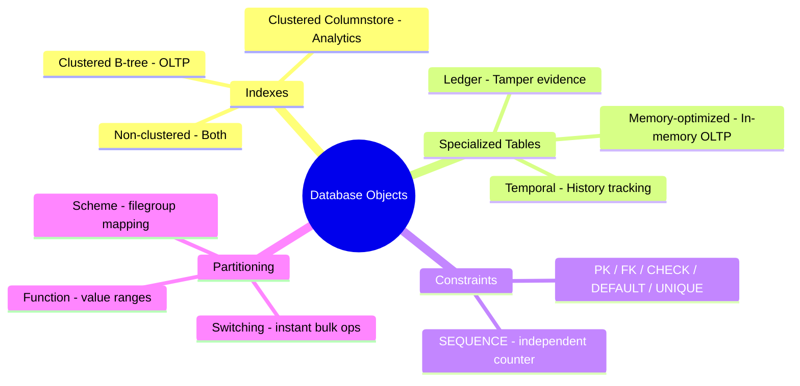
```

- [ ] **Step 2: Add Quick Recall to `02-programmability-objects/README.md`**

```markdown
## Quick Recall

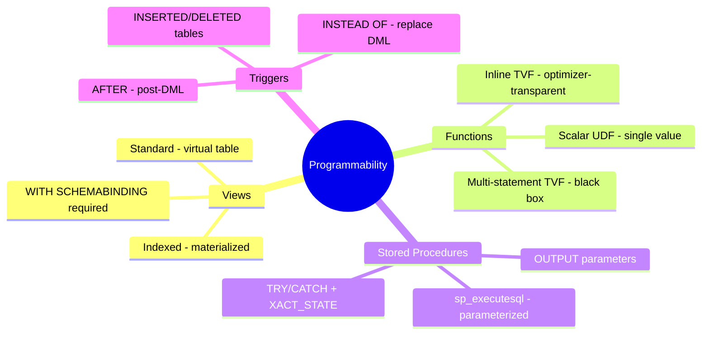
```

- [ ] **Step 3: Add Quick Recall to `03-advanced-tsql/README.md`**

```markdown
## Quick Recall

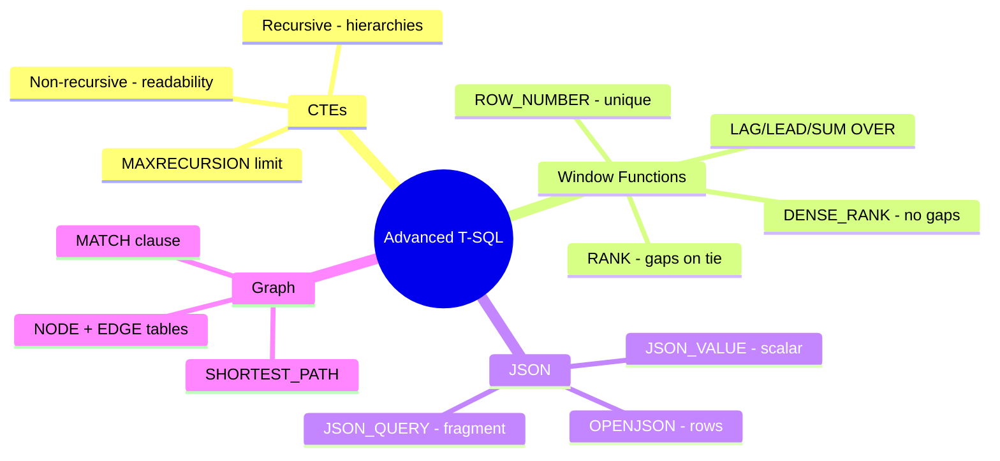
```

- [ ] **Step 4: Add Quick Recall to `04-ai-assisted-tools/README.md`**

```markdown
## Quick Recall

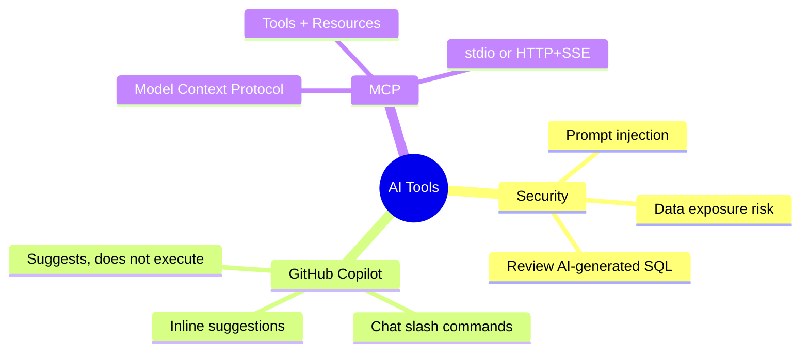
```

- [ ] **Step 5: Add Quick Recall to `05-data-security-compliance/README.md`**

```markdown
## Quick Recall

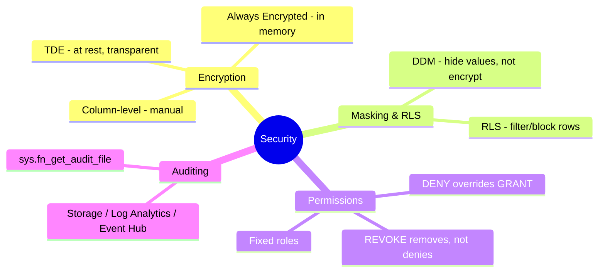
```

- [ ] **Step 6: Add Quick Recall to `06-performance-optimization/README.md`**

```markdown
## Quick Recall

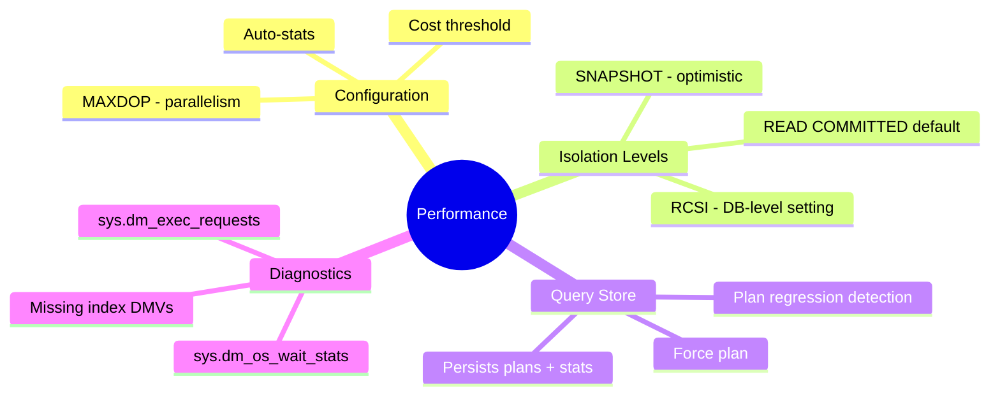
```

- [ ] **Step 7: Add Quick Recall to `07-cicd-database-projects/README.md`**

```markdown
## Quick Recall

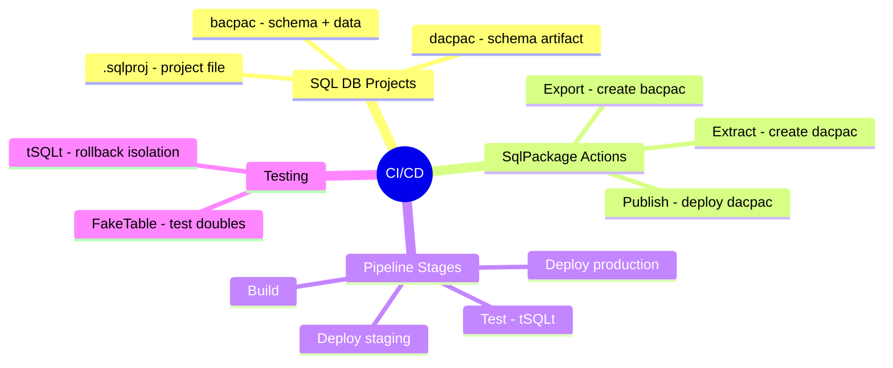
```

- [ ] **Step 8: Add Quick Recall to `08-azure-services-integration/README.md`**

```markdown
## Quick Recall

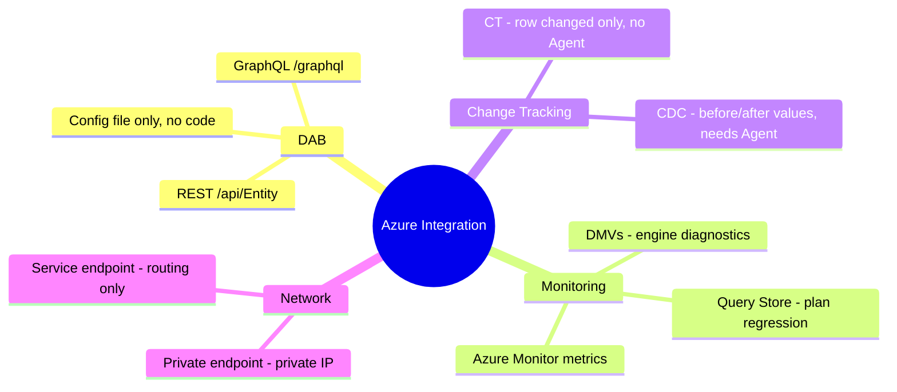
```

- [ ] **Step 9: Add Quick Recall to `09-models-embeddings/README.md`**

```markdown
## Quick Recall

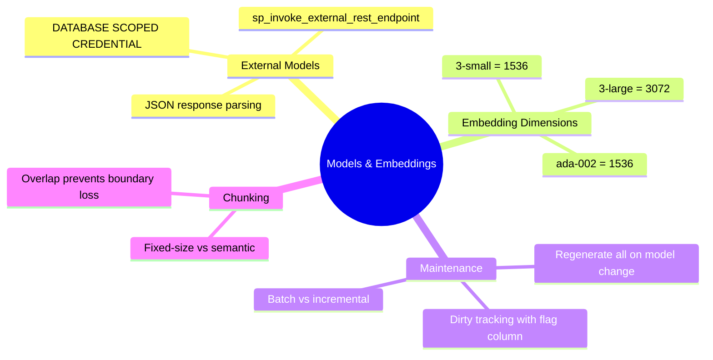
```

- [ ] **Step 10: Add Quick Recall to `10-intelligent-search/README.md`**

```markdown
## Quick Recall

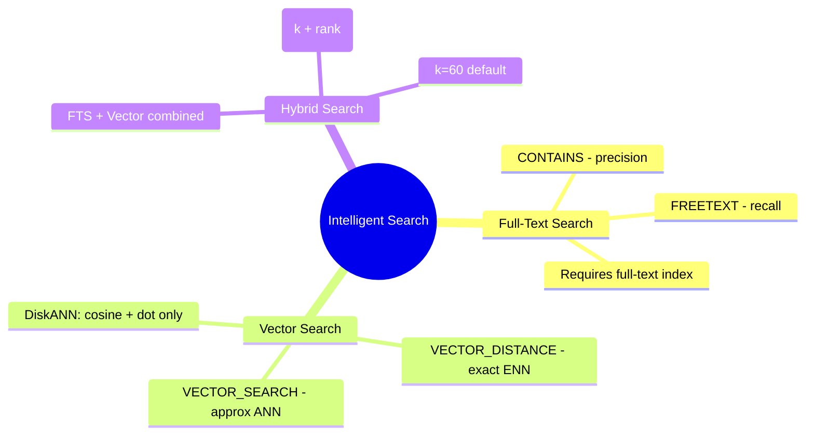
```

- [ ] **Step 11: Add Quick Recall to `11-rag/README.md`**

```markdown
## Quick Recall

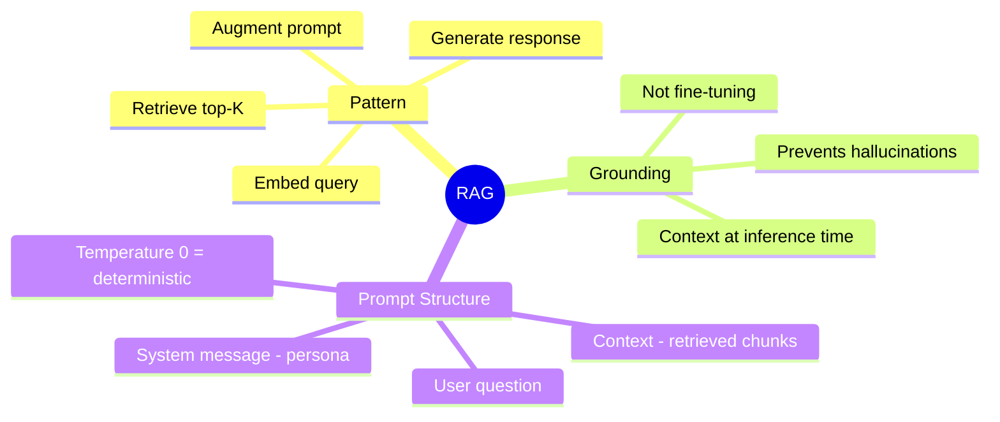
```

- [ ] **Step 12: Commit**

```bash
git add certification/01-database-objects/README.md \
        certification/02-programmability-objects/README.md \
        certification/03-advanced-tsql/README.md \
        certification/04-ai-assisted-tools/README.md \
        certification/05-data-security-compliance/README.md \
        certification/06-performance-optimization/README.md \
        certification/07-cicd-database-projects/README.md \
        certification/08-azure-services-integration/README.md \
        certification/09-models-embeddings/README.md \
        certification/10-intelligent-search/README.md \
        certification/11-rag/README.md
git commit -m "docs: add Quick Recall mindmap diagrams to all section READMEs"
```

---

## Task 20: Apply Global Formatting Pass

Apply `==highlight==`, `**bold**`, and `---` separators across all modified topic files and cheat sheets. This pass is done last, after all content additions, to avoid conflicts.

**Files:** All topic files and cheat sheets modified in Tasks 8–18.

- [ ] **Step 1: For each topic file, apply these formatting rules**

Rules (read each file, then edit):

1. **Horizontal rules**: ensure `---` appears between every `##` section. Add where missing.

2. **Bold key terms in prose**: scan the Overview/intro paragraphs and add `**term**` to the first occurrence of the most critical technical term per paragraph. Example targets:
   - "clustered columnstore index" → "**clustered columnstore index**"
   - "partition function" → "**partition function**"
   - "Always Encrypted" → "**Always Encrypted**"

3. **Highlight in tables**: in each comparison or reference table, add `==value==` to the most exam-critical cell per row. One highlight per row maximum. Examples:
   - Encryption table: highlight `==No==` in the "Server can see plaintext" row for Always Encrypted
   - Isolation levels table: highlight the anomaly that each level prevents
   - Function type table: highlight the performance characteristic

- [ ] **Step 2: Commit after completing all files in the formatting pass**

```bash
git add certification/
git commit -m "docs: apply global formatting pass - highlights, bold terms, section separators"
```
